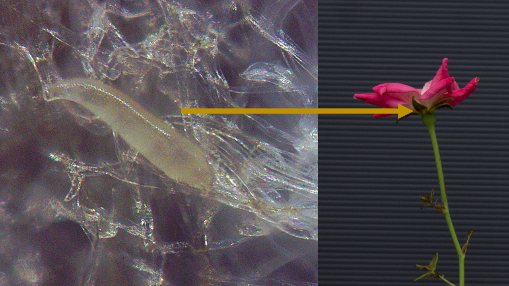

# Literature Review {#review}

## A small introduction to some herbivorous Acari {#acari-litrev}
Mites and ticks belong to a subclass of small arachnids known as the Acari, an incredibly diverse group of arthropods. Despite their ubiquity, mites and invertebrates in general remain understudied relative to other animal fauna [@Grodsky2015; @Rosenthal2017; @Titley2017]. @Hoy2011 speculates that our understanding of mite diversity and abundance may be around 50-100 years behind the taxonomy of the Insecta: The small size and cryptic habits of mites make them easy to overlook, and difficult to observe. In addition, their disputed placement in the Arachnida [@Giribet2018] presents a real challenge for taxonomists [@Giangrande2003]. Lastly, many mite species have been misclassified, and cryptic species make taxonomic certainty elusive [@Bickford2007]. In spite of these impediments, technological improvements, such as Low-Temperature Scanning Electron Microscopy [@Achor2001; @Wergin2006], Confocal Laser Scanning Microscopy [@Chetverikov2012; @Chetverikov2012a], X-ray computed tomography [@Dunlop2011; @Facchini2019], and advances in molecular biology--including high-throughput sequencing--[@Dasch2019], have helped to alleviate the pains of mite identification. The combination of these techniques allows for greater taxonomic certainty [@Chetverikov2012a]. The most well known species of mites have gained scientific recognition primarily due to their pest status [@Jeppson1975; @Hoy2011; @Savory1964]: many acari are parasites of plants and animals, causing disease and economic injury [@Walter2013; @Jeppson1975; @Hoy2011]. Even so, the majority of mite species are of no economic importance, and are harmless, or even beneficial: many show promise as biological control agents for weeds and arthropod pests [@Carrillo2015; @Gerson2003]. Although the majority of arachnids are predatory, mites are unique in that there are species which feed on plants [@Savory1964]. Phytophagy arose at least seven times in the Trombidiformes: Parasitengonae, Tetranychoidea, Raphignathoidea, Heterostigmata, Eupodoidea, Tydeoidea and Eriophyoidea all have species which feed on plants [@Lindquist1999]. Phytophagy is thought to be a facultative development for the majority of mite taxa outside of the Tetranychoidea and Eriophyoidea; few species of Eupodoidea and Raphignathoidea are obligate herbivores--only *Halotydeus*, *Penthaleus* (Raphignathoidea: Penthaleidae) and *Eustigmaeus* (Raphignathoidea: Stigmaeidae [@Gerson1971])--and the other mite groups have few morphological adaptations associated with plant feeding [@Lindquist1999; @Krantz1979]. An important development in the evolution of acarine phytophagy is the reduction of the chelicerae into sharp stylets used for piercing plant tissues [@Lillo2018]. These styliform mouthparts are thought to reduce damage to the plant in order to avoid some of the toxic chemistry plants use to defend themselves from arthropod feeding [@Brattsten1986]. Herbivorous mite damage is dependent on the specific mite-plant interactions for a given plant spp. or cultivar [@Petanovic2010]. Mites generally feed on plant epidermal and mesophyll cells [@McCoy1996; @Rancic2006]. High mite populations can reduce the amount of chlorophyll available to the plant [@Khederi2018a], primarily causing bronzing/russetting/silvering by direct feeding, but this damage often spreads to the surrounding tissues as the plant's immune system responds [@Bensoussan2016]. Mite salivary secretions can also cause a condition known as toxemia, which causes plant tissues to become chlorotic or discolor [@Oldfield1996]. Feeding on young tissues often forms distortions and delays plant growth, and some mites--many eriophyoidea and two spp. of Tenuipalpidae--form galls on their host plants [@Jeppson1975; @Westphal1996; @Oldfield2005]. The majority of herbivorous mites do not transmit pathogens [@Oldfield1996a], but those which do act as vectors of plant viruses principally from two families from the Prostigmata: Eriophyidae and Tenuipalpidae [@Slykhuis1965]. Members of these mite superfamilies are obligate herbivores considered to be some of the more ancient lineages of phytophagous mites [@Lindquist1999]. There have been singular reports of spider mites--tetranychidae--associated with viruses [@Slykhuis1965; @Robertson1988], but other studies have failed to reproduce similar results [@Granillo1974]. Plant mites are generally considered secondary pests, but often cause significant losses when conditions are optimal, due to the fast reproductive rate of many pest species [@Gerson1989; @Dutcher2007].


## Coevolved Plant Specialists: The Eriophyoidea {#erios-litrev}
The eriophyoidea are the second most economically-important group of herbivorous mites, right behind Tetranychidae. Where eriophyoids lose out in damage output, they pull ahead in diversity: It is estimated that the 2,838 species reported in the "Catalog of the Eriophyoidea of the World" represent only about 10% of the total number of species which exist [@Amrine1994]. Publications of new species descriptions of eriophyids averaged about 70 per year from 1996 to 2007, and have greatly increased since the publication of *Eriophyoid Mites -- their Biology, Natural Enemies and Control* [@Lindquist1996], a landmark publication for the field of eriophyoid studies. Eriophyids range in size from 80-500 \si{\micro\metre} long [@Nuzzaci1996], and seem to have evolved specifically for plant feeding [@Krantz1979; @Oldfield1996a; @Lindquist1999; @Skoracka2010; @Lillo2018]: they have styliform chelicera covered with a protective sheath [@Lindquist1999; @Bolton2018], elongate vermiform bodies, and adult mites have a reduced number of legs from the typical eight to four [@Lindquist1996a]. The stylets of eriophyids are short, $\le$ 20 \si{\micro\metre} [@Oldfield1996a], which primarily limits their feeding to epidermal cells, with young/tender meristematic tissues being preferred [@Petanovic2010; @Petanovic2010a]. Feeding is thought to rely on enzymes in their saliva to break down plant cells contents and feed on the resulting soup [@Hoy2011]. Eriophyoid mites also have an abbreviated lifecycle, progressing from egg, to larva, followed by nymph, then adult [@Manson1996]. Many eriophyoid mites have summer forms (protogynes) which readily proliferate and winter forms (deutogynes), which are able to survive harsher conditions until they can disperse when environmental conditions are moderate [@Kassar1990]. Eriophyids are not able to disperse very far by walking [@Calvet2020], but are known to disperse aerially [@Kuczynski2020] and passively [@Galvao2012], rarely by phoresy on other animals [@Li2018]. Eriophyid lifestyles are generally sorted into leaf vagrants/rust mites and galling/bud forms, with rust mites being fusiform and living on the plant surfaces, while bud and gall mites tend to have more cryptic lifestyles, as suggested by their names [@Hoy2011]. The majority of eriophyids studied to date are considered host specific, limited to feeding on a single genus, or one host plant. [@Oldfield1996a; @Lillo2018]. The few mite species which appear to have a broader host range may be misidentified cryptic species [@Navia2012; @Skoracka2013], a hypothesis strengthened by their limited ability to disperse and close associations with their host plants [@Magalhaes2007]. These lifestyles and feeding habits of the Eriophyoidea are thought to have shaped both their relationships with their host plants and their ability to transmit pathogens [@Biere2013; @Mauck2012]: Eriophyid mites represent the majority of mites involved in virus transmission to plants [@Oldfield1996a, @Lillo2018]. In the absence of an infectious agent, most damage from the feeding of vagrant forms of eriophyids is superficial and causes minimal damage to their host plant [@Oldfield1996a; @Krantz1979]. To date, eriophyids have only been associated with plant viruses [@Lillo2018], which may be explained by the small size of eriophyoid mouths and foreguts, which preclude the acquisition and circulation of large pathogens [@Oldfield1996a]. Although these developments can be considered an evolutionary advantage for the the Eriophyoidea, it puts the lifestyles of these minute arachnids in direct conflict with the interests of modern agriculture, and motivates the need for management of mite populations.


### *Phyllocoptes fructiphilus*: the vector of Rose Rosette Virus, the causal agent of Rose Rosette Disease {#pfruct-rrd-litrev}
*Phyllocoptes fructiphilus* Keifer, (Acari: Trombidiformes: Prostigmata: Eriophyoidea: Eriophyidae) is an eriophyoid mite from the Prostigmata group. Like many other eriophyoids, the relationships *P. fructiphilus* has with its host and virus are very specific, and create problems for growers [@Oldfield1996a; @Krantz1979]: *P. fructiphilus* only feeds on plants in the genus *Rosa* (roses), but it doesn't create noticeable damage by feeding. Instead, the increased interest in *P. fructiphilus* stems from its relationship with a virus known as Rose Rosette Virus (RRV) Emaraviridae [@Allington1968; @Tzanetakis2006; @Laney2011]. *P. fructiphilus* transmits RRV while feeding on the rose epidermis [@Allington1968]. A single mite is enough to transmit RRV, and can inoculate a rose in less than an hour [@Bello2017]. Infection creates the following symptoms: clusters of deformed flowers known as rosettes/witches' brooms, increased thorniness, elongated shoots, reddened leaves and stems, and increased cane die-back which ultimately kills the rose host [@Epstein1995]. This disease is known as Rose Rosette Disease (RRD) and is the most serious disease of roses, creating millions of dollars of losses for growers [@Babu2014] and threatening the ornamental rose industry [@Byrne2019, @Rwahnih2019]. RRD was first described in North America in 1941 from an outbreak in Manitoba, Canada [@Conners1941]. *P. fructiphilus* later became recognized as the vector for RRV [@Allington1968; @Doudrick1986; @Jesse2006] and RRV was eventually confirmed to be the casual agent for the RRD [@Doudrick1987; @Tzanetakis2006; @Laney2011; @Dobhal2016; @Bello2015; @Bello2017]. The mite and virus were generally associated with invasive multiflora rose, *Rosa multiflora* (Thunb) [@Amrine1996, @Amrine2002; @Otero-Colina2018] and spread along with the rose throughout the central US [@Crowe1983], and the east [@Hindal1988]. Initially the relationship between *R. multiflora* and the pathogen was considered as a type of natural biological control [@Epstein1999], and some studies even considered artificially spreading viruliferous *P. fructiphilus* to eradicate these pestilent roses [@Tipping2000]. The relationship between, *R. multiflora*, mite and virus also has a positive influence on *P. fructiphilus* fecundity: @Epstein1999 reported a 17-fold increase in the mite population of diseased roses compared to uninfected plants. Like many other species of plant-feeding mites, *P. fructiphilus* reproduce via arrhenotokous parthenogenesis [@Oliver1971], meaning that unfertilized eggs become male, while fertilized eggs become female [@Oldfield1996b]. *P. fructiphilus* grows from egg to adult in 11 days [@Kassar1990], which allows a single female to quickly found a new colony without being fertilized *a priori* to dispersion [@Helle1996]. Together, these factors likely contribute to *P. fructiphilus*'s dispersal ability. RRD and *P. fructiphilus* can spread through the landscape in various ways: RRV can be spread by grafting [@Doudrick1987] and the mites can crawl from plant to plant or be blown by the wind over long distances [@Zhao1997a; @Zhao1997b; @Michalska2009]. Unfortunately, *P. fructiphilus* and RRD have the ability to infest commercial rose cultivars as well [@Byrne2018; @Epstein1995], and can be spread by humans moving infested plants [@Navia2009]. A survey for *P. fructiphilus* and RRD in the southeastern United States [@Solo2018] found both mite and virus to be present in southern Georgia, and *P. fructiphilus* was recently detected in northern Florida [@Fife2020].
The presence of *P. fructiphilus* and RRD in the southeast emphasizes the need to monitor for and manage RRD to prevent its establishment in these rose growing regions. 


```{r rrd-symptoms, fig.height=8, fig.width=10.5, fig.align="center", out.width="80%", warning=FALSE}
grid::grid.raster(tiff::readTIFF("figure/symp-rrd.tif"))
```

`r fig_nums(name = "symptoms", caption = "Typical symptoms of Rose Rosette Disease (RRD), caused by Rose Rosette Virus: clusters of deformed flowers known as rosettes/witches' brooms, increased thorniness, elongated shoots, reddened leaves and stems. RRD ultimately kills the rose host.")`


## Integrated Pest Management (IPM): best practices for modern agriculture {#ipm-litrev}
Integrated Pest Management (IPM) is a philosophy of pest control based on integrating as many different types of control to keep pest populations underneath their economic injury level (EIL) [@Flint1981; @Stern1959]. The EIL is a breaking point, where the cost of controlling the damage from pests exceeds the costs of crop production [@Stern1959]. This EIL is informed by an economic threshold, a point where a specific pest density has been exceeded, and interventions are required to prevent the crop from reaching the EIL [@Stern1959]. A useful framework for controlling plant pathogens has been developed in the concept of the disease triangle. For a long time, plant pathologists have recognized the importance of pathogen, environment and host on disease proliferation [@Gaeumann1950], and all of these factors must be present in sufficient quantity and quality for disease to occur [@Agrios2004; @McNew1960; @Stevens1960]. Extensions of the basic disease triangle have been considered, including adding extra dimensions to account for more variables [@Francl2001], or applying it to different systems [@Scholthof2006], but the basic concept is that removing of one of these main factors of disease gives a point of attack for control efforts: Management may focus on removing a suitable host by crop rotation, or by using cultivars resistant/tolerant to pests and/or pathogens. Pathogens can be excluded from the crop via sanitation measures such as insect screens, tissue culture, seed certification programs, cleaning harvesting equipment, or by growing crops in a greenhouse. Environment can also be manipulated by growing crops in areas where the pest/pathogen isn't present or can't survive under normal conditions. The IPM paradigm encourages the combination of as many of these methods as possible for improved pest control. Although there is some overlap in the technologies and terminologies used, pest management traditionally divides pest interventions into four main categories: chemical, mechanical, cultural (environmental), and biological control methods [@Bradley2018]. Chemical controls are an effective way to quickly control pest outbreaks, but pesticides have many drawbacks as well: they pose a risk to the applicator, harm beneficial insects/pollinators, leave residues on crops meant for consumption, and can harm the environment through runoff/drift, polluting surface and groundwater [@Marquina2010; @Driesche2007]. Pesticides also can create secondary pest outbreaks [@Gerson1989] and pest resurgence by killing natural predators in the environment [@Driesche2007], while encouraging pesticide resistance in surviving pest populations [@Dutcher2007; @Ciancio2007]. Even so, chemical controls remain useful when used judiciously in an IPM program [@Driesche2007; @Dent2000]. Mechanical control is the physical manipulation of plants to prevent pests and pathogens. Mechanical controls include pruning, raking, tilling, removing pests and infected plants (roguing) by hand, creating physical barriers such as raised beds, insect screens, organic or plastic/reflective mulch, solarizing/heating the soil, sticky traps/barriers, and etc. [@Bradley2018; @Ciancio2007]. Cultural control has some overlap with mechanical control methods, but cultural controls tend to refer to controlling the environment of your crops to exclude pests. Some examples include: selecting resistant cultivars, cultivating and planting in healthy soil, managing weeds, interplanting/trap cropping, aerating the soil, choosing appropriate planting dates, rotating crops, letting the field lie fallow, and etc. [@Bradley2018; @Ciancio2007]. Biological control in the classical sense relies on reintroducing the various biological entities which keep pest populations in check in their natural/native environments [@Hajek2019; @Heimpel2017]. This concept is based off of the enemy release hypotheses from invasion ecology, which hypothesizes that introduced pest populations flourish because they have no natural enemies present to control their growth [@Heger2014; @Liu2006]. The corollary being that biological control agents such as parasitoids, predators, herbivores and pathogens can injure pest populations sufficiently to provide control [@Hajek2019; @Heimpel2017]. One of the primary benefits of biological control is that these natural enemies can become established in the environment, creating long term control while adapting to fluctuations in pest populations over time [@Hajek2019]. Biological control has found success in a variety of natural and agricultural environments, protecting crops against insect pests and combating invasive weed species [@Driesche2010].

```{r erio_fungus, fig.height=8, fig.width=10.5, fig.align="center", out.width="80%", warning=FALSE}
grid::grid.raster(tiff::readTIFF("figure/erio_fungus.tif"))
```

`r fig_nums(name = "erio_fungus", caption = "Cryo-SEM image of Eriophyid mite infected with unidentified fungus, collected from *Liriope muscari*. Photo Credit: Dr. Gary R. Bauchan, USDA-ARS, 2020")`


### Current Management of Rose Rosette Disease is not effective {#ipm-erios-litrev}
Nursery managers have been recommended to manage RRD by removing sick plants and spraying acaracides [@UGA2018; @Olson2017; @Hong2012]. Although eriophyid mites are often controlled via chemical means [@Leeuwen2009; @Messing1996], a handful of eriophyoid species have developed resistance to some acaricides, including *Phyllocoptruta oleivora* (Ashmead) and *Acalitus vaccinii* (Keifer) becoming resistant to dicofol [@Omoto1994; @Omoto1995] while *Aculus cornutus* (Banks) and *Aculops lycopersici* (Tryon) have developed resistance to various organophosphates [@Baker1979; @AbouAwad1985]. In addition, to date there is limited information regarding the toxicity and effectiveness of acaricides used to combat *P. fructiphilus*. Pesticide applications are further complicated by the biology of the mite: *P. fructiphilus* are a refuge seeking species of eriophyoids which prefer to feed on the small plant hairs on the sepals, underneath the petals [@Otero-Colina2018; @Lillo2018; @Jesse2006; @Amrine1994]. The petals help shield the mites from conventional pesticide treatments. Furthermore, a single mite is potentially enough to transmit the virus [@Bello2017], which can infect a rose in less than an hour, yet plants can remain sick and symptomless for months to years [@Amrine1996; @Bello2017]. This slow onset of disease symptoms creates an additional challenge for management [@Bello2017], because by the time the disease is noticed, the mites may have already spread to the whole garden. Disease detection is also difficult: Symptoms can appear similar to natural plant growth or herbicide damage, making it hard to diagnose in the field [@Hong2012]. Molecular methods for testing RRV are becoming readily available [@Babu2016; @Babu2017a; @Babu2017b, @Babu2018, @Bello2017], and newer technologies, such as Raman spectroscopy [@Farber2019] are being developed to test for RRV, but it remains to be seen if these methods are capable of identifying asymptomatic infections or if these tests are suitable for disease monitoring on larger scales. Host plant resistance is not a viable option for controlling RRD: currently, all roses are known to host *P. fructiphilus*, and few roses show signs of resistance to RRV [@Byrne2018; @Bello2017]. Mechanical control via pruning and sanitation have not proven to be effective [@Olson2017]. The use of windbreaks has been suggested to reduce the number of mites landing on roses [@Windham2014],  The lack of management options for mites, as well as the increased cost of rose production due to RRV make it difficult for growers to compete with an increasingly competitive international market. Rose growers need better methods to combat *P. fructiphilus* and RRV.

```{r hiding, fig.height=8, fig.width=10.5, fig.align="center", out.width="80%", warning=FALSE}

```

`r fig_nums(name = "hiding", caption = "Illustration of the typical location of *Phyllocoptes fructiphilus* on roses. *P. fructiphilus* are difficult to manage with pesticides due to the protection offered by the sepals.")`


### Phytoseiids mites: good options for biological control of RRD? {#ipm-preds-litrev}
Many mites species have potential as a biological control [@Carrillo2015; @Gerson2003]. Their efficiency as predators of pest species has been recognized for many years: One of the earliest recorded attempts at biological control was of a mite *Tyroglyphus phylloxerae* (Riley & Planchon), which was imported to France from the USA in an attempt to control the grape phylloxera, *Daktulosphaira vitifoliae* (Fitch 1855) [@Riley1874; @Kirchmair2009; @Dent2000]. Although this early attempt was unsuccessful, several mite species have been successful in controlling pest species [@Driesche2010; @BellowsJr1996]. The most well-studied family of predatory mites used for biological control are the Phytoseiidae [@Carrillo2015; @Farragut2010; @Gerson2003]. The lifestyles of Phytoseiid mites are generally split into four categories based on feeding guilds as described in @McMurtry1997: Type I mites belong to the genus *Phytoseiulus*, the only group considered to be specialists on spider mites from the genus *Tetranychus*. These mites reproduce faster than other phytoseiid groups, but only thrive on spider mite prey. They also respond to kairomones emitted by *Tetranychus* feeding [@Farragut2010; @McMurtry1997]. Type II phytoseiids are also heavily associated with *Tetranychus*, including representatives from the genera *Neoseiulus*, *Galendromus*, and *Typhlodromus*, but Type II mites also can feed on other mite groups, such as eriophyid, tydeid, and tarsonemid mites. They also can feed on pollen or plant exudates if necessary [@Farragut2010; @McMurtry1997]. Both Type I and Type II mites often live in the web colonies of their Tetranychid hosts, and have longer dorsal setae to avoid entanglement [@Farragut2010; @McMurtry1997]. Type III phytoseiids are considered to be generalists, and can grow and reproduce on a variety of different mite groups, including Eriophyoid, Tetranychoid, Tarsonemid and Acarid mites. They also feed on plant pollen, nectar, and insects such as whiteflies and thrips [@Farragut2010; @McMurtry1997]. The breadth of their feeding guild has encouraged their use in biological control programs [@Farragut2010]. Type III mites are more likely to feed on other mites of the same species, and require more prey for development than the specialist phytoseiid groups [@Farragut2010; @McMurtry1997]. Type III live on plants rather than in spider mite colonies, and accordingly have shorter dorsal setae. Type III mites will still feed opportunistically on *Panonychus*, a groups of Tetranychid mites which produce less dense webbing [@Farragut2010; @McMurtry1997]. Lastly, Type IV mites belong to the genus *Euseius*, which are polyphagous mites which primarily feed on pollen, although they will feed on other mites and small insects as well. They have short dorsal setae [@Farragut2010; @McMurtry1997]. Phytoseiid mites of all four types have been integrated successfully into various pest management programs. Many phytoseiids have been tested with various combinations of other biocontrol agents, such as predatory bugs and *Beauveria bassiana* [@Freitas2021; @Bouagga2018; @Chow2010; @Midthassel2016], as well as certain pesticides [@Trumble1993; @Nicetic2001; @Fernandez2017]. Phytoseiid reproduction has been studied to develop methods for mass-rearing and releasing as biological control agents for thrips, whiteflies, spider mites (Tetranychidae), flat mites (Tenuipalpidae), scale insects and other pests [@Argolo2020; @Carrillo2011; @Carrillo2011a; @Chen2006; @Knapp2018; @Sarwar2017; @Gerson2003]. One of the more popular species of commercially-available predatory mite is *Amblyseius swirskii* Athias-Henriot [@Calvo2014]. *A. swirskii* is a Type III mite species [@Farragut2010], which has been used successfully in agriculture for pest control of crop pests such as whiteflies [@Bolckmans2005], spider mites [@McMurtry1970], rust mites [@Onzo2012; @Park2010], broad mites (Tarsonemidae) [@Lopez2016], and thrips [@Wimmer2008]. *A. swirskii* tolerate shipping well [@Lopez2016a] and are often sold packaged in vermiculite or in sachets with wheat bran which allows the mites to slowly release into the environment [@Buitenhuis2014; @Calvo2014]. *A. swirskii* can be reared on artificial diets [@Nguyen2013], natural and supplemental pollen [@Loughner2011; @Park2011; @Delisle2015] and/or other arthropods present in the environment even when the pest of concern is absent [@Janssen2015; @Kumar2015]. This allows *A. swirskii* to be released periodically as a preventative measure instead of reacting to an outbreak [@Kutuk2011]. Volunteer and banker plants near cropping systems can also provide shelter for phytoseiids to live in [@Nunes2020; @Xiao2012; @Coli1994; @Smith1991]. Type III phytoseiid mites are generally associated with plants [@Farragut2010], and do not survive well without them [@Jung2000]. Plant structures affect many aspects of a phytoseiid's life [@Schmidt2013; @Cortesero2000], influencing dispersal [@Lopez2016; @Buitenhuis2013], as well as performance as predators [@Buitenhuis2013; @Seelmann2007; @Cedola2001]. For example, Type III phytoseiids prefer to live on 'hairy' plants with dense trichomes, and will leave glabrous leaf surfaces [@Loughner2010; @Loughner2010a], often laying their eggs in the densest patches of plant hair, or the thick tufts of trichomes along axillary veins known as 'domatia' on the underside of leaves [@Agrawal1997; @Walter1996; @Grostal1994; @Walter1992; @ODowd1991], possibly to avoid predation [@Faraji2002]. Predator-plant mutualisms also extend into the realm of chemical communications: many types of phytoseiids learn to associate their prey with chemical cues [@Nomikou2005; @Boer2005], and become attracted to the Volatile Organic Compounds (VOCs) released when plants are injured by pests or infected with pathogens [@Maeda2006; @Maeda2001; @Boer2004a; @Boer2004b; @Boom2002].

```{r persim, fig.height=8, fig.width=10.5, fig.align="center", out.width="80%", warning=FALSE}
grid::grid.raster(tiff::readTIFF("figure/p_persimilis.tif"))
```

`r fig_nums(name = "persim", caption = "*Phytoseiulus persimilis* are type I phytoseiid mites: specialists of spider mites from the genus *Tetranychus* [@Farragut2010; @McMurtry1997].")`


## Plant defenses and Systemic Acquires Resistance (SAR) {#sar-litrev}

<!-- Coevolution of secondary plant metabolites with herbivores [@Ehrlich1964] -->

Plants are primarily sessile organisms which aren't able to run or hide when an herbivorous mite attacks it. Instead, plants rely heavily on their ability to protect themselves in-situ, via a myriad of different physical and chemical defenses [@Walling2000]. These defenses are categorized as either constitutive defenses or induced defenses [@Farmer2016]. Constitutive defenses are always 'on', being produced by the plant constantly, such as tannins and latex, while inducible defenses rely on some sort of signal before the plant will produce them. Physical defenses of herbivory includes spines, prickles, thorns, glandular trichomes, latex, sclereids, epicuticular wax, bark, thick cell walls, and compensatory growth to prevent tissue damage while increasing wear on herbivore mouthparts [@Farmer2016]. In addition to these physical barriers to herbivory, plants are also efficient chemical factories which produce a bevy of secondary plant metabolites, including inhibitory proteins, enzymes, and toxins which reduce palatability of plant tissues, prevent uptake of essential amino acids, or kill the herbivore outright [@Farmer2016]. The hypotheses surrounding inducible defenses vary, from considering the costs of resource allocation (Optimal Defense Theory) [@Adler1994] The majority of chemical defenses are inducible in nature [@citation], which permits them to be exploited for laboratory studies and pest management.

There are a number of hypotheses about plant defenses,  to be a trade-off between growth and defense

<!-- Citation describing how SA and JA induction decreased mite numbers [@Khederi2018] -->


Induction of plant defenses can have negative consequences for the herbivores as well as the predators [@Pappas2017]: @Ataide2016 observed that inducing a plant JA pathway reduces phytophagous mite performance, but also negatively affected ovophagy by predatory mites. Also, the predatory mites preferred eggs from herbivorous mites unaffected by the induced plant defenses [@Ataide2016]. This reduction in predation allowed the resurgence of the pest mite later [@Ataide2016].

@Kant2007 found examples of interspecific variation of *T. urticae*'s ability to induce--and resist--JA defenses.

The interaction of SA and JA varies by species, and exhibit negative cross-talk in some plant systems
*Aculops lycopersici* induce SA defenses while suppressing JA pathways, not via antagonistic cross-talk between the responses, but by suppressing downstream accumulation of JA [@Glas2014]. *T. urticae* feeding induces both JA and SA pathways, but when both mites were introduced to the same plant, the JA response plummeted and SA doubled [@Glas2014]. When the mites feed on the same plant, *T. urticae* populations benefit from the reduction of JA caused by *A. lycopersici*, but *A. lycopersici* populations suffer [@Glas2014]. Meanwhile, the effects of increased SA from eriophyid mite feeding prevented a secondary bacterial infection.

When a plant is attacked by an herbivore and a plant pathogen at the same time, it creates pressure on the plant to defend on two fronts, which is further complicated by the negative cross-talk which sometimes occurs when defenses are induced [@Belliure2010]. This struggle has clear benefits for vectors of plant pathogens [@Belliure2010].

*T. urticae* and *Brevipalpus* suppress plant defenses [@Alba2014; @Arena2018]

Plant cross-talk during the induction of plant defenses is put under pressure when mites and viruses team up? [@Belliure2010]

## A second mite-plant-pathogen system: *Brevipalpus californicus* and Orchid fleck virus {#bcali-litrev}
The most important superfamily of herbivorous mites is the Tetranychoidea. The Tetranychoidea are comprised of 2,000 species divided into 5 families [@Krantz2009], two of which have economic significance, Tetranychidae--the spider mites--and Tenuipalpidae. Tenuipalpidae are known colloquially as the false spider mites, or flat mites due to their flattened character and superficial similarity to the Tetranychidae. In contrast to tetranychids, tenuipalpids do not spin webs and are considered to be a pest of reduced severity: @Krantz2009 places them as the 'third most important family of phytophagous mites'. Flat mites are considered to be a tropical to subtropical group of mites [@Gerson2008], the majority of which are not of economic significance [@Hoy2011]. Consequently, tenuipalpids have been studied much less than the Tetranychidae [@Jeppson1975; @Gerson2008; @Childers2003b], but flat mites from the genus *Brevipalpus* have been gaining importance in recent years as vectors of plant viruses [@Dietzgen2018a; @ChabiJesus2018; @RamosGonzalez2017; @Rodrigues2013; @Rodrigues2003a; @Melzer2013; @Kitajima2010; @Kitajima2008 ;@Kitajima2003b; @Chagas2003; @Childers2011; @Childers2003a; @Childers2003c]. Another major pest of modern concern is *Raoiella indica* (Hirst), a pest of palms (Arecaceae), ginger (Zingiberaceae), bananas (Musaceae), and bird of paradise plants (Strelitziaceae) [@Beard2012a; @Hoy2011; @Jeppson1975; @Etienne2006], which has been invading the Neotropics since their introduction to the Caribbean [@Amaro2021; @Ramirez2020; @Rodrigues2020; @Alcivar2020; @EscobarGarcia2020; @Kane2012; @Pena2012; @Carrillo2011b; @Dowling2011; @Vasquez2008; @Roda2008; @Rodrigues2007; @Etienne2006]. Flat mites are typically small (200 to 300 \si{\micro\metre}) red or green, and move slowly [@Hoy2011; @Jeppson1975]. Tenuipalpids feeding is typically restricted to a few hosts, and mites can usually be found on the underside of leaves, often along leaf veins or the midrib [@Hoy2011; @Jeppson1975]. Some species feed on grass, bark, flower heads, leaf sheaths, or form galls [@Hoy2011; @Jeppson1975].  Flat mites have egg, larva, protonymph, deutonymph and adult forms over an average of 3-4 weeks [@Hoy2011]. A few species have only six legs as adults. Tenuipalpid mites can be difficult to classify correctly with light microscopy, due to distortions during mounting of characters used in species identification [@Welbourn2003]. Furthermore, flat mites are thelytokous parthenogenic: Males are seldom encountered, due to infections with the feminizing bacteria *Candidatus* Cardinium (Cytophaga–Flavobacterium–Bacteroides phylum) [@Groot2006; @Groot2005 @Chigira2005]. This has caused some concern that some *Brevipalpus* species are actually isofemale lines specialized on their specific hosts [@Groot2005], an idea which is further complicated by the occurrence of cryptic species in these groups [@Navia2013; @Skoracka2015]. Few methods of pest management have been reported from past reviews of tenuipalpids [@Hoy2011; @Gerson2008; @Jeppson1975]: a number of different mite predators have been tested for their efficacy, as well as the pathogenic fungi *Hirsutella thompsonii* and *Metarhizium anisopliae* [@Gerson2008; @RossiZalaf2006]. @Zheng2012 tested the ability of water and phytoseiids to reduce populations of *B. obovatus*. *Beauveria bassiana* has been tested to control *R. indica*, and is potentially compatible with the previously-tested phytoseiid species *Amblyseius largoensis* and *Typhlodromus ornatus* [@Freitas2021; @Carrillo2011]. Chemical applications are typically used to control tenuipalpids [@Childers1994], but some species have begun to develop chemical resistance to the more common applications [@Rocha2021; @Campos2002].

```{r brevi_fungus, fig.height=8, fig.width=10.5, fig.align="center", out.width="80%", warning=FALSE}
grid::grid.raster(tiff::readTIFF("figure/brevi_fungus.tif"))
```

`r fig_nums(name = "brevi_fungus", caption = "a) Cryo-SEM image of Tenuipalpid mite infected with unidentified fungus, collected from *Liriope muscari* b) detail of sporangia. Photo Credit: Dr. Gary R. Bauchan, USDA-ARS, 2020")`


One of the more cosmopolitan species of tenuipalpid is *Brevipalpus californicus* (Banks). *B. californicus* is a common pest with a large host range of agricultural and ornamental crops, including tea, orchids, citrus, cotton and tobacco [@Hoy2011; @Jeppson1975]. *B. californicus* acts as the primary vector for Orchid fleck virus (OFV), the type member for the genus *Dichorhavirus*, family *Rhabdoviridae*; a bacilliform, nuclear rhabdoviruses composed of two segments of single-stranded, negative-sense RNA which infects plants [@Dietzgen2014; @Walker2018; @Amarasinghe2019]. Dichorhaviruses are only known to be transmitted by mites in the genus *Brevipalpus* [@Dietzgen2014]. Other members of this genus are: Citrus chlorotic spot virus, Citrus leprosis virus N, Clerodendrum chlorotic spot virus and Coffee ringspot virus [@Dietzgen2018].  Many orchid genera are able to become infected with OFV [@Kondo2006; @Kondo2006], as well as some Asparagaceae (Nolinoidaea) [@Dietzgen2018], and *Citrus* plants (Rutaceae), where it causes leprosis-like symptoms [@GarciaEscamilla2018; @Roy2013a; @Bastianel2010]. Mechanical transmission of OFV is possible under lab conditions to various Chenopodiaceae, Aizoaceae, Fabaceae, and Solanaceae [@Chang1976; @Kondo2003; @Peng2013]. *B. californicus* has been collected from OFV-infected Nolinoidaea plants in Australia [@Dietzgen2018b; @Mei2016]. *B. californicus* was historically associated with cases of citrus leprosis disease of Florida and Texas prior to 1925, when the disease mysteriously disappeared from the US [@Childers2003; @Knorr1968b]. Later studies of herbarium specimens from this time period revealed this disease to be caused by a Dichorhavirus, distantly related to modern OFV strains [@Hartung2015; @Kitajima2011a]. @Maeda1998 found evidence that *B. californicus* can transmit OFV in a persistent propagative manner, which means that the virus may replicate inside of its mite vector. OFV was first described infecting *Cymbidium* orchids in Japan [@Doi1977]. Many countries have reported OFV and OFV-like rhabdoviruses infecting orchids worldwide [@Kondo2003], including Asia: [China [@Peng2017], Korea [@Peng2013]], Africa: [South Africa @Blanchfield2001], North America: [The United States [@Blanchfield2001], [@Bratsch2015]], South America: [Brazil [@Kitajima1974, @Kitajima2001], Colombia [@Kubo2009], Costa Rica [@FreitasAstua2002], Paraguay [@RamosGonzalez2015], Europe: [Denmark [@Begtrup1972], France @Sauvetre2018], Germany [@Petzold1971; @Lesemann1975]] and Oceania: [Australia @Lesemann1971; @Lesemann1975; @Gibbs2000], Fiji [@Pearson1993], Vanuatu [@Pearson1993]]. The prevalence of OFV and its mite vector is thought to be associated with the importation of infected orchids [@Dietzgen2018].


```{r oncidium_ofv, fig.height=8, fig.width=10.5, fig.align="center", out.width="80%", warning=FALSE}
grid::grid.raster(tiff::readTIFF("figure/oncidium_ofv.tif"))
```

`r fig_nums(name = "oncidium_ofv", caption = "*Oncidium* orchid infected with Orchid fleck virus")`
