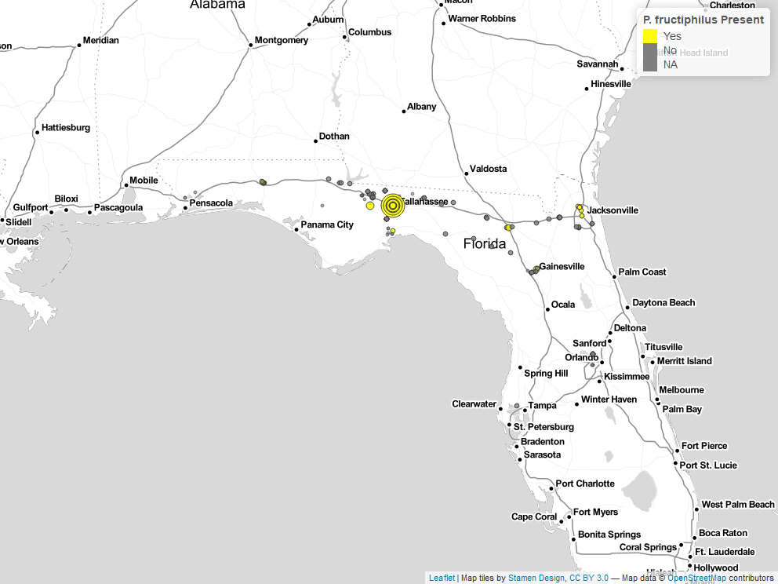
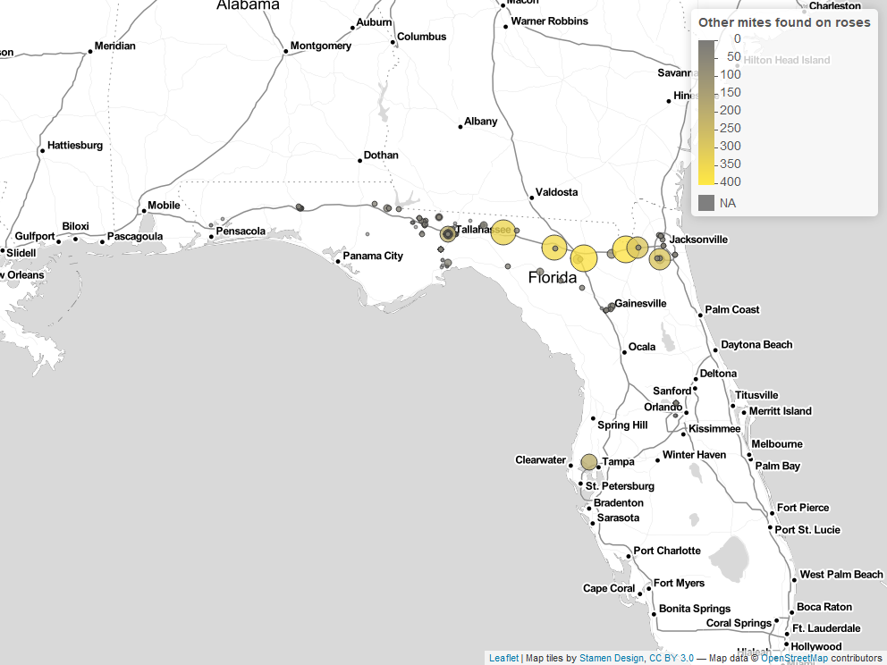

# Survey for the invasive mite *Phyllocoptes fructiphilus*, Rose Rosette Virus (RRV), and wild predatory mites in northern Florida {#survey}

## Introduction {#survey-nfl}
*Phyllocoptes fructiphilus* is a microscopic plant-feeding eriophyid mite. Eriophyoid mites are very host specific [@Skoracka2009; @Oldfield1996c] and *P. fructiphilus* only feeds on plants in the genus *Rosa* [@Amrine1996]. *P. fructiphilus* is the vector of Rose Rosette Virus (RRV). RRV infection is commonly associated with the following symptoms: witches’ brooms/rosetting, deformed flowers, increased prickle density, elongated shoots, reddened leaves and stems, and increased die-back which ultimately kills the rose host [@Amrine1996]. This disease is known as Rose Rosette Disease (RRD). and is the most serious disease of roses. Florida is the largest producer of roses with a total value exceeding $30 million, and stands to lose millions of dollars if RRD and *P. fructiphilus* become established. There are few options available to control RRD, prevention of disease spread by quarantine and rouging infected roses is key to controlling the spread of this disease into Florida. Rose Rosette Disease and the mite have invaded the southeastern united states as they followed the range expansion of the non-native *Rosa multiflora* (Thunb) towards the coast [@Amrine2002; @Otero-Colina2018]. In 2018, a group of researchers conducted a series of surveys for *P. fructiphilus* and RRD in the southeastern United States [@Solo2020; @Solo2018]. They encountered *P. fructiphilus* in Thomas County and Lowndes County, GA (*`r citef("solo_maps")`*), less than 20 miles from the northern border of Florida. RRD has been detected in previously in southern [@Babu2014], no mites were detected at that time, and no disease spread has been documented in those areas since.

```{r solo_maps, fig.height=8, fig.width=10.5, fig.align="center", out.width="80%", warning=FALSE}
grid::grid.raster(tiff::readTIFF("figure/solo_maps.tif"))
```

`r fig_nums(name = "solo_maps", caption = "From @Solo2020: a) 'Map of the southern incidence line of Rose rosette virus (RRV) and eriophyid mites in Alabama, Georgia, and Mississippi in 2017. Plant hardiness Zone 7b is in pink, Zone 8a is brown, Zone 8b is blue, and Zone 9a is in gray. Note that there are five locations in which two mite species were found on the same rose sample' b) 'Map of the southern incidence line of Rose rosette virus (RRV), southern distribution of Phyllocoptes fructiphilus and Eriophyes eremus, and the population densities of eriophyid mites found on rose samples in Alabama, Georgia, and Mississippi in 2017. The larger the circle, the more mites found in the sample.' Citation: HortScience horts 55, 8; 10.21273/HORTSCI14653-20")`

## Surveying for *P. fructiphilus*, RRD and predatory mites Florida
A key part of *P. fructiphilus* control is vector and disease monitoring. Previous surveys of the southeastern United States did not survey for *P. fructiphilus* in Florida, so it is possible that *P. fructiphilus* and/or RRV are present in other parts of the state. In 2017, our lab began a series of surveys of roses along the borders of northern Florida and southern Georgia. Our purpose was to estimate the distribution and populations levels of *P. fructiphilus*, as well as recording any RRD incidence in northern Florida. An additional goal of the rose surveys was to detect other predatory mites present on roses: there are many species of predatory phytoseiid mites present in Florida with potential to control agricultural pests such as *P. fructiphilus* [@Muma1970]. Encountering predatory mites native to the Florida landscape may help in the development of biological control methods for *P. fructiphilus*: native predatory mites sometimes have an advantage for bio-control because native mites have adapted to the environment where they will be released [@Gerson2014]. Our results should help identify areas with greater risk for invasion of *P. fructiphilus* and/or RRD.


## Materials & Methods
A survey of roses in the landscape was conducted following a transect of northern Florida from west to east, Pensacola to Jacksonville. Cities with populations over 1,000 were visited along this route and cuttings were taken from various roses in each city. Rose cultivar/species, sun exposure and GPS coordinates were recorded to map out sites which had predatory mites, eriophyoid mites, or possibly symptoms of RRD. Rose tissue samples were taken from the periphery of various roses in the landscape; sampling was focused on the flowering tips of roses and included a mixture of flowers, fruits, buds, and short lengths of rose cane. Samples were trimmed with bypass pruners which were routinely sanitized with 70% ethanol between cuts. Samples were stored in 500 \si{\milli\liter} Nalgene™ Wide-Mouth Polypropylene Copolymer bottles (ThermoFisher Scientific, Waltham, MA, USA) with ~10 \si{\milli\liter} of 95\% ethanol. The rose samples then were gently shaken to coat the rose tissues sampled with ethanol. Doing so made sure that the sampled mites were killed and acted to preserve both mites and rose tissues until samples could be processed further and checked for mites. Samples were processed using a washing method derived from @Monfreda2007 used to detect eriophyoid mites such as *P. fructiphilius*: The sampling bottles with ethanol and rose tissues were vigorously shaken to dislodge any mites, then the ethanol in the container was poured over a stack of sieves with decreasing screen sizes: 180 \si{\micro\metre}, 53 \si{\micro\metre}, and 25 \si{\micro\metre}. The bottle and rose pieces were then further rinsed with 95\% ethanol over the sieve stack to dislodge any remaining mites. The 53 \si{\micro\metre} and 25 \si{\micro\metre} sieves were processed separately; the 53 \si{\micro\metre} sieve retained larger mites while the 25 \si{\micro\metre} sieve retained smaller mites, including *P. fructiphilus*. The sieves were then backwashed from the underside of their screen with a 95\% ethanol-filled wash bottle, starting from the highest point of a sieve and working to the bottom to flush any trapped debris and mites into a 50 \si{\milli\liter} centrifuge tube for storage and future observations. The ethanol solutions of mites and plant debris were stained with a derivative of McBride's acid fuchsin stain to enhance contrast [@Backus1988]. Solutions were allowed to settle until excess ethanol could be siphoned off, making it possible to then pour this concentrated plant-mite mixture into a thin, small petri dishes or a glass plate for observation under a dissecting microscope. Mites found among the plant debris were counted, then siphoned off with a glass pipette and subsequently stored in micro-centrifuge containers with 95% ethanol as a preservative. 5-10 unstained specimens from each sample were made into prepared microscope slides: Mites were cleared and mounted using the methods of @Faraji2008: mites were simultaneously cleared and stained with Faraji and Bakker's modified clearing solution and heated on a hot plate until the specimens were clear. Subsequently, these mites were moved with an eyelash tool into an iodine-modified Hoyer’s slide mounting media (Hempstead Halide®, Inc., Galveston, Texas, USA), underneath a 12 m\si{\milli\metre} glass coverslip. The prepared slide was then dried at 90&deg;C before sealing the slide by painting a ring of alkyd insulating enamel (Red Glyptal® 1201, Chelsea, MA, USA) over the edges of the coverslip to seal the slide, to protect it from damage by air incursion and moisture. These slides could then be observed under a compound microscope with phase-contrast objectives to identify the mite families and species if necessary. After mite quantities and species were recorded, a representative sample of eriophyoids putatively identified as *P. fructiphilus* had their identity verified with the acarologist, Dr. Sam Bolton of the Florida Department of Agriculture and Consumer Services, Division of Plant Industry (FDACS-DPI) to ensure accuracy. Roses which appeared to show symptoms of RRD, or which had populations of *P. fructiphilus* present were tested by the Plant Disease Diagnostic Clinic at the NFREC. Plant tissues were tested for RRV by Dr. Fanny Iriarte using the currently accepted molecular methods described in @Babu2016, @Babu2017a, and/or @Babu2017b. 

## Results
425 samples were taken from 33 cites from an east to west transect along the border northern Florida. *P. fructiphilus* mites were recovered in rose samples from six cities: Baldwin, Defuniak Springs, Gainesville, Jacksonville and Tallahassee. Other mites were collected from 68\% of the cities visited. *P. fructiphilus* per sample were low on average, but abundant in individual samples. No evidence of RRD was observed in northern Florida. Many other mites were collected, including a number of predatory mites which await identification.


```{r survey_map_1, fig.height=8, fig.width=10.5, fig.align="center", out.width="85%", warning=FALSE}

```
`r fig_nums(name = "survey_map_1", caption = "*P. fructiphilus* mites recovered during surveys of roses in Florida, 2017-2021.")`

```{r survey_map_2, fig.height=8, fig.width=10.5, fig.align="center", out.width="85%", warning=FALSE}

```
`r fig_nums(name = "survey_map_2", caption = "Other mites recovered during surveys of roses in Florida, 2017-2021.")`


```{r survey_table_1, echo = FALSE, warning = FALSE}
df_fl <- read_csv('data/rrv_survey_fl_table.csv', show_col_types = FALSE)
df_fl$pfuct_per <- round(df_fl$pfuct_per, digits = 1)
df_fl$se_pfruct <- round(df_fl$se_pfruct, digits = 2)
df_fl$se_other <- round(df_fl$se_other, digits = 2)
df_fl <- df_fl %>%
  bind_rows(summarise(.,
                      across(where(is.numeric), sum),
                      across(where(is.character), ~ "Grand Totals")))
df_fl <- df_fl %>% rename(
  'City' = city,
  'P. fructiphilus' = pfruct,
  'Std. Error' = se_pfruct,
  'Other Mites' = other,
  'Std Error' = se_other,
  'Samples per site' = samples,
  'P. fructiphilus per sample' = pfuct_per,
  'Totals' = totals
)
knitr::kable(df_fl, format="latex", booktabs=TRUE) %>%
  kable_styling(latex_options= c("striped", "hold_position", "scale_down")) %>% 
row_spec(nrow(df_fl), bold = TRUE)

```
`r tab_nums(name = "survey_table_1", caption = "Eriophyids and other mites recovered during surveys of roses in Florida, 2017-2021.")`

## Discussion

*P. fructiphilus* have been found in northern Florida.

Although a large number of other mites have been collected, it is beyond our ability to identify them to species. Phytoseiid mites require expert identification, and many species have been misidentified [@Demard2021].

<!-- this imports my publication -->
\includepdf[pages={-}, pagecommand={\phantomsection  \addcontentsline{toc}{section}{Publication: First report of \textit{Phyllocoptes fructiphilus} in Florida}}]{pubs/pfruct-report.pdf}