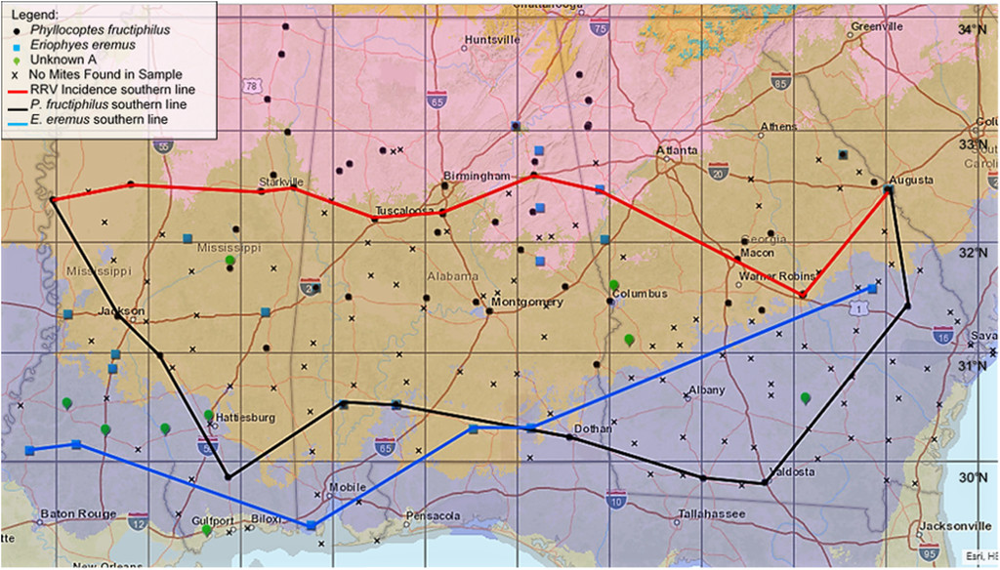
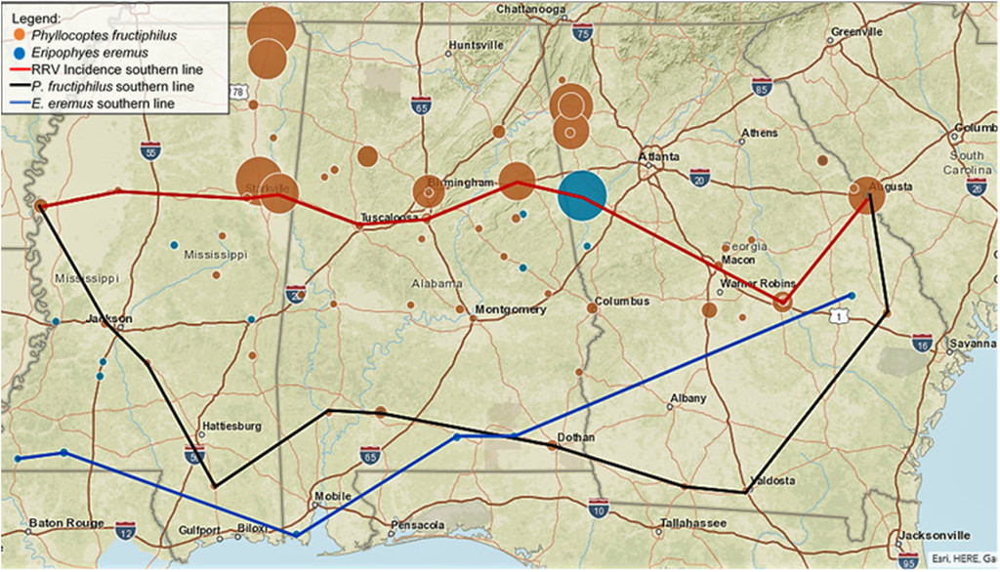
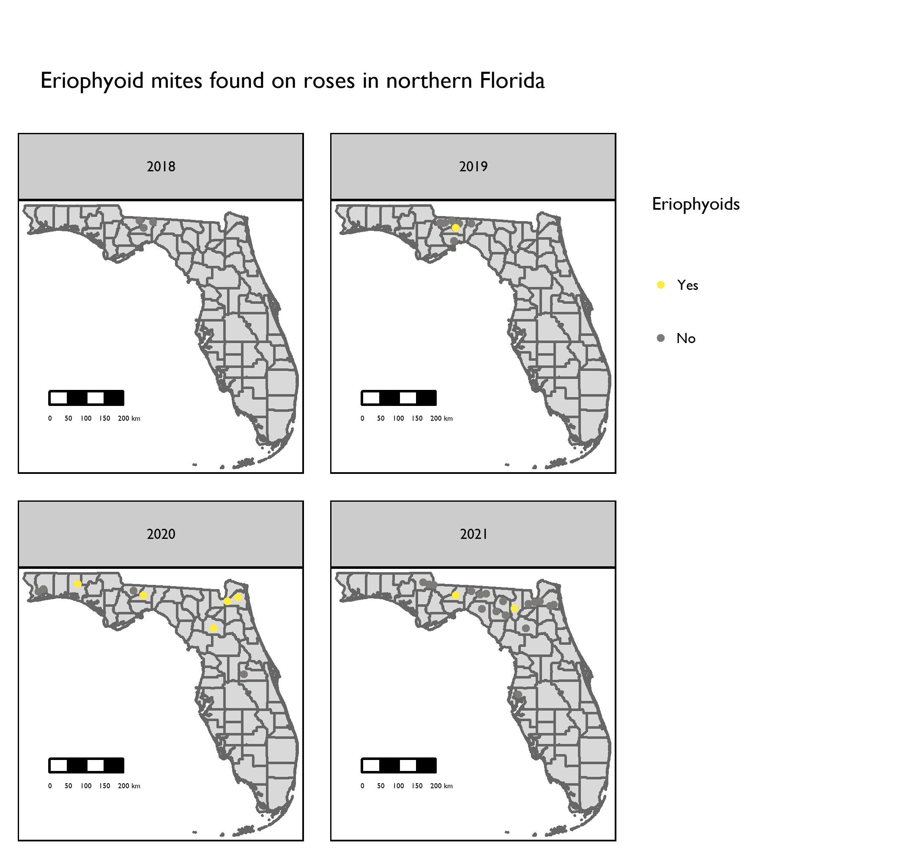
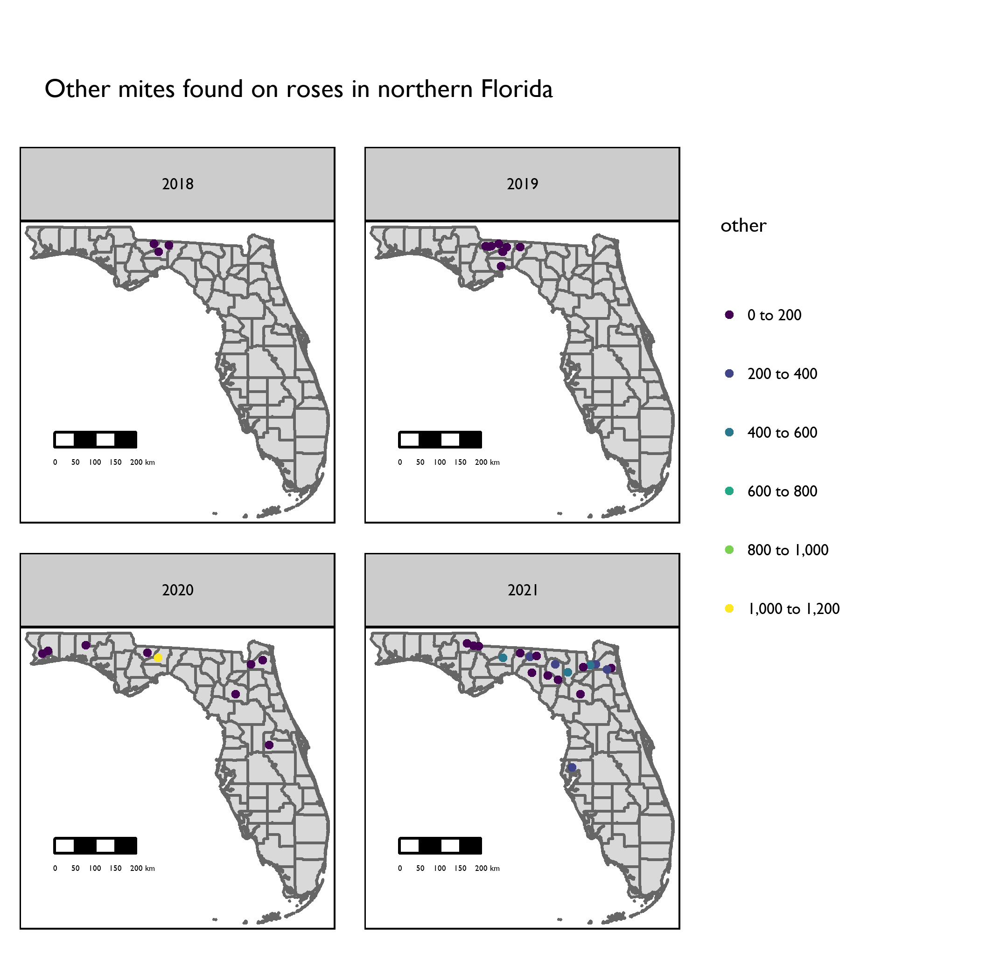

# SURVEY AND PHENOLOGY OF NATURAL POPULATIONS OF THE INVASIVE MITE *Phyllocoptes fructiphilus* IN NORTHERN FLORIDA {#survey}

## Introduction
*Phyllocoptes fructiphilus* is a microscopic plant-feeding eriophyid mite. Eriophyoid mites are very host specific [@Skoracka2009; @Oldfield1996c] and *P. fructiphilus* only feeds on plants in the genus *Rosa* [@Amrine1996]. *P. fructiphilus* is the vector of Rose Rosette Virus (RRV). RRV infection is commonly associated with the following symptoms: witches’ brooms/rosetting, deformed flowers, increased prickle density, elongated shoots, reddened leaves and stems, and increased die-back which ultimately kills the rose host [@Amrine1996]. This disease is known as Rose Rosette Disease (RRD). and is the most serious disease of roses. Florida is the largest producer of roses with a total value exceeding $30 million, and stands to lose millions of dollars if RRD and *P. fructiphilus* become established. There are few options available to control RRD, prevention of disease spread by quarantine and rouging infected roses is key to controlling the spread of this disease into Florida. Rose Rosette Disease and the mite have invaded the southeastern united states as they followed the range expansion of the non-native *Rosa multiflora* (Thunb) towards the coast [@Amrine2002; @Otero-Colina2018]. In 2017, a group of researchers conducted a series of surveys for *P. fructiphilus* and RRD in the southeastern United States [@Solo2020, @Solo2018]. They encountered *P. fructiphilus* in Thomas County and Lowndes County, GA, less than 20 miles from the northern border of Florida *see \@ref(fig:solo-map-1)* and *\@ref(fig:solo-map-2)* [@Solo2020, @Solo2018]. RRD has been detected in previously in southern Florida [@Babu2014], but no mites were detected at that time, and no RRD has been documented in those areas since.

```{r solo-map-1, cache = TRUE, cache.extra = file.mtime('figure/full-1288fig1.jpg'), fig.cap="Map of the southern incidence line of \\textit{{Rose rosette virus}} (RRV) and eriophyid mites in Alabama, Georgia, and Mississippi in 2017. Plant hardiness Zone 7b is in pink, Zone 8a is brown, Zone 8b is blue, and Zone 9a is in gray. Note that there are five locations in which two mite species were found on the same rose sample.' Citation: HortScience horts 55, 8; 10.21273/HORTSCI14653-20, CC BY-NC-ND 4.0, Unmodified from the original version.", fig.scap="Map of the southern incidence line of \\textit{{Rose rosette virus}} (RRV) and eriophyid mites, from Solo et al. 2020", out.width="100%", warning=FALSE}

```

```{r solo-map-2, cache = TRUE, cache.extra = file.mtime('figure/full-1288fig2.jpg'), fig.cap="Map of the southern incidence line of Rose rosette virus (RRV), southern distribution of \\textit{{Phyllocoptes fructiphilus}} and \\textit{{Eriophyes eremus}}, and the population densities of eriophyid mites found on rose samples in Alabama, Georgia, and Mississippi in 2017. The larger the circle, the more mites found in the sample.' Citation: HortScience horts 55, 8; 10.21273/HORTSCI14653-20, CC BY-NC-ND 4.0. Unmodified from the original version.", fig.scap="Map of the southern incidence line of Rose rosette virus (RRV), southern distribution of \\textit{{Phyllocoptes fructiphilus}} and \\textit{{Eriophyes eremus}}, from Solo et al. 2020", out.width="100%", warning=FALSE}

```

## Surveying for *P. fructiphilus*, RRD and Predatory Mites in Northern Florida {#intro-survey}
A key part of *P. fructiphilus* control is vector and disease monitoring. Populations of *P. fructiphilus* are easily overlooked, the mites are microscopic and cryptic in habits, primarily located under the sepals of rose flowers, near glandular trichomes on the tips of rose canes [@Bauchan2019; @Jesse2006]. Humidity was once hypothesized to be a limiting factor for growth and spread of *P. fructiphilus* populations, but @Monterrosa2021 reported greater mite survival at moderate humidity (60% RH) and increased RRD severity in plants exposed to greater than 20% RH. Furthermore, previous surveys of the southeastern United States did not extend into Florida (@Solo2020, *see \@ref(fig:solo-maps)*). It is possible that *P. fructiphilus* and/or RRV are present in northern Florida or other parts of the state. In 2017, the entomology lab at the North Florida Research and Education Center (NFREC) in Quincy, FL, began a series of surveys of roses along the borders of northern Florida and southern Georgia. Our purpose was to estimate the distribution and populations levels of *P. fructiphilus*, as well as recording any RRD incidence in northern Florida. An additional goal of the rose surveys was to detect other predatory mites present on roses: there are many species of predatory phytoseiid mites present in Florida with potential to control agricultural pests such as *P. fructiphilus* [@Muma1970]. Encountering predatory mites native to the Florida landscape may help in the development of biological control methods for *P. fructiphilus*: native predatory mites sometimes have an advantage for bio-control because native mites have adapted to the environment where they will be released [@Gerson2014]. Our results should help identify areas with greater risk for invasion of *P. fructiphilus* and/or RRD.

## Materials & Methods {#mm-survey}
A survey of roses in the landscape was conducted following a transect of northern Florida from west to east, Pensacola to Jacksonville. Cities with populations over 1,000 were visited along this route and cuttings were taken from various roses in each city *(see \@ref(tab:survey-table-1))*. Rose cultivar/species, sun exposure and GPS coordinates were recorded to map out sites which had predatory mites, eriophyoid mites, or possibly symptoms of RRD. Rose tissue samples were taken from the periphery of various roses in the landscape; sampling was focused on the flowering tips of roses and included a mixture of flowers, fruits, buds, and short lengths of rose cane. Samples were trimmed with bypass pruners which were routinely sanitized with 70% ethanol between cuts. Samples were stored in 500 \si{\milli\liter} Nalgene™ Wide-Mouth Polypropylene Copolymer bottles (ThermoFisher Scientific, Waltham, MA, USA) with ~10 \si{\milli\liter} of 95\% ethanol. The rose samples then were gently shaken to coat the rose tissues sampled with ethanol. Doing so made sure that the sampled mites were killed and acted to preserve both mites and rose tissues until samples could be processed further and checked for mites. Samples were processed using a washing method derived from @Monfreda2007 used to detect eriophyoid mites such as *P. fructiphilius*: The sampling bottles with ethanol and rose tissues were vigorously shaken to dislodge any mites, then the ethanol in the container was poured over a stack of sieves with decreasing screen sizes: 180 \si{\micro\metre}, 53 \si{\micro\metre}, and 25 \si{\micro\metre}. The bottle and rose pieces were then further rinsed with 95\% ethanol over the sieve stack to dislodge any remaining mites. The 53 \si{\micro\metre} and 25 \si{\micro\metre} sieves were processed separately; the 53 \si{\micro\metre} sieve retained larger mites while the 25 \si{\micro\metre} sieve retained smaller mites, including *P. fructiphilus*. The sieves were then backwashed from the underside of their screen with a 95\% ethanol-filled wash bottle, starting from the highest point of a sieve and working to the bottom to flush any trapped debris and mites into a 50 \si{\milli\liter} centrifuge tube for storage and future observations. The ethanol solutions of mites and plant debris were stained with a derivative of McBride's acid fuchsin stain to enhance contrast [@Backus1988]. Solutions were allowed to settle until excess ethanol could be siphoned off, making it possible to then pour this concentrated plant-mite mixture into a thin, small petri dishes or a glass plate for observation under a dissecting microscope. Mites found among the plant debris were counted, then siphoned off with a glass pipette and subsequently stored in micro-centrifuge containers with 95% ethanol as a preservative. 5-10 unstained specimens from each sample were made into prepared microscope slides: Mites were cleared and mounted using the methods of @Faraji2008: mites were simultaneously cleared and stained with Faraji and Bakker's modified clearing solution and heated on a hot plate until the specimens were clear. Subsequently, these mites were moved with an eyelash tool into an iodine-modified Hoyer’s slide mounting media (Hempstead Halide®, Inc., Galveston, Texas, USA), underneath a 12 \si{\milli\metre} glass coverslip. The prepared slide was then dried at 90&deg;C before sealing the slide by painting a ring of alkyd insulating enamel (Red Glyptal® 1201, Chelsea, MA, USA) over the edges of the coverslip to seal the slide, to protect it from damage by air incursion and moisture. These slides could then be observed under a compound microscope with phase-contrast objectives to identify the mite families and species if necessary. After mite quantities and species were recorded, a representative sample of eriophyoids putatively identified as *P. fructiphilus* had their identity verified with the acarologist, Dr. Sam Bolton of the Florida Department of Agriculture and Consumer Services, Division of Plant Industry (FDACS-DPI) to ensure accuracy. Roses which appeared to show symptoms of RRD, or which had populations of *P. fructiphilus* present were tested by the Plant Disease Diagnostic Clinic at the NFREC. Plant tissues were tested for RRV by Dr. Fanny Iriarte using the currently accepted molecular methods described in @Babu2016, @Babu2017a, and/or @Babu2017b. 

## Results {#results-survey}
425 samples were taken from 33 sites from an east to west transect along the border northern Florida. Eriophyoid mites were recovered in rose samples from six cities. The first samples of *P. fructiphilus* were first encountered in Tallahassee during 2019; subsequent sampling efforts found in more eriophyoids in Jacksonville, Baldwin, Gainesville and Defuniak Springs in 2020, and Lake City in 2021. Other mites were collected from 68\% of the cities visited. The largest populations of *P. fructiphilus* were seen in Tallahassee, with over 8,400 eriophyoid mites from 260 samples collected during 2019-2021 (*see \@ref(tab:survey-table-1)*). No evidence of RRD was observed in northern Florida during the surveys, even in areas where abundant *P. fructiphilus* were found. Over 4,600 non-eriophyoid mites were collected from various cities during 2019-2021 *\@ref(tab:survey-table-1)*. Other non-eriophyoid mites collected primarily belong to the family Tetranychidae, but a small number of phytoseiidae and other predatory mites were recovered as well. These other mites currently await curation and expert identification.

\FloatBarrier

```{r survey-map-1, cache = TRUE, cache.extra = file.mtime('figure/rrv_survey_map_fl_pf.png'), fig.pos = 'p', fig.cap = "\\textit{P. fructiphilus} mites recovered during surveys of roses in Florida, 2017-2021.", fig.scap="\\textit{P. fructiphilus} mites recovered during surveys of roses in Florida", out.width="100%", warning=FALSE}
knitr::include_graphics('figure/rrv_survey_map_fl_pf.png')
```


```{r survey-map-2, cache = TRUE, cache.extra = file.mtime('figure/rrv_survey_map_fl_other.png'), fig.pos = 'p', fig.cap= "Other mites recovered during surveys of roses in Florida, 2017-2021.", fig.scap="Other mites recovered during surveys of roses in Florida", out.width="100%", warning=FALSE}
knitr::include_graphics('figure/rrv_survey_map_fl_other.png')
```


```{r survey-map-3, cache = TRUE, cache.extra = file.mtime('figure/rrv_survey_map_years_pf.png'), fig.pos = 'p', fig.cap="Location of populations of eriophyoid mites found on roses in northern Florida 2018-2021.", fig.scap="Location of populations of eriophyoid mites found on roses in northern Florida", out.width="100%", warning=FALSE}

```


```{r survey-map-4, cache = TRUE, cache.extra = file.mtime('figure/rrv_survey_map_years_others.png'), fig.pos = 'p', fig.cap="Locations of other mites recovered during surveys of roses in Florida, 2018-2021.", fig.scap="Locations of other mites recovered during surveys of roses in Florida", out.width="100%", warning=FALSE}

```


```{r survey-table-1, echo = FALSE, warning = FALSE, cache = TRUE, cache.extra = file.mtime('data/rrv_survey_fl_table.csv'), caption = "\\label{tab:survey-table-1}"}
df_fl <-
  read_csv('data/rrv_survey_fl_table.csv', show_col_types = FALSE)
df_fl$erios_per <- round(df_fl$erios_per, digits = 1)
df_fl$se_erios <- round(df_fl$se_erios, digits = 2)
df_fl$se_other <- round(df_fl$se_other, digits = 2)
df_fl$lat <- round(df_fl$lat, digits = 5)
df_fl$lon <- round(df_fl$lon, digits = 5)
tots  <-
  df_fl %>% summarise(., across(where(is.numeric), sum), across(where(is.character), ~ "Grand Totals"))
tots$lat <- round(tots$lat / length(df_fl$lat), digits = 5)
tots$lon <- round(tots$lon / length(df_fl$lon), digits = 5)
tots[, 1] <- 2021
df_fl <- bind_rows(df_fl, tots)
df_fl <- df_fl %>% rename(
  'City' = city,
  'Eriophyoids' = erios,
  'Std. Error' = se_erios,
  'Other Mites' = other,
  'Std Error' = se_other,
  'Samples per city' = samples,
  'Eriophyoids per sample' = erios_per,
  'Totals' = totals,
  "Latitude" = lat,
  "Longitude" = lon,
  'Year' = year
)
df_fl %>% select(-pfruct) %>% 
filter(Year != 2017) %>% group_by(Year) %>% arrange(.by_group = TRUE) %>% 
knitr::kable(format = "latex", booktabs = TRUE, caption = "Eriophyids and other mites recovered during surveys of roses in Florida, 2017-2021.") %>%
  kable_styling(latex_options = c("striped", "hold_position", "scale_down", full_width = TRUE)) %>%
  row_spec(nrow(df_fl), bold = TRUE)
# %>%
#   footnote(general = "Eriophyids and other mites recovered during surveys of roses in Florida, 2018-2021.")

```

\FloatBarrier

## Discussion {#dis-survey-pheno}
The presence of *P. fructiphilus* in northern Florida over multiple years and seasons provides evidence against a putative southern limit for the species [@Solo2020]. Our survey efforts were severely hampered by the COVID-19 pandemic, which limited opportunities to travel and collect mites. We expect that further investigations of roses in other Florida cities will reveal more site with *P. fructiphilus*. The arrival of a competent vector is not a guarantee that its associated disease will follow suit, but it does provide a necessary component of the disease triangle: if the environmental conditions are suitable, and the rose host is sufficiently abundant, there is potential for disease to occur [@Francl2001]. We did not see any signs of RRD in roses in northern Florida, but it is important to note that the delayed onset and difficulty of identifying symptoms makes it likely to miss detection until late stages of the disease. It is not known how *P. fructiphilus* have arrived in northern Florida, and unfortunately our observations are not sufficient to describe a mechanism of invasion. Eriophyoid mites are known to disperse in a variety of ways: they may be windblown, transported with infected plants, move on contaminated equipment or clothes, or rarely, through phoresy [@Sabelis1996]. The short distances between mite infested roses in Georgia, Alabama and Florida suggest the possibility of multiple routes of introduction, but the mechanisms of dispersal require further investigation for *P. fructiphilus*. In addition, the movements of plant pathogens such as RRD is thought to be partially driven by socioeconomic factors and the movement of plants by people [@Nelson2015; @Katsiani2020]. Inspections and quarantines of mite-infested roses by wholesalers and larger growers is predicted to slow the spread of plant pathogen epidemics [@Nelson2015]. A large number of other non-eriophyoid mites have been collected as well, but it is beyond our ability to identify many of them. Phytoseiid and other predatory mites require expert identification by mite taxonomists, and many species have been misidentified by amateurs either through carelessness or ignorance [@Demard2021]. The presence of *P. fructiphilus* in Florida necessitates the development of mite control practices to prevent mite populations from surging, and to hopefully prevent the spread of RRD.
