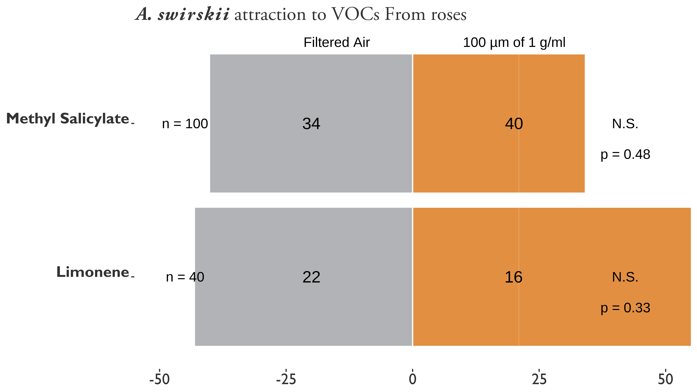

# CHANGES IN HEADSPACE VOLATILES FOR RRD-INFECTED ROSES {#chemeco}

<!-- Uncomment and run code chunk to update values after changing R files: -->
<!-- ```{r} -->
<!-- source('code/rrv_pred_mite_data_cleaning.R') -->
<!-- source('code/rrv_pred_mite_analysis.R') -->
<!-- source('code/rrv_pred_mite_graphs.R') -->
<!-- ``` -->

<!-- Phytoseiids rely heavily on VOCs to orient themselves towards their prey and potential mates, while avoiding predators [@Gnanvossou2003]. -->

<!-- Phytoseiids also attracted to synthetic MeSA in lab [@Gadino2011], But lures had mixed results @Gadino2012 -->


## *Amblyseius swirskii* attraction to RRD-infected roses {#chemeco-swirskii}

Rose Rosette Virus (RRV), the casual agent of Rose Rosette Disease (RRD) and *P. fructiphilus* Kiefer invaded the southeastern United States on the multiflora rose, *R. multiflora* (Thunb) as it spread its range towards the coast [@Amrine2002; @Otero-Colina2018]. RRD is present throughout the US, including Decatur County, GA, near the Florida border (figure?), [@EDDMapS2019].

Rose Rosette Virus (genus *Emaraviridae*) is the most devastating disease of roses. Rose Rosette Virus creates witches’ brooms, rosetting, deforms flowers, increases prickle density, elongates shoots, reddens of plant tissues, causes dieback and ultimately plant death. Rose Rosette Virus is spread by a microscopic eriophyid mite known as *Phyllocoptes fructiphilus* Keifer (Trombidiformes: Eriophyidae). Few management options are available: Current mite control is achieved by removing infected roses and frequent pesticide applications. Growers are interested in alternative and less expensive management options to combat *P. fructiphilus* and Rose Rosette Virus. Predatory mites have potential to fulfill this need: Mites from the family Phytoseiidae are being investigated as biocontrol agents for the management of *P. fructiphilus*. Preliminary data suggest that the phytoseiid mite *Amblyseius swirskii* Athias-Henriot (Mesostigmata: Phytoseiidae) orients itself towards volatiles of Rose Rosette-infected roses. This attraction may have synergistic effects for *P. fructiphilus* control. *A. swirskii* and three other commercially-available phytoseiid mites will be tested in olfactometer choice tests to identify specific volatile compounds which may be causing this behavior. Findings will help to develop chemical lures and promote depredation on *P. fructiphilus* in Rose Rosette-infected roses. This research will contribute a biocontrol option for the management of *P. fructiphilus* in southern Georgia and northern Florida.

#### Statement of Problem, Rationale and Justification
The purpose of this project is to investigate the predatory persistence of four commercially-available mites for management of *P. fructiphilus* and RRV in southern Georgia and northern Florida. Specifically, this project will determine which compounds released from Rose Rosette Virus (RRV) infected Double Knock Out® roses encourage recruitment, lengthen search time or improve depredation of phytoseiid mites on *Phyllocoptes fructiphilus* Keifer (Trombidiformes: Eriophyidae).

Phytoseiid mites have no eyes, instead relying on plant volatiles such as Methyl Salicylate to guide them to their prey [@Boer2004a]. Methyl Salicylate is also released when a plant is attacked by herbivores or pathogens [@Boer2004a; @Shulaev1997], so when preliminary tests with *A. swirskii* showed attraction to RRV-infected roses, coupled Gas Chromatography-Mass Spectroscopy analysis was expected to reveal high levels of Methyl Salicylate. Contrary to expectation, RRV-infected roses had low levels of Methyl Salicylate compared to healthy plants. This suggests that phytoseiid attraction may be attributed to volatiles besides Methyl Salicylate. This is important because such volatiles may be used to lure phytoseiids to eriophyid-infested areas, encouraging feeding and enhancing pest control [@Boer2004a; @Boer2004b]. Understanding which volatiles are responsible for phytoseiid attraction to RRV-infected roses will provide preliminary research which impacts management options for *P. fructiphilus* in southern Georgia/northern Florida as well as other *P. fructiphilus* & RRV-infested regions. 


#### Project Relevance to Sustainable Agriculture
This project will contribute to agricultural sustainability by developing biological-control management practices for the control of Rose Rosette Virus (RRV). Understanding how predatory mites interact with volatiles in their environment will add value to biocontrol by encouraging predatory persistence, luring mites to areas where their prey is present and increasing prey-seeking behaviors [@Boer2004a; @Boer2004b]. Chemical lures such as Methyl Salicylate can also encourage local recruitment of nearby mites and other natural predators [@Boer2004a; @Boer2004b], which can contribute to control of other pests of roses. Predatory mites are not environmentally-damaging or a health concern. Phytoseiid mites are compatible with some pesticides and other biocontrol methods, and feed on many different agricultural pests as well, so they can integrate well with existing pest management programs. Developing a biocontrol option for RRV can also increase profitability for rose growers not only by reducing losses from RRV-infection, but by reducing the number of pesticides which need to be applied. Reducing grower's reliance on pesticides has multiple benefits, promoting the health and safety of growers as well as protecting the environment. Reducing pesticide usage can also prevent *P. fructiphilus* from developing pesticide resistance and decrease risks for pollinators which frequent roses. Predatory mites are low-low-maintenance to rear and deploy and subsist in the environment without decreasing sustainability in other areas. Overall, predatory mites represent great value for sustainable agriculture.

#### Objectives
1. Determine which of four commercially-available phytoseiid mites (*Amblyseius swirskii* Athias-Henriot, *Neoseiulus californicus* (McGregor), *Neoseiulus cucumeris* (Oudemans), and *Neoseiulus fallacis* (Garman)) demonstrate attraction to Rose Rosette Virus (RRV)-infected roses
1. Determine which volatiles are causing this attraction with Gas Chromatography-Mass Spectrometry
1. Develop synthetic blends of the attractive volatiles and compare them to RRV-infected rose volatiles and the control (filtered air).
1. Release the mites with lures on roses in Griffin, Georgia and observe depredation on *P. fructiphilus* and recruitment of local mite species
1. Report which of the mite spp. demonstrate significantly higher depredation of *P. fructiphilus*
1. Report the efficacy of lure deployment


#### Approach and Methods
A brief description of the methods to be used for each objective, numbered according to their corresponding objective.  There must be a direct relationship between the approach and methods and the project relevance to sustainable agriculture.  Approach and Methods is limited to no more than 1000 words.

1. Count the number of mites which choose to walk towards volatiles from RRV-infected roses rather than the control (untreated filtered air) with two-arm olfactometer assays analyzed using [@appropiatestaticalmethod] tests. Mites which significantly choose RRV-infected rose volatiles over the control will be considered "responsive" and used for further assays.
1. Measure amounts of headspace volatiles extracted from both RRV-infected and uninfected roses. Paired Gas Chromatography-Mass Spectrometry will measure the quantity and determine the types of volatiles released using [@appropiatestaticalmethod] tests.
1. Count the number of responsive mites which choose to walk towards synthetic volatile blends rather than the control (untreated filtered air) with two-arm olfactometer assays analyzed using [@appropiatestaticalmethod].
1. Count the number of responsive mites which choose to walk towards synthetic volatile blends rather than volatiles from RRV-infected roses or controls (untreated filtered air) with four-arm olfactometer assays analyzed using [@appropiatestaticalmethod].
1. Compare populations of *P. fructiphilus*, phytoseiid mites and RRV infection in field trials in Griffin, Georgia with randomized block experiments comparing synthetic lures to controls without lures and analyzing data with [@appropiatestaticalmethod].

#### 3.1.1 Problem Statement

Salicylic Acid plays a role in activating a plant's immune system and helps protect the plant from pests, bacteria, fungus or viruses [@Gozzo2013]. We are collaborating with the University of Georgia to test how activating plant defensive compounds might protect roses from *P. fructiphilus* and/or RRD. We applied Acibenzolar-S-methyl (ASM), a chemical which works like Salicylic Acid to activate plant defenses [@Ziadi2001; @Tripathi2010] at a high and a low rate, as well as a miticide and water as controls. These data suggest that activated plant defenses may work to control *P. fructiphilus*.

#### 3.1.2 Preliminary Data

Predatory mites do not feed on the plants they live on, so they shouldn't be harmed by activated plant defensive compounds. In natural systems, predatory mites learn to follow plant defensive chemicals to find their prey [@Boer2004a]. This suggests that combining ASM-activated plant defenses with predatory mites may enhance the ability of predatory mites to find their prey, but this combination hasn't been tested yet.

Preliminary tests with *A. swirskii* show attraction towards compounds from RRV-infected roses. The lab has tested some of these compounds with Y-tube choice tests to determine their role in attracting *A. swirskii* to the infected roses. Other chemicals remain to be tested. Understanding which chemicals are responsible for attracting *A. swirskii* to RRV-infected roses is a preliminary part of determining if *A. swirskii* will search for *P. fructiphilus* when on a rose.

```{r aswir-rrd, fig.height=8, fig.width=10.5, fig.align="center", fig.cap = "\\textit{Amblyseius swirskii} attraction to healthy and Rose Rosette Virus-infected Pink Double Knock Out® roses. Asterisks represent significant differences as calculated by $\\chi^2$ contingency table tests for given probabilities. N.S. = not significant. RRV-infected vs Healthy Rose: $\\chi^2 = 9.33$, $df = 1$, $\\alpha = 0.05$, $p-value = 0.002$. Filtered Air vs Healthy Rose: $\\chi^2 = 0.47$, df $=$ 1, $\\alpha = 0.05$, $p-value = 0.4913$.", out.width="80%", warning=FALSE}
knitr::include_graphics('figure/reed.jpg')
```

## 3.2 Volatile changes in Rose Rosette Virus-infected Plants Treated with Acibenzolar-S-Methyl, a functional analog of Salicylic Acid {#swirskii-trials}

#### 3.2.1 Problem Statement
Some mites orient themselves towards volatiles of their prey or the host plant of their prey. We intend to investigate differences between RRV-infected and uninfected Pink Double Knock Out® roses and their volatiles, as well as the effects of SAR-induction on rose volatiles. The results will help inform future assays involving predatory mites and their *P. fructiphilus*-seeking behaviors in relation to rose RRV-infection status and the use of SAR-inducers for biological control.

<!-- #### Rationale -->


<!-- #### Proposal:  -->

#### 3.2.2 Materials & Methods
We plan on collecting plant volatiles from Double Knock Out® roses and comparing the differences between RRV-infected and uninfected roses, using a push-pull volatile collection system as illustrated in *\@ref(fig:vol-extract)*. Filtered air fills an oven bag sealed over rose canes to trap leaf volatiles. Volatiles are then drawn through a clean collection filter by a vaccuum. The chemicals on the filter are eluted with 150 \si{\micro\liter} of dichloromethane, then 5 \si{\micro\liter} of nonyl acetate are added as an internal standard to the extraction. The extractions then are injected into a GC-MS and their spectra are analyzed. Compounds are identified by comparison to mass spectra databases as well as synthetic standards for confirmation.

Treatments will be the following:

1.	Uninfected Pink Double Knock Out® roses
1.	RRD infected Pink Double Knock Out® roses
1.	SAR-induced uninfected Pink Double Knock Out® roses
1.	SAR-induced RRD-infected Pink Double Knock Out® roses

A group of 20 plants will be isolated. Volatiles from the 20 plants will be collected as a baseline (already collected). Then half of the plants will be SAR inducted by bi-weekly spray applications of Acibenzolar-S-Methyl. Subsequently half of the remaining plants (5 control and 5 SAR-induced plants) will be grafted with RRV-infected buds to innoculate them with the virus [@Doudrick1987]. Volatiles will be collected bi-monthly following SAR-induction and RRV application.  

```{r vol-extract, fig.height=8, fig.width=10.5, fig.align="center", fig.cap = "Volatile collection system for rose headspace sampling. An inert nylon bag is placed around the canes of interest, an air inlet is inserted and sealed at the base with a zip-tie to form a relatively air-tight seal around the base of the rose canes. Once the bag begins to inflate, a small hole is cut in the corner of the bag and a filter inserted and sealed with a zip-tie to form a second seal. The exterior end of the filter is attached to a vacuum airline set to allow for constant static pressure on the bag from inflation. The rose is then left for 24 hours, the filter is eluted with Dichloromethane into a gas chromatography vial, 1 \\si{\\micro\\liter} of Nonyl Acetate is added as an internal standard, and then the sample is processed using a coupled Gas Chromatography - Mass Spectrometer (GC-MS) for chemical identification.", out.width="80%", warning=FALSE}
grid::grid.raster(tiff::readTIFF("figure/vol-extract-trap-filter.tif"))
```


#### 3.2.3 Potential benefits
By determining which chemicals change during infection or with SAR-induction, we can gain insight into the physiological changes occuring during RRV-infection and SAR-induction in roses. Testing headspace volatiles can also give us insight into what VOCs predators like *A. swirskii* may encounter on infected or SAR-induced roses.

#### 3.2.4 Expected outcomes

- Determine which headspace VOCs are different between RRV-infected and healthy roses

- Determine what effects SAR-induction has on RRV-infected and healthy roses

- Creates a starting point for volatile testing for future olfactometer studies with *A. swirskii*

Knowing which VOCs affect the host-seeking abilities of a predatory mite like *A. swirskii* is part of preliminary work for determining the compatibility of *A. swirskii* as a predator of *P. fructiphilus*.


#### 3.3.1 Proposal: a series of behavioral tests to determine which compounds from RRV-infected Pink Double Knock Out® roses are attractive to *A. swirskii*

We propose observing the behavior of *A. swirskii* with Y-tube choice tests to test *A. swirskii*'s potential to control *P. fructiphilus*.

#### 3.3.2 Materials & Methods

*Amblyseius swirskii* Athias-Henriot will be reared according to procedures adapted from @Sarwar2017: *A. swirskii* mites will be reared in growth chambers set at 25 &deg;C with 70\% RH and 16:8 hours light:dark. Colonies will be kept in vermiculite-filled plastic containers, which will be suspended on plastic pylons in a moat of water with a surfactant to break the surface tension, preventing mite escape. Colonies will be fed every 2 days with bee pollen.

1. We will analyze differences in headspace VOCs extracted from both RRV-infected and uninfected roses using paired Gas Chromatography-Mass Spectrometry and preform a Principal Component Analysis to determine which compounds are good candidates for testing *A. swirskii* attraction.

1. We will record the reponses of *A. swirkii* mites with two-arm olfactometer assays to determine the attractiveness to the selected compounds and analyze the results using \\chi-squared tests.

1. If there are significant differences in *A. swirskii* attraction towards single compounds or blends with Y-tube assays, we will preform a series of tests with four-arm olfactometer assays to compare *A. swirskii* choices between different attractive compounds.

#### 3.3.3 Potential benefits

*A. swirskii* are compatible with some pesticides and existing bio-control methods. *A. swirskii* feed on other pests as well, so they can integrate with existing pest management programs. Developing a bio-control option for RRD can increase profitability for rose growers, reduces losses from RRV-infection, and reduce the number of pesticide applications required. Reduced reliance on pesticides promotes the health and safety of growers as well as protecting the environment. Reducing pesticide usage can also prevent *P. fructiphilus* from developing pesticide resistance and decrease risks for pollinators which frequent roses. Predatory mites are low-maintenance to rear and deploy. Mites subsist in the environment without decreasing sustainability in other areas. Overall, predatory mites represent great value for sustainable agriculture.

```{r aswir-mesa-lim, fig.height=8, fig.width=10.5, fig.align="center", fig.cap="\\textit{Amblyseius swirskii*} attraction to Methyl Salicylate (MeSA) and D-L Limonene vs Filtered Air at concentrations of 1 g/\\si{\\micro\\liter}. 100 \\si{\\micro\\liter}s of chemical was applied to 3 cm of dental wick inside of erlenmeyer flasks inline with the filtered air from the olfactometer. Asterisks represent significant differences as calculated by $\\chi^2$ contingency table tests for given probabilities. N.S. = not significant. MeSA vs Air: $\\chi^2 = 0.48649$, $df = 1$, $\\alpha = 0.05$, $p-value = 0.4855$. D-L Limonene vs Air: $\\chi^2 = 0.94737$, $df = 1$, $\\alpha = 0.05$, $p-value = 0.3304$.", out.width="80%", warning=FALSE}

```


Volatiles from 20 roses will be collected before treatments as a baseline (already collected). Then half of the plants will be SAR-induced by bi-weekly spray applications of Acibenzolar-S-Methyl. Subsequently, half of the remaining plants (5 control and 5 SAR-induced plants) will be grafted with RRV-infected buds to innoculate them with the virus [@Doudrick1987]. Volatiles will be collected bi-monthly following SAR-induction and RRV application.  

```{r voc-trap, fig.height=8, fig.width=10.5, fig.align="center", fig.cap="Volatile collection system for rose headspace sampling. An inert nylon bag is placed around the canes of interest, an air inlet is inserted and sealed at the base with a zip-tie to form a relatively air-tight seal around the base of the rose canes. Once the bag begins to inflate, a small hole is cut in the corner of the bag and a filter inserted and sealed with a zip-tie to form a second seal. The exterior end of the filter is attached to a vacuum airline set to allow for constant static pressure on the bag from inflation. The rose is then left for 24 hours, the filter is eluted with Dichloromethane into a gas chromatography vial, 1 \\si{\\micro\\liter} of Nonyl Acetate is added as an internal standard, and then the sample is processed using a coupled Gas Chromatography - Mass Spectrometer (GC-MS) for chemical identification.", out.width="80%", warning=FALSE}
grid::grid.raster(tiff::readTIFF('figure/vol-extract-trap-filter.tif'))
```


Expected Results:

There will be differences in Methyl Salicylate between each group of roses: SAR-induced plants will have the most, RRV-infected roses will have the least, indicating changes in plant chemistry during RRV-infection. Other chemicals, particularly those associated with plant defenses, follow similar trends, and vary from group to group, but we have little preliminary data on this. By determining which chemicals change during infection or with SAR-induction, we can gain insight into the physiological changes occuring during RRV-infection and SAR-induction in roses. Testing headspace volatiles can also give us insight into what VOCs predators like *A. swirskii* may encounter on infected or SAR-induced roses.

- Determine which headspace VOCs are different between RRV-infected and healthy roses

- Determine what effects SAR-induction has on RRV-infected and healthy roses

- Creates a starting point for volatile testing for future olfactometer studies with *A. swirskii* and predatory mites

- Knowing which VOCs affect the host-seeking abilities of a predatory mite like *A. swirskii* is part of preliminary work for determining the compatibility of predatory mites for control of *P. fructiphilus*.

#### 3.3.4 Expected outcomes

Potential outcomes of observing predatory mite behaviors are: 

- Identify which RRV-infected rose compounds are attracting *A. swirskii*

- Determine rate of *A. swirskii* predation on *P. fructiphilus*

Nursery managers are interested in alternative and less expensive management options to combat *P. fructiphilus* and Rose Rosette Virus. Predatory mites have potential to fulfill this need: Mites from the family Phytoseiidae are being investigated as biocontrol agents for the management of *P. fructiphilus*. Preliminary data suggest that the phytoseiid mite *A. swirskii* is attracted to volatiles of Rose Rosette-infected roses. This attraction may have synergistic effects for *P. fructiphilus* control. *A. swirskii*  This research will contribute testing the suitability of *A. swirskii* as a biocontrol option for the management of *P. fructiphilus*.