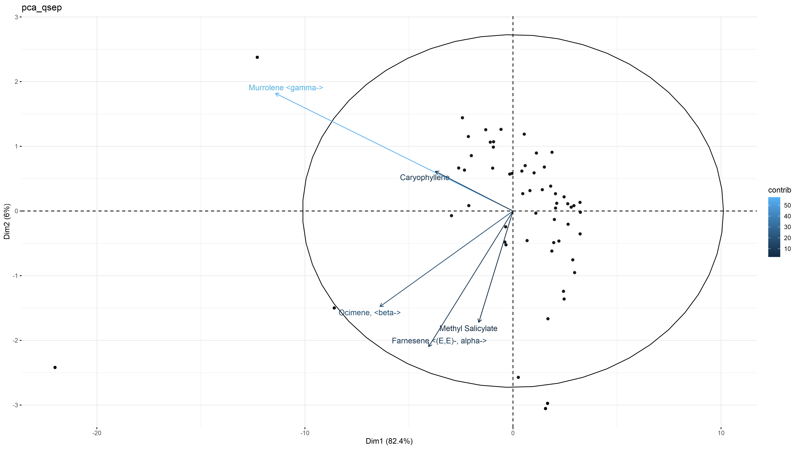
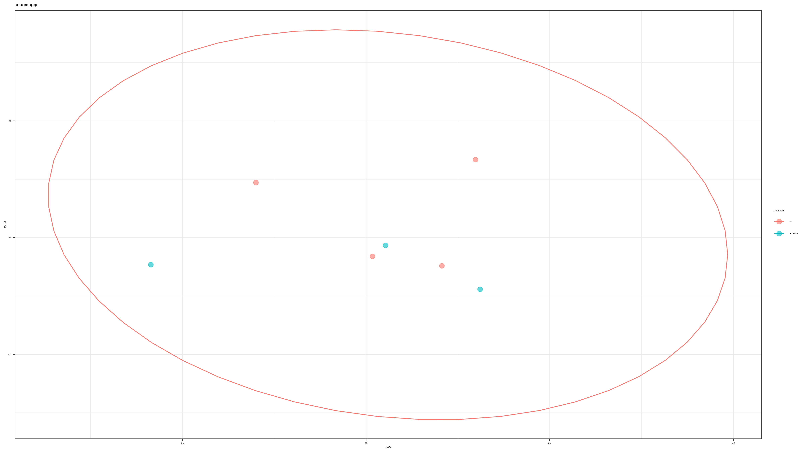
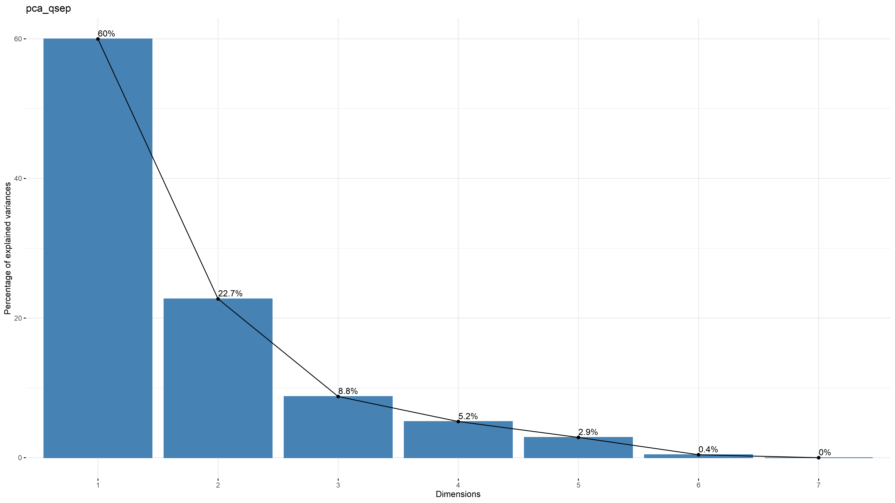
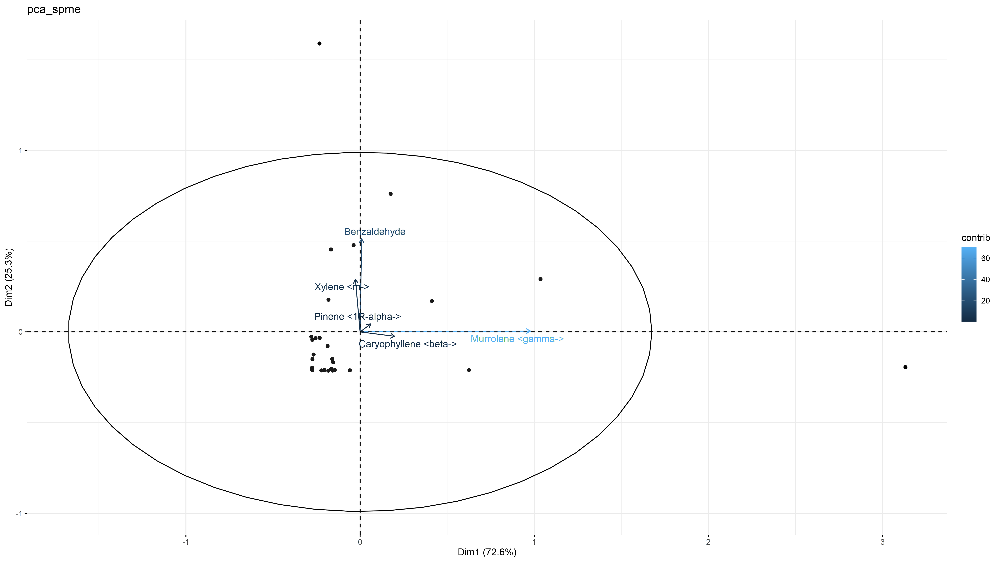
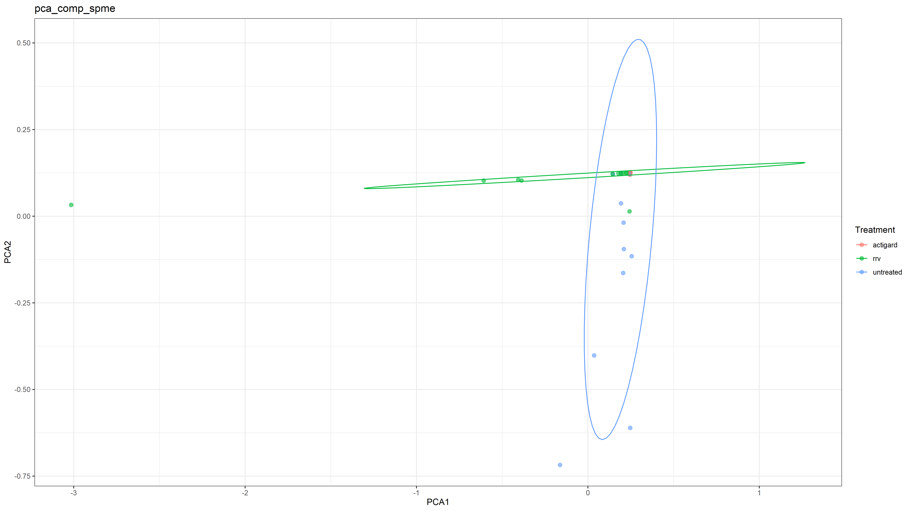
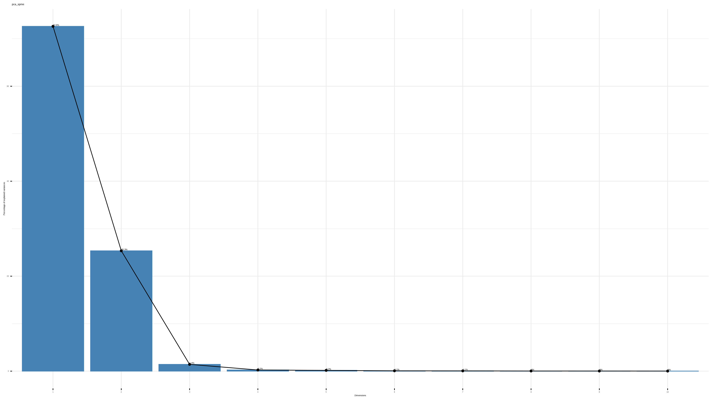
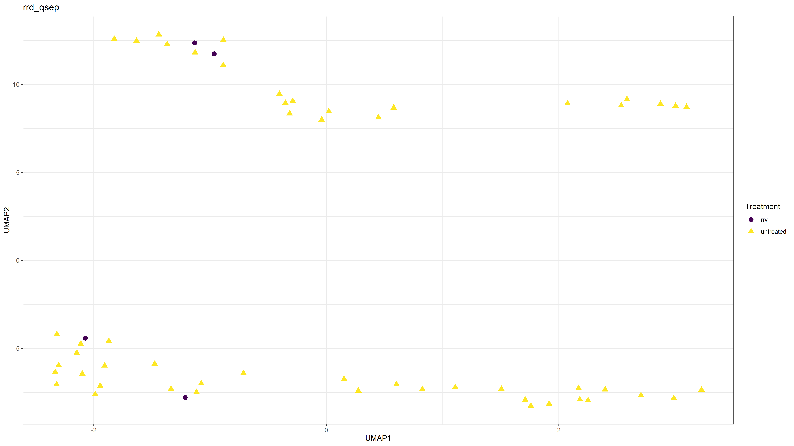
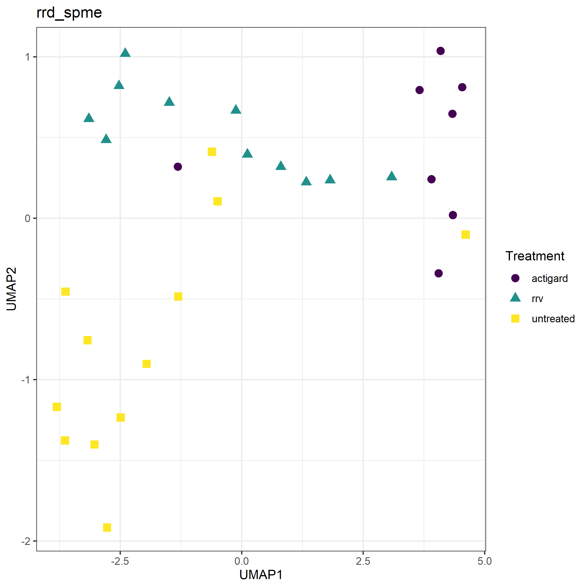
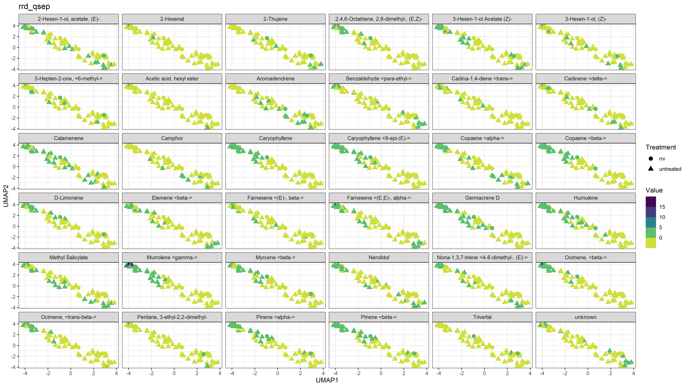
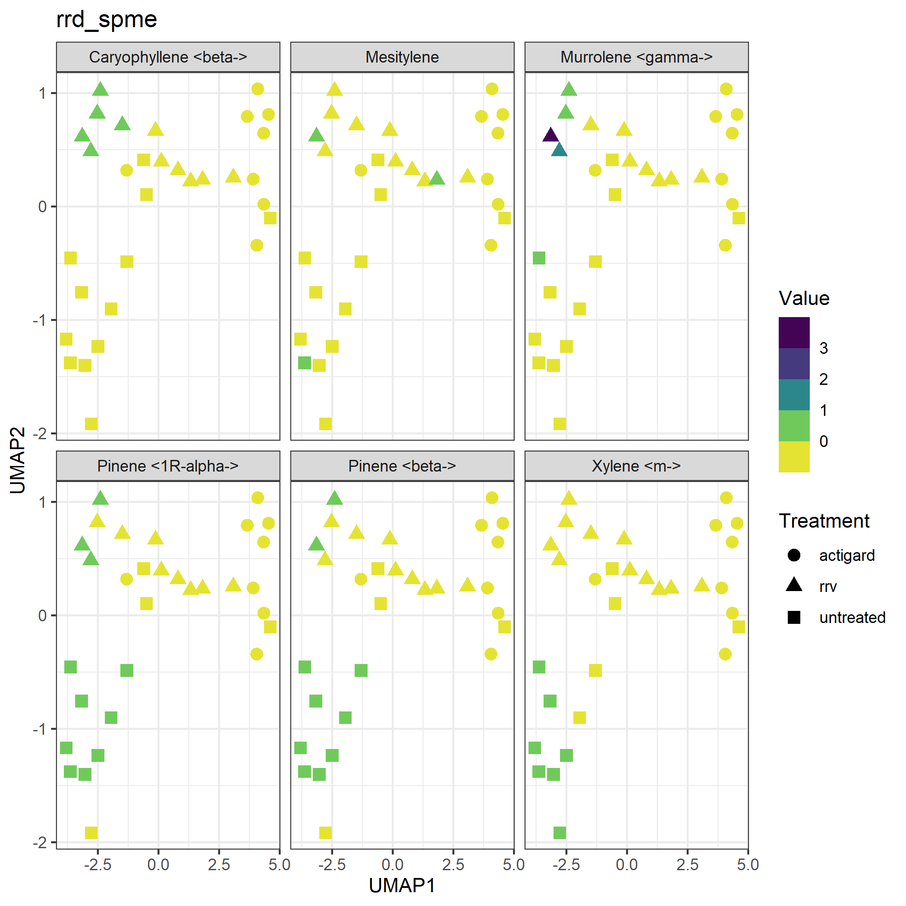

# CHANGES IN HEADSPACE VOLATILES FOR RRD-INFECTED ROSES {#chemeco}
## Introduction {#intro-swirskii-vocs}
### Rose Rosette Disease, Predatory mites and Plant Defensese: Why are *Amblyseius swirskii* attracted to infected roses? {#intro-swirskii}
Rose Rosette Virus (RRV) genus *Emaraviridae* is the the casual agent of Rose Rosette Disease (RRD), the most severe disease of roses [@Laney2011]. RRD is thought to have invaded the southeastern United States by the movement of its vector, the eriophyid mite, *Phyllocoptes fructiphilus* Kiefer (Trombidiformes: Eriophyidae), on multiflora rose (*Rosa multiflora* (Thunb)), as these organisms expanded their range from the US northwest, south and east towards the coast [@Amrine2002; @Otero-Colina2018; @Solo2020]. RRD is currently present throughout the US, and has been recently detected in Florida (@Fife2020, see *\@ref(survey-map-3)*). Infection with RRD creates witches’ brooms, rosetting, deforms flowers, increases prickle density, elongates shoots, reddens of plant tissues, causes die-back and ultimately plant death. Few management options are available to manage *P. fructiphilus*: Current mite control is achieved by removing infected roses and frequent pesticide applications [@UGA2018; @Olson2017; @Hong2012]. Nursery managers are interested in alternative and less expensive management options to combat *P. fructiphilus* and RRD. Predatory mites may have potential to fulfill this need [@Gerson2014; @Carrillo2015; @Farragut2010; @Gerson2003]: Many predatory mites species have been successfully integrated into pest management programs along with other biocontrol agents [@Freitas2021; @Bouagga2018; @Chow2010; @Midthassel2016], and certain pesticides [@Trumble1993; @Nicetic2001; @Fernandez2017]. Predatory mites from the family phytoseiidae live in close association with their host plants and are effective predators of many pest species [@Carrillo2015; @Farragut2010; @Gerson2003]. One of the most popular species of commercially-available phytoseiid mites is *Amblyseius swirskii* Athias-Henriot (Mesostigmata: Phytoseiidae)[@Calvo2014]. *A. swirskii* are considered to be a generalist species which feed on a variety of different arthropod pests [@McMurtry1997], including eriophyoid mites [@Park2010; @Park2011]. *A. swirskii* are able to be purchased in slow release sachets and safely shipped to growers that need them [@Calvo2014; @Lopez2016a; @Buitenhuis2014]. They are commonly used in biological control programs [@Calvo2014], partially because of their ability to survive on alternative food sources when pests are not present [@Nguyen2013]. They are also able to be released before pests arrive [@Kutuk2011], surviving on banker and native plants in the environment until pest populations increase [@Xiao2012]. This intimate relation with plants extends into the realm of chemical communications: Phytoseiid like *A. swirskii* have no eyes, instead relying on plant Volatile Organic Compounds (VOCs) to guide them to their prey [@Nomikou2005; @Boer2004a; @Gnanvossou2003]. Many plant VOCs are released when a plant is attacked by herbivores or pathogens [@Halitschke2007; @Sabelis1999; @Shulaev1997], the composition of which varies, depending on the plant species and type of damage/infection [@Maeda2006; @Qualley2008; @Boom2004; @Sabelis1999]. Methyl Salicylate (MeSA) is a VOC commonly produced under many types of pathogen attack [@Arimura2011; @Park2007]. This plant volatile is derived from Salicylic Acid (SA), an important plant hormone involved in activating the hypersensitive response to pathogens [@Vlot2009; @Park2007; @Gaffney1993; @Goodman1994]. Volatilized MeSA can initiate the the signalling pathway which primes a plant's immune system against attacks by pathogens [@Conrath2006; @Tieman2010; @Shulaev1997; @Gozzo2013]. Activation of these plant defenses creates long term resistance against future pathogen attack throughout the plant, through a mechanism known as systemic acquired resistance (SAR) [@Zhang2010; @Boller2009; @Vlot2009]. These same pathways can be induced in a plant by chemical analogues to SA, such as the benzothiadiazoles, including acibenzolar-S-methyl (ASM) [@Darolt2020; @Ziadi2001; @Tripathi2010; @Narusaka1999]. Inducing SAR can have various positive effects on disease prevention: SAR induction is often used to combat fungal diseases [@Suo2001; @Narusaka1999; @Xue1998; @Goy1992], and some studies have found that SAR induction and the hypersensitive response can disrupt the establishment of eriophyoid mites [@Bronner1991; @Bronner1991a; @Westphal1991]. Infested plants produced \textbeta-1,3-glucanase and chitinases, which were hypothesized to contribute to defenses against these eriophyoid mites [@Bronner1991a; @Ward1991a]. Similar increases in \textbeta-1,3-glucanase and chitinase activity was seen in roses treated with ASM, restricting the growth of a fungal pathogen [@Suo2001]. This suggests that SAR-induction in roses may have biological activity against eriophyoid mites, including *P. fructiphilus*. Unfortunately, inducing SAR can have negative effects on herbivores as well as predators [@Pappas2017; @Ataide2016; @Kant2015], which necessitates careful study of all organisms involved to create a successful pest management program. Our study was designed to investigate some of the interactions between plant volatiles and their effects on predatory mites: Preliminary data suggest that *A. swirskii* are attracted towards volatiles of RRD-infected plants. Similarly, MeSA has been reported to attract phytoseiid mites towards their prey to varying degrees of success [@James2004; @Boer2004a; @Boer2004b; @Gadino2011; @Gadino2012]. We hypothesized that infection with RRD was triggering the release of MeSA, creating *A. swirskii*'s attraction to the infected plants. Our studies were designed to investigate differences between RRV-infected and uninfected Pink Double Knock Out® roses and their volatiles, as well as the effects of SAR-induction on rose volatiles. The results will help inform future assays involving predatory mites and their prey-seeking behaviors in relation to rose RRV-infection status and the use of SAR-inducers for biological control of *P. fructiphilus*.


## Materials & Methods {#mm-vocs-olfact}
### Collection of headspace volatiles from roses {#mm-vocs}
Two methods for collecting headspace volatiles were explored, Volatile Collection Traps (VCT) and Solid Phase Micro Extraction (SPME).

#### Volatile Collection Trap Method {mm-vct}
The VCT method of collecting VOCs was based on a push-pull volatile collection method as illustrated in *\@ref(fig:vol-extract)*. Filtered air was provided by a 4-Port Positive Pressure Flow Out/Dual Y-Tubes & Volatile Collection System (Sigma Scientific, Micanopy, FL USA) [2.0 @pressure]. Air was blown through a teflon tube into a nylon oven bag (@brand) that had been dried in an  over at 50 &deg;C overnight. The bag would be sealed over the end of a flowering rose cane from from Double Knock Out® roses. Bags were allowed to inflate in order to detect excessive leaks, if no large leaks were detected, the corner of the bag would be cut and a VCT would be inserted. Traps were 3.5” with 28 ± 5 \si{\milli\gram} 80/100 mesh with HayeSep® Q adsorbent (Sigma Scientific, Micanopy, FL USA). Headspace volatiles were drawn through the filter by a vacuum line operating at [1.0 @pressure]. Bags were left at positive pressure during volatile collection for 24 hours. The VOCs adsorbed inside the VCT filter were then eluted with 150 \si{\micro\litre}s of dichloromethane into a glass mandrel, then 5 \si{\micro\liter} of 1 \si{\micro\liter}/\si{\gram} Nonyl Acetate were added to each solution as an internal standard. 

#### Solid Phase Micro Extraction Method {mm-spme}
The SPME method was created to overcome a specific study limitation: after the detection of *P. fructiphilus* in Florida, NFREC researchers were restricted from working with RRD-infected plants. In order to obtain volatile extractions from RRD-infected roses, 


Extractions from VCT and SPME were then injected into a paired Gas Chromatography-Mass Spectrometer (GC-MS) (ThermoFisher Trace 1300) and their spectra were analyzed with Chromeleon 7 software (ThermoFisher Scientific, ). Compounds were identified by comparisons of mass spectra to spectral databases for confirmation. 


Treatments will be the following:

1.	Uninfected Pink Double Knock Out® roses
1.	RRD infected Pink Double Knock Out® roses
1.	SAR-induced uninfected Pink Double Knock Out® roses
1.	SAR-induced RRD-infected Pink Double Knock Out® roses

A group of 20 plants will be isolated. Volatiles from the 20 plants will be collected as a baseline (already collected). Then half of the plants will be SAR inducted by bi-weekly spray applications of Acibenzolar-S-Methyl. Subsequently half of the remaining plants (5 control and 5 SAR-induced plants) will be grafted with RRV-infected buds to inoculate them with the virus [@Doudrick1987]. Volatiles will be collected bi-monthly following SAR-induction and RRV application.  


```{r voc-qsep, fig.height=8, fig.width=10.5, fig.align="center", cache = TRUE, cache.extra = file.mtime('figure/vol-extract-qsep.tif'), fig.cap="Volatile collection system for rose headspace sampling. An inert nylon bag is placed around the canes of interest, an air inlet is inserted and sealed at the base with a zip-tie to form a relatively air-tight seal around the base of the rose canes. Once the bag begins to inflate, a small hole is cut in the corner of the bag and a filter inserted and sealed with a zip-tie to form a second seal. The exterior end of the filter is attached to a vacuum airline set to allow for constant static pressure on the bag from inflation. The rose is then left for 24 hours, the filter is eluted with Dichloromethane into a gas chromatography vial, 1 \\si{\\micro\\liter} of Nonyl Acetate is added as an internal standard, and then the sample is processed using a coupled Gas Chromatography - Mass Spectrometer (GC-MS) for chemical identification.", out.width="80%", warning=FALSE}
grid::grid.raster(tiff::readTIFF('figure/vol-extract-qsep.tif'))
```

```{r voc-spme, fig.height=8, fig.width=10.5, fig.align="center", cache = TRUE, cache.extra = file.mtime('figure/vol-extract-spme.tif'), fig.cap="Volatile collection system for rose headspace sampling. An inert nylon bag is placed around the canes of interest, an air inlet is inserted and sealed at the base with a zip-tie to form a relatively air-tight seal around the base of the rose canes. Once the bag begins to inflate, a small hole is cut in the corner of the bag and a filter inserted and sealed with a zip-tie to form a second seal. 1 \\si{\\micro\\liter} of Nonyl Acetate is added as an internal standard, and then the sample is processed using a coupled GC-MS for chemical identification.", out.width="70%", warning=FALSE}
grid::grid.raster(tiff::readTIFF('figure/vol-extract-spme.tif'))
```


### Two arm olfactometer assays {#mm-olfact}
*Amblyseius swirskii* Athias-Henriot will be reared according to procedures adapted from @Sarwar2017: *A. swirskii* mites will be reared in growth chambers set at 25 &deg;C with 70\% RH and 16:8 hours light:dark. Colonies will be kept in vermiculite-filled plastic containers, which will be suspended on plastic pylons in a moat of water with a surfactant to break the surface tension, preventing mite escape. Colonies will be fed every 2 days with bee pollen.

1. We will analyze differences in headspace VOCs extracted from both RRV-infected and uninfected roses using paired Gas Chromatography-Mass Spectrometry and preform a Principal Component Analysis to determine which compounds are good candidates for testing *A. swirskii* attraction.

1. We will record the reponses of *A. swirkii* mites with two-arm olfactometer assays to determine the attractiveness to the selected compounds and analyze the results using \\chi-squared tests.

1. If there are significant differences in *A. swirskii* attraction towards single compounds or blends with Y-tube assays, we will preform a series of tests with four-arm olfactometer assays to compare *A. swirskii* choices between different attractive compounds.


1. Count the number of mites which choose to walk towards volatiles from RRV-infected roses rather than the control (untreated filtered air) with two-arm olfactometer assays analyzed using [@appropiatestaticalmethod] tests. Mites which significantly choose RRV-infected rose volatiles over the control will be considered "responsive" and used for further assays.
1. Measure amounts of headspace volatiles extracted from both RRV-infected and uninfected roses. Paired Gas Chromatography-Mass Spectrometry will measure the quantity and determine the types of volatiles released using [@appropiatestaticalmethod] tests.
1. Count the number of responsive mites which choose to walk towards synthetic volatile blends rather than the control (untreated filtered air) with two-arm olfactometer assays analyzed using [@appropiatestaticalmethod].
1. Count the number of responsive mites which choose to walk towards synthetic volatile blends rather than volatiles from RRV-infected roses or controls (untreated filtered air) with four-arm olfactometer assays analyzed using [@appropiatestaticalmethod].
1. Compare populations of *P. fructiphilus*, phytoseiid mites and RRV infection in field trials in Griffin, Georgia with randomized block experiments comparing synthetic lures to controls without lures and analyzing data with [@appropiatestaticalmethod].


## Results {#results-vocs-olfact}
### Volatile differences between infected, healthy and induced roses {#results-vocs}
```{r qsep-vocs, fig.height=8, fig.width=10.5, fig.align="center", out.extra='angle=90', cache = TRUE, cache.extra = file.mtime('figure/rrv_volatiles_biplot_var_pca_qsep.png'), fig.cap="beans.", out.width="100%", warning=FALSE}

```

```{r qsep-vocs-compares, fig.height=8, fig.width=10.5, fig.align="center", out.extra='angle=90', cache = TRUE, cache.extra = file.mtime('figure/rrv_volatiles_comparison_pca_comp_qsep.png'), fig.cap="beans.", out.width="100%", warning=FALSE}

```

```{r qsep-vocs-scree, fig.height=8, fig.width=10.5, fig.align="center", out.extra='angle=90', cache = TRUE, cache.extra = file.mtime('figure/rrv_volatiles_screeplot_pca_qsep.png'), fig.cap="beans.", out.width="100%", warning=FALSE}

```


```{r spme-vocs, fig.height=8, fig.width=10.5, fig.align="center", out.extra='angle=90', cache = TRUE, cache.extra = file.mtime('figure/rrv_volatiles_biplot_var_pca_spme.png'), fig.cap="beans.", out.width="100%", warning=FALSE}

```

```{r spme-vocs-compares, fig.height=8, fig.width=10.5, fig.align="center", out.extra='angle=90', cache = TRUE, cache.extra = file.mtime('figure/rrv_volatiles_comparison_pca_comp_spme.png'), fig.cap="beans.", out.width="100%", warning=FALSE}

```

```{r spme-vocs-scree, fig.height=8, fig.width=10.5, fig.align="center", out.extra='angle=90', cache = TRUE, cache.extra = file.mtime('figure/rrv_volatiles_screeplot_pca_spme.png'), fig.cap="beans.", out.width="100%", warning=FALSE}

```

```{r qsep-vocs-umap, fig.height=8, fig.width=10.5, fig.align="center", out.extra='angle=90', cache = TRUE, cache.extra = file.mtime('figure/rrv_volatiles_umap_rrd_qsep.png'), fig.cap="beans.", out.width="100%", warning=FALSE}

```

```{r spme-vocs-umap, fig.height=8, fig.width=10.5, fig.align="center", out.extra='angle=90', cache = TRUE, cache.extra = file.mtime('figure/rrv_volatiles_umap_rrd_spme.png'), fig.cap="beans.", out.width="100%", warning=FALSE}

```


```{r qsep-vocs-umap-chems, fig.height=8, fig.width=10.5, fig.align="center", out.extra='angle=90', cache = TRUE, cache.extra = file.mtime('figure/rrv_volatiles_umap_chems_rrd_qsep.png'), fig.cap="beans.", out.width="100%", warning=FALSE}

```

```{r spme-vocs-umap-chems, fig.height=8, fig.width=10.5, fig.align="center", out.extra='angle=90', cache = TRUE, cache.extra = file.mtime('figure/rrv_volatiles_umap_chems_rrd_spme.png'), fig.cap="beans.", out.width="100%", warning=FALSE}

```


### *A. swirskii* attraction to VOCs {#results-olfact}
```{r aswir-mesa-lim, fig.height=8, fig.width=10.5, fig.align="center", cache = TRUE, cache.extra = file.mtime('figure/rrv_graph_olfact_vocs.png'), fig.cap="\\textit{Amblyseius swirskii*} attraction to Methyl Salicylate (MeSA) and D-L Limonene vs Filtered Air at concentrations of 1 g/\\si{\\micro\\liter}. 100 \\si{\\micro\\liter}s of chemical was applied to 3 cm of dental wick inside of erlenmeyer flasks inline with the filtered air from the olfactometer. Asterisks represent significant differences as calculated by $\\chi^2$ contingency table tests for given probabilities. N.S. = not significant. MeSA vs Air: $\\chi^2 = 0.48649$, $df = 1$, $\\alpha = 0.05$, $p-value = 0.4855$. D-L Limonene vs Air: $\\chi^2 = 0.94737$, $df = 1$, $\\alpha = 0.05$, $p-value = 0.3304$.", out.width="100%", warning=FALSE}
knitr::include_graphics('figure/rrv_graph_olfact_vocs.png')
```

```{r aswir-rrd, fig.height=8, fig.width=10.5, fig.align="center", fig.cap = "\\textit{Amblyseius swirskii} attraction to healthy and Rose Rosette Virus-infected Pink Double Knock Out® roses. Asterisks represent significant differences as calculated by $\\chi^2$ contingency table tests for given probabilities. N.S. = not significant. RRV-infected vs Healthy Rose: $\\chi^2 = 9.33$, $df = 1$, $\\alpha = 0.05$, $p-value = 0.002$. Filtered Air vs Healthy Rose: $\\chi^2 = 0.47$, df $=$ 1, $\\alpha = 0.05$, $p-value = 0.4913$.", out.width="100%", warning=FALSE}
knitr::include_graphics('figure/rrv_graph_olfact_rose.png')
```


- Identify which RRV-infected rose compounds are attracting *A. swirskii*

## Discussion {#dis-vocs-olfact}

Olfactometers are considered a useful way to determine predatory mite attraction to different prey items [@Janssen1990]