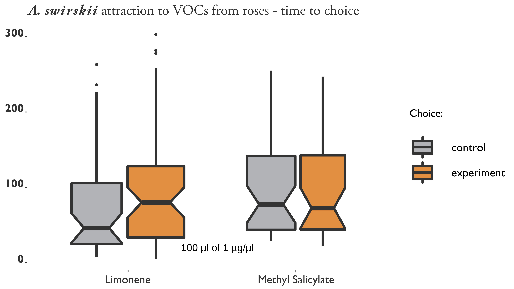
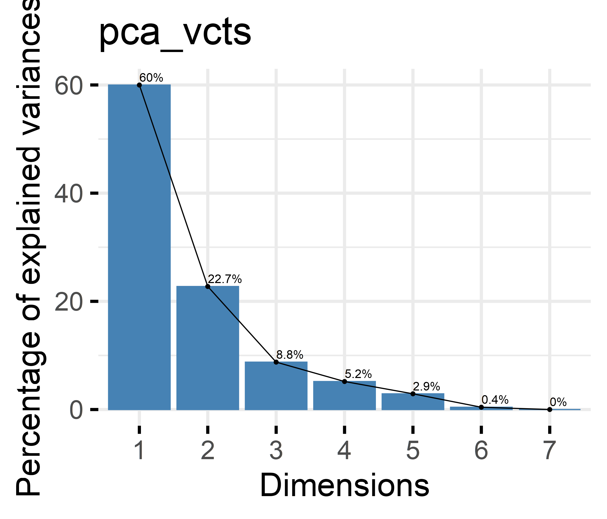
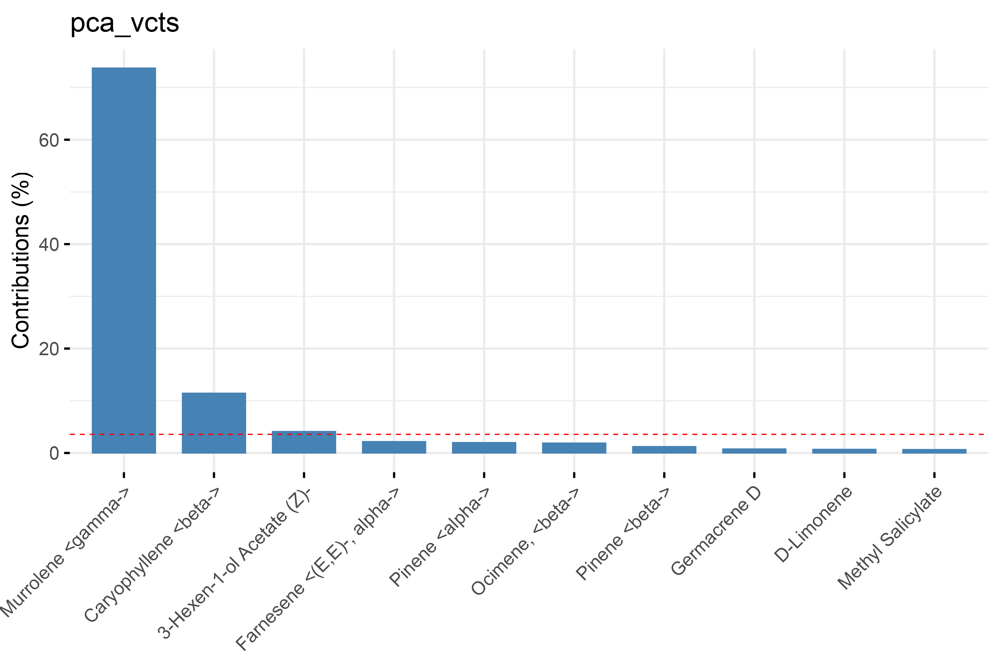
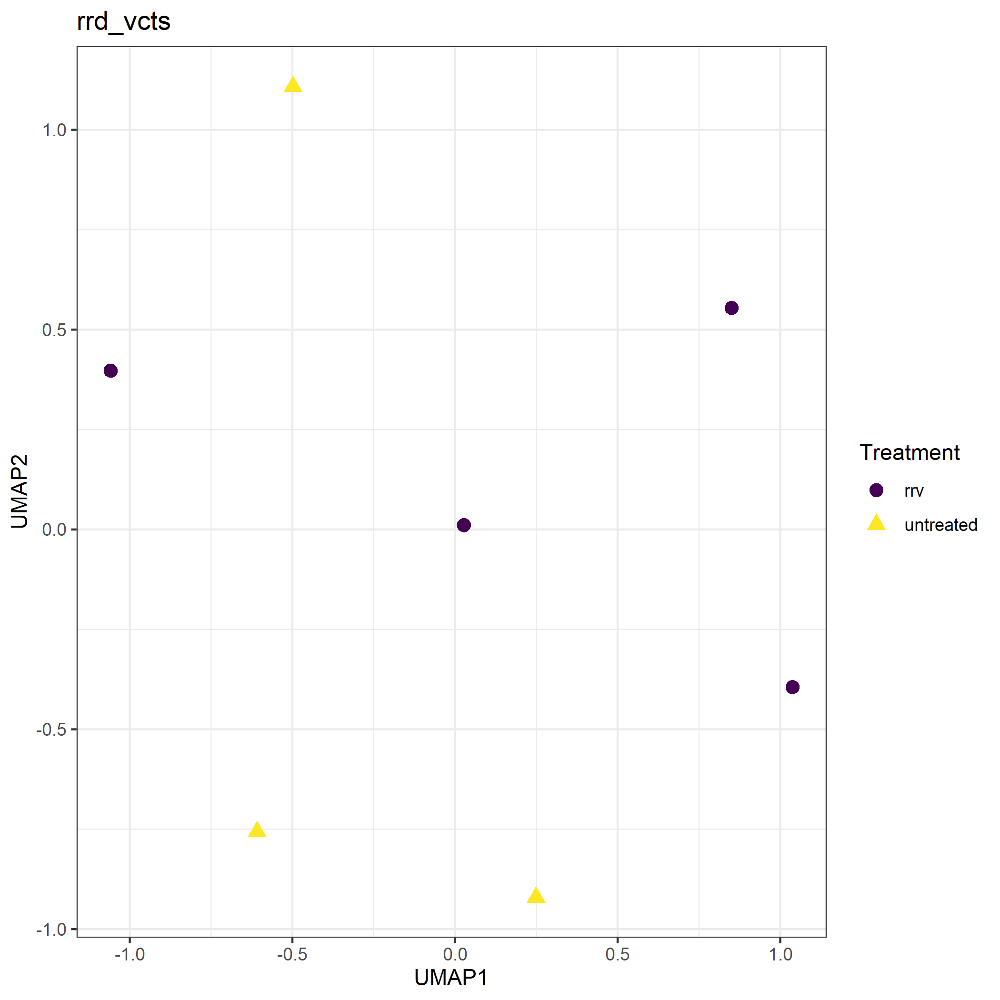
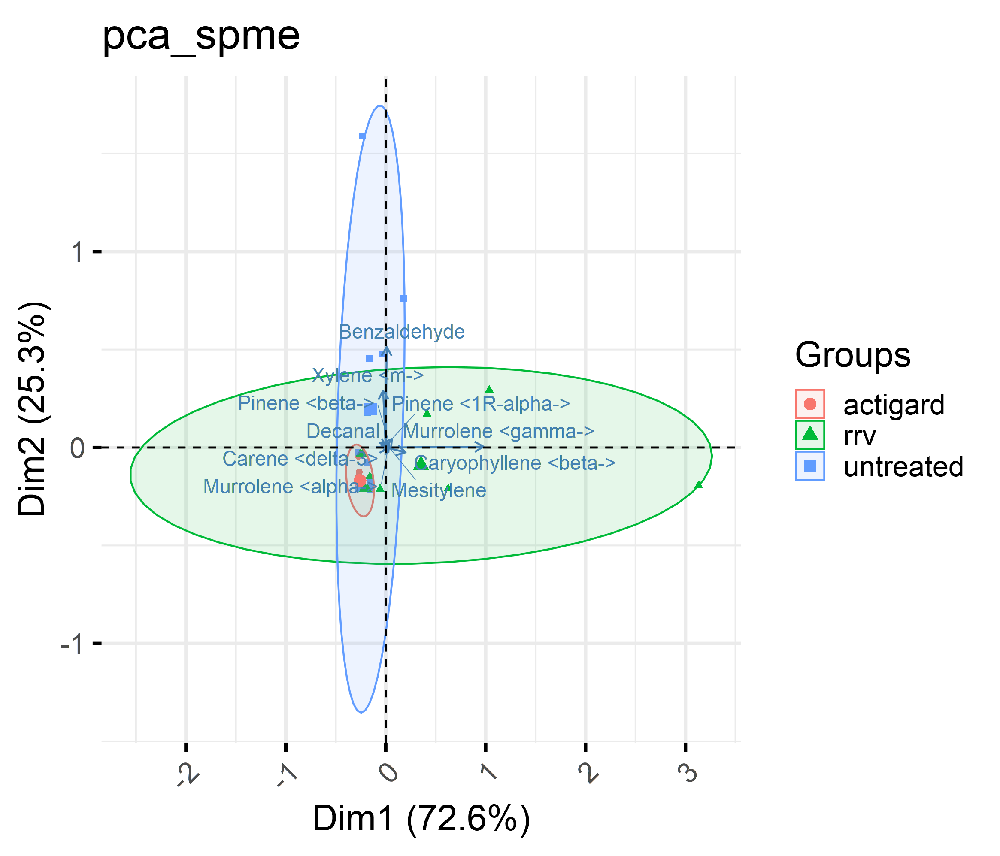
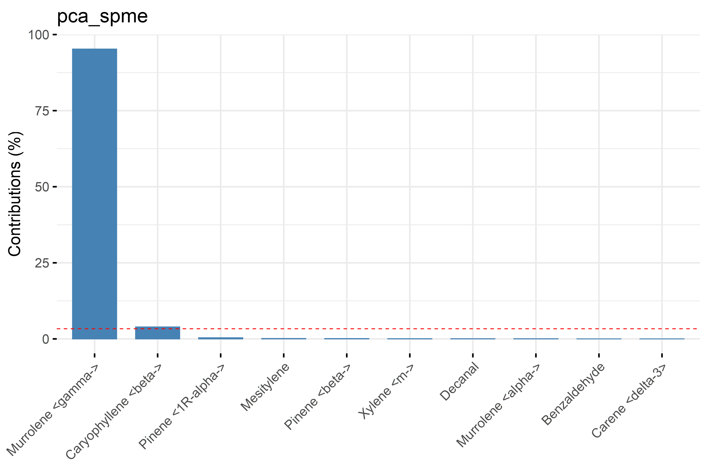

# CHANGES IN HEADSPACE VOLATILES FOR ROSES INFECTED WITH ROSE ROSETTE DISEASE

## Introduction

### Plant defenses and volatiles: why are *Amblyseius swirskii* attracted infected roses?

Rose Rosette Virus (RRV) genus *Emaraviridae* is the the casual agent of Rose Rosette Disease (RRD), the most severe disease of roses [@Laney2011]. RRD is thought to have invaded the southeastern United States by the movement of its vector, the eriophyid mite, *Phyllocoptes fructiphilus* Kiefer (Trombidiformes: Eriophyidae), on multiflora rose (*Rosa multiflora* (Thunb)), as these organisms expanded their range from the US northwest, south and east towards the coast [@Amrine2002; @Otero-Colina2018; @Solo2020]. RRD is currently present throughout the US, and has been recently detected in Florida [@Fife2020]. Infection with RRD creates witches’ brooms, rosetting, deforms flowers, increases prickle density, elongates shoots, reddens of plant tissues, causes die-back and ultimately plant death. Few management options are available to manage *P. fructiphilus*:  Current mite control is achieved by removing infected roses and frequent pesticide applications [@UGA2018; @Olson2017; @Hong2012]. Nursery managers are interested in additional management options to combat *P. fructiphilus* and RRD. Induced plant defenses offer an important potential role in the prevention of disease and control of insect pests [@Walling2000; @Farmer2016]. When plants detect elicitors from a pathogen or an herbivore [@Boller2009; @Mithoefer2008], they respond by upregulating intercellular Salicylic Acid (SA), initiating a process known as systemic acquired resistance (SAR) [@Gaffney1993; @Park2007; @Vlot2009; @Goodman1994]. Induction of SAR helps to provide protection from herbivory as well as pathogen damage [@Babu2021; @Doungous2021; @Anfoka2000; @Cole1999]. Inducing SAR can have various positive effects on disease prevention: SAR induction is often used to combat fungal diseases [@Suo2001; @Narusaka1999; @Xue1998; @Goy1992], and some studies have found that SAR induction and the hypersensitive response can disrupt the establishment of eriophyoid mites [@Bronner1991; @Bronner1991a; @Westphal1991]. Infested plants produce \textbeta-1,3-glucanase and chitinases, which were hypothesized to contribute to plant defenses against eriophyoid mites [@Bronner1991a; @Ward1991a]. Similar increases in \textbeta-1,3-glucanase and chitinase activity was seen in roses treated with acibenzolar-S-methyl (ASM), a benzothiadiazole known used to induce SAR [@Doungous2021; @Darolt2020; @Cole1999]. Applications of ASM have also been reported to help restrict the growth of fungal pathogens in roses [@Suo2001], and purportedly control populations of whiteflies [@Doungous2021; @Correa2005] as well as aphids [@Costa2006]. We hypothesize that SAR-induction in roses may be able to reduce populations of *P. fructiphilus* as well. Unfortunately, inducing SAR can have negative effects on herbivores as well as predators [@Pappas2017; @Ataide2016; @Kant2015], which necessitates careful study of all organisms involved in the system to create a successful pest management program. A handful of studies tested *Amblyseius swirskii* Athias-Henriot (Mesostigmata: Phytoseiidae), for their suitability to control pests on ornamental roses [@Hoogerbrugge2014; @Hoogerbrugge2011; @Chow2010; @Alipour2019; @Alipour2016]. *A. swirskii* is one of the most popular species of commercially-available phytoseiid mites [@Calvo2014], but has been seldom used in ornamental crops [@Buitenhuis2015]. *A. swirskii* are considered to be a generalist species which feed on a variety of different arthropod pests, including thrips, whiteflies, and occasionally other mites [@Hoogerbrugge2014; @Bolckmans2005; @McMurtry1997], and there is growing interest in using them on ornamental crops to control pests commonly encountered in roses [@Schoeller2020; @Buitenhuis2015; @Chow2010]. Phytoseiid like *A. swirskii* have no eyes, instead relying on plant VOCs to guide them to their prey [@Nomikou2005; @Boer2004a; @Gnanvossou2003]. Many plant VOCs are released when a plant is attacked by herbivores or pathogens [@Halitschke2007; @Ozawa2000; @Sabelis1999; @Shulaev1997], the composition of which varies, depending on the plant species and type of damage/infection [@Maeda2006; @Qualley2008; @Boom2004; @Sabelis1999]. Volatiles also deter herbivores or attract predators [@Pichersky2002], so it important to understand which chemicals may manipulate the behaviors of released biological agents in the same system. Studies by @Farber2019 found differences between healthy and RRV-infected roses using Raman spectroscopy at a spectral band of 1720 \si{\centi\meter}^{−1}$, a spectral region associated with carbonyl stretching vibrations. This indicates the presence of carbonyl compounds, a group functional group commonly seen in many organic compounds, including esters, aldehydes, carboxylic acids, and ketones. @Farber2019 suggested that bands may be evidence for the presence of the carboxylic compounds Jasmonic Acid and Salicyclic Acid, due to the association of these plant hormones with plant defenses against pathogens [@Verma2016]. When SAR is induced, SA becomes methylated and converts to Methyl Salicylate (MeSA), a volatile signal which helps to propagate resistance throughout the plant [@Shulaev1997]. This chemical is known to be attractive to phytoseiid mites towards their prey with varying degrees of success [@James2004; @Boer2004a; @Boer2004b; @Gadino2011; @Gadino2012], meaning that applications of ASM in the field may interfere with their efficacy as biological control agents of rose. Fortunately, the VOCs released from infected or induced plants can be analyzed using the methods of paired Gas Chromatography - Mass Spectrometry to determine the quantity and quality of plant headspace volatiles. Once the primary VOCs are identified, olfactometers assays can be used a preliminary method to screen the attractiveness of various VOCs to predatory mites [@Halitschke2007; @Nomikou2005; @Janssen1990; @Dicke1988]. With that in mind, our studies were designed to investigate differences between RRV-infected and uninfected Pink Double Knock Out® roses and their volatiles, as well as the effects of SAR-induction on rose volatiles. We hypothesized that *A. swirskii* would be attracted to infected roses and SAR-induced plants due to increases in defensive volatiles consistent with SAR-induction, including MeSA. Our results should help provide preliminary understanding of the effects of SAR-induction and RRV infection status on the VOCs released from roses, and determine any effects on *A. swirskii* behavior. An important limitation of the study was the inability to bring bring RRV-infected plants or *P. fructiphilus* into the lab for volatile extractions. After finding *P. fructiphilus* in northern Florida, our lab was asked to destroy graft-inoculated roses. Due to federal quarantines, the majority of volatiles samples of infected roses had to be taken in the field in Athens, GA, where the RRV pathogen is present in the landscape. Future studies will need to develop additional methods to overcome these restrictions, or should be done in areas where manipulations of *P. fructiphilus* and RRV are permitted in the lab for better environmental control of volatile collection.


## Materials & Methods

### Which volatiles are most attractive?: two-arm olfactometer assays

*A. swirskii* mites were purchased online as mini sachets with hooks (Ambly-S, Arbico Organics, Oro Valley, AZ, USA). Sachets would be emptied into a plastic container before assays in order to facilitate finding mites. The mite colony was fed every 2 days with bee/pine pollen. 

Filtered air was provided by a 4-Port Positive Pressure Flow Out/Dual Y-Tubes & Volatile Collection System (Sigma Scientific, Micanopy, FL USA) at 0.3 \si{\litre}s/min for each arm of the Y-tube olfactometer. Air was humidified by passing air through a gas washing bubbler flask filled with water. The bubbler flasks were placed inline before any volatile sources and the arms of the Y-tube. Air was blown through a teflon tube into a nylon oven bag (GoBeGreen Turkey Oven Bags, GoBeGreen, Los Angeles, CA, USA.) that had been dried in an  over at 50 &deg;C overnight. The bag would be sealed over the end of a flowering rose cane from Pink Double Knock Out® roses. Bags were allowed to inflate in order to detect excessive leaks, if no large leaks were detected, outlet air lines would be connected to the inlet of one arm of the Y-tube. In this manner, comparisons were made between an empty bag of air and a healthy rose, as well as uninfected roses to RRV-infected roses. The olfactometer was held vertically with a lab stand, and illuminated with a 60 watt household 5000K white LED lightbulb. One arm of the Y-tube would be labelled as the experiment side, and the other arm would be the control chemical. Air lines would be switched after every 5 assays to avoid side bias in the Y-tube. After every 10 assays, the Y-tube was switched for a clean one. Individual *A. swirksii* mites were transferred to the mouth of the Y-tube olfactometer using a fine tipped paintbrush. Assays were recorded for 5 minutes. If a mite entered midway into the arm of an olfactometer, the time and label of the tube would be recorded, the mite removed, and the assay would end. Mites which failed to do so were considered to have made 'no choice' and were removed.

Additional olfactometer experiments were conducted after collecting and identifying headspace volatiles of interest from roses *\@ref(voc-collect)*. Available synthetic volatiles were selected from the top ten chemicals seen in the contributions table from the PCA analysis of rose headspace volatiles (*\@ref(tab:spme-contrib-table), \@ref(tab:vcts-contrib-table)*). Assays of synthetic volatiles were conducted diluting a selected VOC to with dicholoromethane to a concentration of 1 \si{\micro\gram}/\si{\micro\liter}. The solution was then applied to a 3 \si{\centi\metre} dental wick. Dental wicks were placed in otherwise empty inline gas washing bubbler flasks, and left for 5 minutes before beginning an assay. The synthetic VOCs MeSA and DL-Limonene were tested. 100 \si{\micro\litre} of dicholoromethane was used as a control.

Responses of *A. swirkii* were compared with $\chi^2$ tests using R version 4.1.1 [@RCT2021].

### Collection of headspace volatiles from roses {#voc-collect}

Two methods for collecting headspace volatiles were explored, Volatile Collection Traps (VCT) and Solid Phase Micro Extraction (SPME).

#### Volatile collection trap methodology

The VCT method of collecting VOCs was based on a push-pull volatile collection method as illustrated in *\@ref(fig:voc-vcts)*. Filtered air was provided by a 4-Port Positive Pressure Flow Out/Dual Y-Tubes & Volatile Collection System (Sigma Scientific, Micanopy, FL USA) at 0.2 \si{\litre}s/min. Assays with roses involved bagging the roses as previously described, but the corner of the bag would be cut and a VCT would be inserted. Traps were 3.5” with 28 ± 5 \si{\milli\gram} 80/100 mesh with HayeSep® Q adsorbent (Sigma Scientific, Micanopy, FL USA). Headspace volatiles were drawn through the filter by a vacuum line operating at 0.1 \si{\litre}/min. Bags were left at positive pressure during volatile collection for 24 hours. The VOCs adsorbed inside the VCT filter were then eluted with 150 \si{\micro\litre} of dichloromethane into a glass headspace vial, then 5 \si{\micro\liter} of 1 \si{\micro\liter}/\si{\gram} Nonyl Acetate were added to each solution as an internal standard. A baseline of 53 headspace VOC extractions were collected from 20 mite-free, one-year-old, uninfected Pink Double Knock Out® roses growing in 3 gallon buckets, 16:8 Light:Dark cycles. Extractions were conducted for ~12 hours. 4 extractions were completed from graft-inoculated RRV-positive roses [@Doudrick1987], grown in a quarantine greenhouse under similar parameters. Headspace samples of the RRV-infected roses were taken prior to the quarantine measures requested by federal agencies. Samples were taken at ~20 &deg;C and RH 50-66\%.

#### Solid phase micro extraction (SPME) methodology

The Solid Phase Micro Extraction (SPME) field method was created to overcome a specific study limitation: shortly after the detection of *P. fructiphilus* in Florida, NFREC researchers were restricted from working with RRV-infected plants by state agencies to prevent the introduction of the virus to the mites found in the region. In order to obtain VOCs from RRV-infected roses, extractions were taken *in situ* from roses in the landscape of Athens, GA *\@ref(fig:voc-spme)*. The SPME procedure was similar to the VCT method with a few exceptions: Oven bags were left over rose canes and flowers for an hour before extraction would begin. Filtered air was provided by a Kobalt 24v cordless high-volume inflator (Lowe's, Mooresville, NC, USA) attached to a inline carbon block filter (Clear$_2$O® RV and Marine Inline Water Filter - CRV2006, Miramar, FL, USA). Air flow was adjusted to 0.2 \si{\litre}/min with a variable flow meter (Sho-Rate™ Series Glass Tube Variable Area Flow Meter, model 1350CB1F, Brooks Instruments, Hatfield, PA, USA) and blown through a teflon tube into an oven bag surrounding the rose flowers and canes to agitate the headspace VOCs. An edge of the oven bag was removed and a disposable air filter/check valve inserted to prevent the oven bag from bursting due to over pressure. Once the bag was in place, an aluminum rod with burette holder/clamps was driven into the ground near the rose to be sampled, and the manual SPME injector (Supelco, Inc, Sigma-Aldrich, Bellefonte, PA, USA) clamped so that the needle of the fiber holder could pierce the inflated bag. Before VOC extraction, 1 \si{\micro\liter} of Nonyl Acetate was added to the bag as an internal standard. Extractions were done for 20 minutes. Injections were done using 24 Ga Stableflex SPME fibers with 50/30 \si{\micro\meter} DVB/CAR/PDMS coatings (Supelco, Inc, Sigma-Aldrich, Bellefonte, PA, USA). For SPME sampling, headspace VOCs were collected from 11 untreated roses from *P.fructiphilus*-infested roses in the landscape of Tallahassee, FL. 8 roses from the same location were treated with Actigard® 50WG (Syngenta, Greensboro, NC, USA), (ASM) 100 \si{\milli\gram}/\si{\liter} for 12 weeks before sampling, and 11 RRV-infected roses were sampled from three locations in Athens, GA on May 28th, 2021. Plants were of unknown age, growing in full sun, with symptoms of RRD. The daily temperature of the day of extractions ranged from 24-31 &deg;C, RH 46-74\%.

#### Analysis of headspace data

Headspace extractions from VCTs and SPME were injected into a paired Gas Chromatography-Mass Spectrometer (GC-MS) (ThermoFisher Trace 1310 Gas Chromatograph and ThermoFisher ISQ QD Single Quadrupole Mass Spectrometer, (ThermoFisher Scientific, Waltham, Massachusetts) and their spectra were analyzed with Chromeleon™ 7 Chromatography Data System software (ThermoFisher Scientific, Waltham, Massachusetts). GC-MS Injections were for 38 mins with 5 &deg;C increase per minute. Volatile collection equipment was cleaned according to manufacturer's instructions. Compounds were identified by comparisons of mass spectra to spectral databases for confirmation. The ratio of the area under the curve for each chemical peak was then divided by the area of the internal standard (Nonyl Acetate). These values were used for Principal Component Analysis (PCA) with the factoextra package [@Kassambara2020a], and Uniform Manifold Approximation and Projection (UMAP) [@Konopka2020a] in R version 4.1.1 [@RCT2021], to visualize any clustering of data and to determine which VOCs are of interest. 
<!-- The first three samples of VCTs uninfected rose data was averaged for the comparison to the four infected rose samples in order to balance the data. -->


```{r voc-vcts, cache = TRUE, cache.extra = file.mtime('figure/vol-extract-vct.tif'), fig.cap="Volatile collection trap method for rose headspace sampling. An inert nylon bag is placed around the canes of interest, an air inlet is inserted and sealed at the base with a zip-tie to form a relatively air-tight seal around the base of the rose canes. Once the bag begins to inflate, a small hole is cut in the corner of the bag and a filter inserted and sealed with a zip-tie to form a second seal. The exterior end of the filter is attached to a vacuum airline set to allow for constant static pressure on the bag from inflation. The rose is then left for 24 hours, the filter is eluted with Dichloromethane into a gas chromatography vial, 1 \\si{\\micro\\liter} of Nonyl Acetate is added as an internal standard, and then the sample is processed using a coupled Gas Chromatography - Mass Spectrometer (GC-MS) for chemical identification.", fig.scap="Volatile collection trap method for rose headspace sampling", warning=FALSE}
grid::grid.raster(tiff::readTIFF('figure/vol-extract-vct.tif'))
```

```{r voc-spme, cache = TRUE, cache.extra = file.mtime('figure/vol-extract-spme.tif'), fig.cap="Solid phase micro extraction (SPME) method for rose headspace sampling. An inert nylon bag is placed around the canes of interest, an air inlet is inserted and sealed at the base with a zip-tie to form a relatively air-tight seal around the base of the rose canes. Once the bag begins to inflate, a small hole is cut in the corner of the bag and a filter inserted and sealed with a zip-tie to form a second seal. 1 \\si{\\micro\\liter} of Nonyl Acetate is added as an internal standard. The needle of a SPME fiber holder is used to puncture the bag, and the fiber is exposed to the headspace for 20 minutes to adsorb volatiles to the special coating of the SPME fiber. The fiber is then injected into a coupled GC-MS for chemical identification.", fig.scap="Solid phase micro extraction (SPME) method for rose headspace sampling", fig.dim = c(8, 10), out.width = "90%", warning=FALSE}
grid::grid.raster(tiff::readTIFF('figure/vol-extract-spme.tif'))
```


## Results

### *Amblyseius swirskii* were not attracted or repelled by the VOCs tested

*A. swirskii* were not significantly selective for MeSA at the concentrations we used, but mites were significantly more likely to make choices when testing with roses. DL-Limonene created more choices than other treatments. (*\@ref(fig:aswir-mesa-lim)*). Choices for DL-Limonene vs. control and Filtered Air vs. Healthy Roses were not significantly different, but *A. swirskii* mites were significantly more attracted to RRV-infected roses.

```{r aswir-rrd, fig.cap = "\\textit{Amblyseius swirskii} attraction to healthy and Rose Rosette Virus-infected Pink Double Knock Out® roses. Asterisks represent significant differences as calculated by $\\chi^2$ contingency table tests for given probabilities. N.S. = not significant. RRV-infected vs Healthy Rose: $\\chi^2 = 9.33$, $df = 1$, $\\alpha = 0.05$, $p-value = 0.002$. Filtered Air vs Healthy Rose: $\\chi^2 = 0.47$, df $=$ 1, $\\alpha = 0.05$, $p-value = 0.4913$.", fig.scap="Attraction of the predatory phytoseiid mite \\textit{Amblyseius swirskii} to healthy and Rose Rosette Virus-infected Pink Double Knock Out® roses", warning=FALSE}
knitr::include_graphics('figure/rrv_graph_olfact_rose.png')
```

```{r aswir-mesa-lim, cache = TRUE, cache.extra = file.mtime('figure/rrv_graph_olfact_vocs.png'), fig.cap="\\textit{Amblyseius swirskii} attraction to Methyl Salicylate (MeSA) and D-L Limonene vs filtered air at concentrations of 1 g/\\si{\\micro\\liter}. 100 \\si{\\micro\\liter}s of chemical was applied to 3 cm of dental wick inside of erlenmeyer flasks inline with the filtered air from the olfactometer. Asterisks represent significant differences as calculated by $\\chi^2$ contingency table tests for given probabilities. N.S. = not significant. MeSA vs Air: $\\chi^2 = 0.48649$, $df = 1$, $\\alpha = 0.05$, $p-value = 0.4855$. D-L Limonene vs Air: $\\chi^2 = 0.94737$, $df = 1$, $\\alpha = 0.05$, $p-value = 0.3304$.", fig.scap="\\textit{Amblyseius swirskii} attraction to Methyl Salicylate (MeSA) and D-L Limonene vs filtered air", warning=FALSE}
knitr::include_graphics('figure/rrv_graph_olfact_vocs.png')
```

```{r aswir-mesa-lim-times, cache = TRUE, cache.extra = file.mtime('figure/rrv_graph_olfact_vocs_time_choice.png'), fig.cap="Time elapsed before choice of \\textit{Amblyseius swirskii} to MeSA and D-L Limonene vs filtered air at concentrations of 1 g/\\si{\\micro\\liter}. 100 \\si{\\micro\\liter}s of chemical was applied to 3 cm of dental wick inside of erlenmeyer flasks inline with the filtered air from the olfactometer.", fig.scap="Time elapsed before choice of \\textit{Amblyseius swirskii} to MeSA and D-L Limonene vs filtered air", warning=FALSE}

```


### Volatiles differ between RRV-infected, uninfected and induced roses

The top six contributing VOCs for VCTs were \textgamma-Murrolene, \textbeta-Ocimene, (E,E)-\textalpha-Farnesene, \textbeta-Caryophyllene, Methyl Salicylate and \textbeta-Pinene (*\@ref(tab:vcts-contrib-table)*). The top six contributing chemicals for SPME were \textgamma-Murrolene,	\textbeta-Caryophyllene 1R-\textalpha-Pinene, Mesitylene, \textbeta-Pinene and m-Xylene (*\@ref(tab:spme-contrib-table)*). Roses infected with RRD were generally similar to uninfected roses for both VCT and SPME methods, (*\@ref(fig:vcts-vocs-compares)*, *\@ref(fig:spme-vocs-compares)*, *\@ref(fig:vcts-vocs-umap)*, *\@ref(fig:spme-vocs-umap)*), but ASM-treated roses had less chemical variance than either group (*\@ref(fig:spme-vocs-compares)*, *\@ref(fig:spme-vocs-umap)*). For VCT samples, \textgamma-Murrolene explained most of the variance in uninfected roses, while SPME samples showed the opposite:\textgamma-Murrolene and \textbeta-Caryophyllene were primarily found in infected roses.


<!-- ####vcts#### -->
```{r vcts-vocs-compares, cache = TRUE, cache.extra = file.mtime('figure/rrv_volatiles_pca_var_biplot_pca_vcts.png'), fig.cap="Principal component analysis (PCA) biplot of volatiles collected with Volatile Collection Traps (VCTs). Ellipses represent 95\\% confidence intervals. Clusters represent similarities in chemical profile.", fig.scap="Principal component analysis (PCA) biplot of volatiles collected with Volatile Collection Traps (VCTs)", out.width = "110%", warning=FALSE}
knitr::include_graphics('figure/rrv_volatiles_pca_var_biplot_pca_vcts.png')
```

```{r vcts-vocs-scree, cache = TRUE, cache.extra = file.mtime('figure/rrv_volatiles_screeplot_pca_vcts.png'), fig.cap="Scree plot of VCT principal components.", fig.scap="Scree plot of VCT principal components", warning=FALSE}

```


```{r vcts-vocs, cache = TRUE, cache.extra = file.mtime('figure/rrv_volatiles_var_pca_vcts.png'), fig.cap="Top ten contributing volatiles collected with the VCT method as determined by PCA.", fig.scap="Top ten contributing volatiles collected with the VCT method as determined by PCA.", warning=FALSE}

```


```{r vcts-contrib-table, echo = FALSE, warning = FALSE, cache = TRUE, cache.extra = file.mtime('data/rrv_volatiles_contribution_table_pca_dat_vcts.csv'), caption = "\\label{tab:vcts-contrib-table}"}
read_csv('data/rrv_volatiles_contribution_table_pca_dat_vcts.csv', show_col_types = FALSE) %>% 
knitr::kable(format = "latex", booktabs = TRUE, caption = "Contribution table for PCA of headspace VOCs collected with VCT methods from Pink Double Knock Out® roses.") %>%
  kable_styling(latex_options = c("striped", "scale_down", full_width = TRUE))
# %>%
#   footnote(general = "beans.")

```

```{r vcts-corr-table, echo = FALSE, warning = FALSE, cache = TRUE, cache.extra = file.mtime('data/rrv_volatiles_correlation_table_pca_dat_vcts.csv'), caption = "\\label{tab:vcts-corr-table}"}
read_csv('data/rrv_volatiles_correlation_table_pca_dat_vcts.csv', show_col_types = FALSE) %>% 
knitr::kable(format = "latex", booktabs = TRUE, caption = "Correlation table for PCA of headspace VOCs collected with VCT methods from Pink Double Knock Out® roses.") %>%
  kable_styling(latex_options = c("striped", "scale_down", full_width = TRUE))
# %>%
#   footnote(general = "beans.")

```

```{r vcts-vocs-umap, cache = TRUE, cache.extra = file.mtime('figure/rrv_volatiles_umap_rrd_vcts.png'), fig.cap="Uniform Manifold Approximation and Projection (UMAP) of VCT samples. Clusters represent similarities in chemical profile.", fig.scap="Uniform Manifold Approximation and Projection (UMAP) of VCT samples", out.width = "110%", warning=FALSE}

```

```{r vcts-vocs-umap-chems, cache = TRUE, cache.extra = file.mtime('figure/rrv_volatiles_umap_chems_rrd_vcts.png'), fig.cap="UMAP of VCT method's ten largest contributions to volatile compositions.", fig.scap="UMAP of VCT method's ten largest contributions to volatile compositions. Clusters represent similarities in chemical profile.", out.width = "110%", warning=FALSE}
knitr::include_graphics('figure/rrv_volatiles_umap_chems_rrd_vcts.png')
```


\FloatBarrier

<!-- ####SPME#### -->
```{r spme-vocs-compares, cache = TRUE, cache.extra = file.mtime('figure/rrv_volatiles_pca_var_biplot_pca_spme.png'), fig.cap="Principal component analysis (PCA) biplot of volatiles collected with Solid Phase Microextraction (SPME) methods. Ellipses represent 95\\% confidence intervals. Clusters represent similarities in chemical profile.", fig.scap="Principal component analysis (PCA) biplot of volatiles collected with Solid Phase Microextraction (SPME) methods.", out.width = "110%", warning=FALSE}

```


```{r spme-vocs-scree, cache = TRUE, cache.extra = file.mtime('figure/rrv_volatiles_screeplot_pca_spme.png'), fig.cap="Scree plot of SPME principal components", fig.scap="Scree plot of SPME principal components", warning=FALSE}
knitr::include_graphics('figure/rrv_volatiles_screeplot_pca_spme.png')
```

```{r spme-vocs, cache = TRUE, cache.extra = file.mtime('figure/rrv_volatiles_var_pca_spme.png'), fig.cap="Top ten contributing volatiles collected with SPME methods as determined by PCA.", fig.scap="Top ten contributing volatiles collected with SPME methods as determined by PCA.", warning=FALSE}

```


```{r spme-contrib-table, echo = FALSE, warning = FALSE, cache = TRUE, cache.extra = file.mtime('data/rrv_volatiles_contribution_table_pca_dat_spme.csv'), caption = "\\label{tab:spme-contrib-table}"}
read_csv('data/rrv_volatiles_contribution_table_pca_dat_spme.csv', show_col_types = FALSE) %>% 
knitr::kable(format = "latex", booktabs = TRUE, caption = "Contribution table for PCA of headspace VOCs collected with SPME methods from Pink Double Knock Out® roses.") %>%
  kable_styling(latex_options = c("striped", "scale_down", full_width = TRUE))
# %>%
#   footnote(general = "beans.")

```

```{r spme-corr-table, echo = FALSE, warning = FALSE, cache = TRUE, cache.extra = file.mtime('data/rrv_volatiles_correlation_table_pca_dat_spme.csv'), caption = "\\label{tab:spme-corr-table}"}
read_csv('data/rrv_volatiles_correlation_table_pca_dat_spme.csv', show_col_types = FALSE) %>% 
knitr::kable(format = "latex", booktabs = TRUE, caption = "Correlation table for PCA of headspace VOCs collected with SPME methods from Pink Double Knock Out® roses.") %>%
  kable_styling(latex_options = c("striped", "scale_down", full_width = TRUE))
# %>%
#   footnote(general = "beans.")

```

```{r spme-vocs-umap, cache = TRUE, cache.extra = file.mtime('figure/rrv_volatiles_umap_rrd_spme.png'), fig.cap="UMAP of SPME method volatiles. Clusters represent similarities in chemical profile.", fig.scap="UMAP of SPME method volatiles", out.width = "110%", warning=FALSE}
knitr::include_graphics('figure/rrv_volatiles_umap_rrd_spme.png')
```

```{r spme-vocs-umap-chems, cache = TRUE, cache.extra = file.mtime('figure/rrv_volatiles_umap_chems_rrd_spme.png'), fig.cap="UMAP of SPME method's ten largest contributions to volatile compositions. Clusters represent similarities in chemical profile.", fig.scap="UMAP of SPME method's ten largest contributions to volatile compositions", out.width = "110%", warning=FALSE}
knitr::include_graphics('figure/rrv_volatiles_umap_chems_rrd_spme.png')
```


## Discussion

Plants play a large role in the lives of phytoseiid mites [@Schmidt2013; @Cortesero2000]: for example the trichome density of plants affects their dispersal [@Loughner2010; @Loughner2010a; @Lopez2016; @Buitenhuis2013], oviposition, [@Agrawal1997; @Walter1996; @Grostal1994; @Walter1992; @ODowd1991], performance as predators [@Buitenhuis2013; @Seelmann2007; @Cedola2001] and their ability to avoid predation [@Faraji2002]. Therefore, it is not unusual to see a preference towards plant VOCs, but it is interesting to note their attraction to an infected rose (*\@ref(fig:aswir-rrd)*). Future tests should try varying the concentrations of these chemicals, and testing the other chemicals detected from the volatile extractions. Olfactometers are considered a useful way to determine predatory mite attraction to different plant volatiles [@Janssen1990]. It is interesting to note that VCT methods found that levels of MeSA were lower for infected plants; SPME methods did not recover MeSA. It may be that SPME fibers were not exposed to VOCs long enough on infected roses to reach equilibrium, or MeSA is very low in severely infected plants. It is also peculiar to see that MeSA levels were not recovered from ASM-treated plants (*\@ref(tab:spme-contrib-table), \@ref(tab:spme-corr-table)*). ASM induces SAR, again possibly that SPME fibers may not be adsorbing MeSA in our assays for some reason. Furthermore, ASM-treated plants had lower volatile activity overall, compared to other roses, which may explain the clustering we see in our figures (*\@ref(fig:spme-vocs-compares)*, *\@ref(fig:vcts-vocs-compares)*). Unfortunately, these data are not truly comparable due to the inherent differences in the collecting methods used. Another possibility is that the time of sampling affected the outcome, as SPME is affected by temperature and plant volatiles are regulated by both time of day and UV exposure [@EscobarBravo2019; @Griebel2008]. Double Knock Out® roses are known to have less fragrance than other rose cultivars, suggesting lower levels of volatile emissions from petals [@Bergougnoux2007], which may have affected the quantities of the VOCs collected. Another issue comes from the field aspects of the study, with multiple herbivores present on the roses in the landscape which could activate different plant defenses. For example, *T. urticae* are known to activate both SA and JA signalling pathways during feeding [@Ozawa2000], which may be interfering with volatiles which would normally be introduced by an infestation of just *P. fructiphilus* Herbivore induced plant volatiles often last only for a few days after induction [@Choh2007], but ASM-treated plants were sampled at the end of a 12-week application period, so these plants may have downregulated their production of MeSA by the time of sampling. This is an unfortunate side effect of sampling in the field at a remote site rather than in the lab. The SPME method is limited to short extractions, partially due to overheating of the inflator pumps. It is harder to have high confidence about results without VCT validation, due to the many variables and possible confounding effects such as plant age, measurement error, sample contamination, temperature, etc.. Sampling recently SAR-induced plants with VCT methods would give a good point of reference to resolve this discrepancy. If MeSA levels are truly low on infected roses, it may suggest that MeSA was not the primary chemical involved with attracting *A. swirskii* to roses. The most common VOCs extracted from roses were terpenes. \textgamma-Murrolene and \textbeta-Caryophyllene were the largest contributors to the VOC composition from the roses collected, so it would be worth testing these chemicals with *A. swirskii* to see if these chemicals play a role in *A. swirskii* attraction to infected roses. Mites were not more attracted to Limonene than filtered air in our preliminary trials, but there were differences in time to choice (*\@ref(fig:aswir-mesa-lim-times)*) and a significant difference between making a choice vs. no choice (*\@ref(fig:aswir-mesa-lim)*). On the contrary to the Limonene results, *A. swirskii* appeared to have random behaviors between choices and no-choice, and did not vary in their time to choice (*\@ref(fig:aswir-mesa-lim)*, *\@ref(fig:aswir-mesa-lim-times)*). We predict that reducing the concentrations of these synthetic VOCs may produce different responses, more experiments are warranted. In conclusion, we have found preliminary data about volatile changes in infected roses and SAR-induced roses, and their putative relationships with *A. swirskii*.

