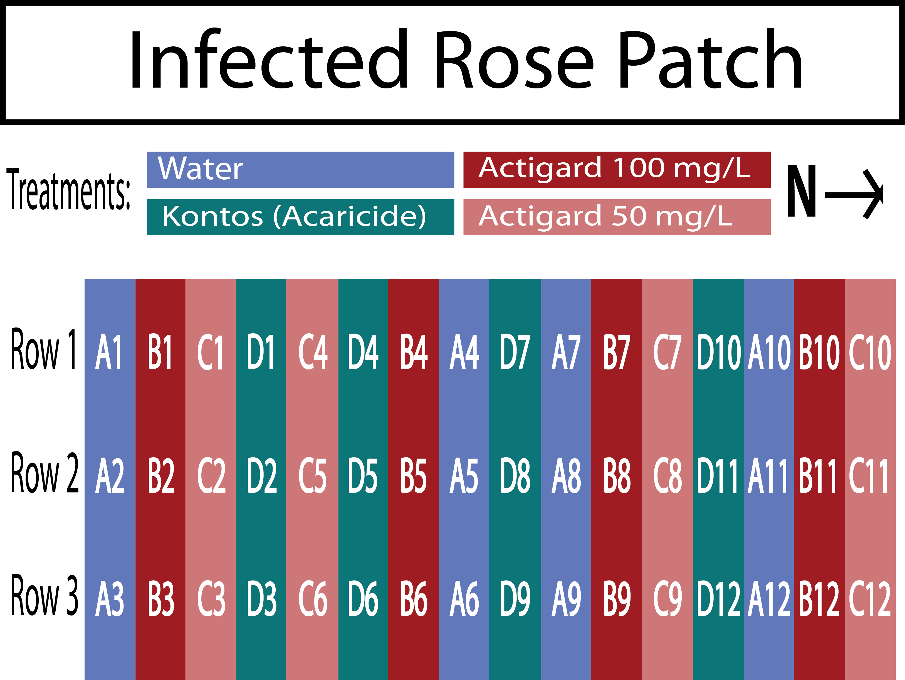
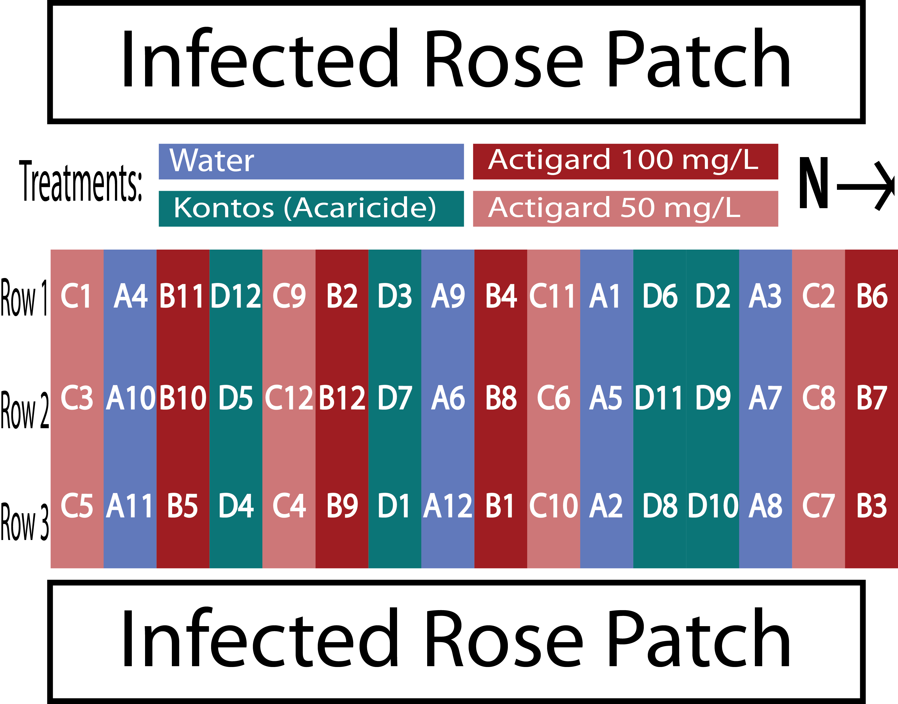
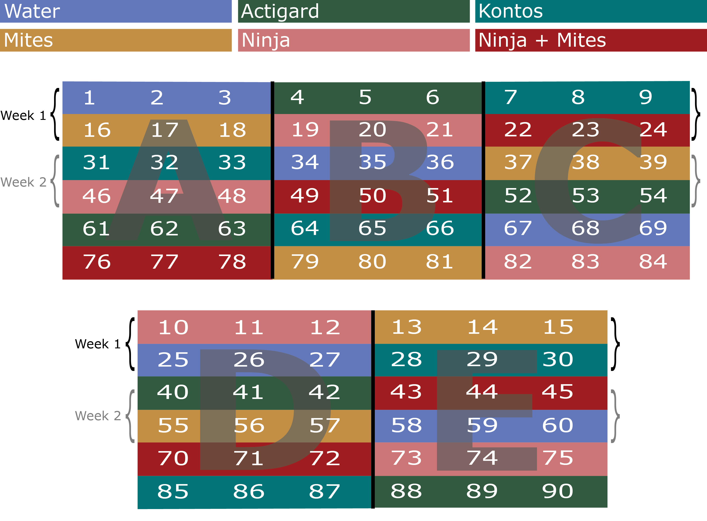
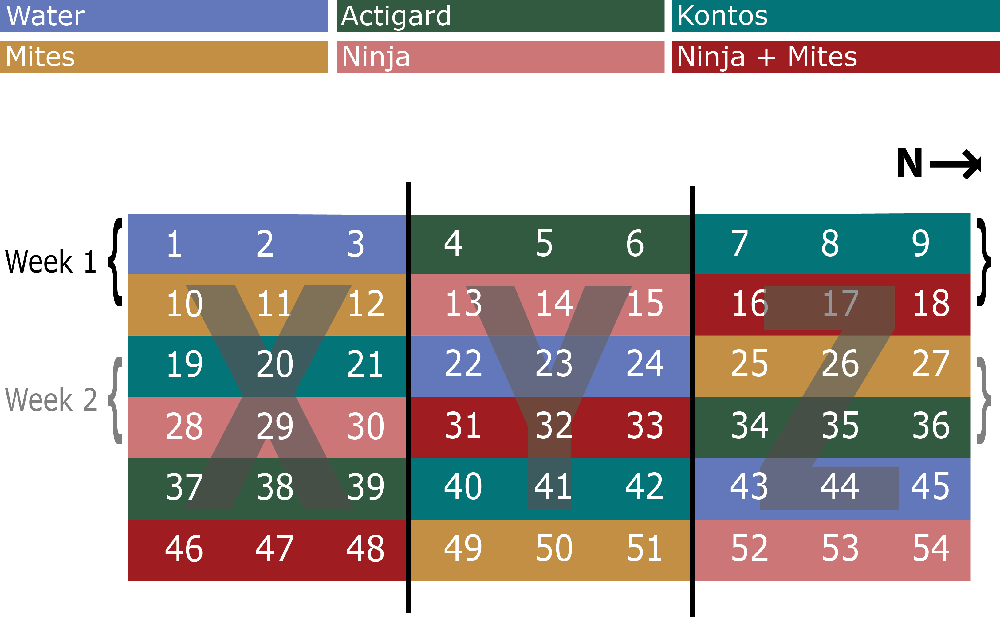

# Integrated Pest Management of *Phyllocoptes fructiphilus*

### Introduction
Rose Rosette Virus (RRV) is a lethal emaravirus (Emaraviridae) vectored by *Phyllcoptes fructiphilus* Kiefer as it feeds [@Laney2011; @Allington1968]. RRV creates a condition known as Rose Rosette Disease (RRD), with the following symptoms: witches' brooms/rosetting, deformed flowers, increased prickle density, elongated shoots, reddened leaves and stems, increased die-back and ultimately rose death. RRV and *P. fructiphilus* are widely distributed in the US, and both virus and mite are present in the southeastern United States [@Solo2018], and *P. fructiphilus* has been recently detected in Florida [@Fife2020]. The presence of *P. fructiphilus* in Florida emphasizes the need to monitor and managed both mite and virus, to prevent establishment of RRV in Florida. Currently, no roses are known to resist *P. fructiphilus* and few roses show signs of resistance to RRV [@Bello2017]. Horticulturists manage the disease by removing sick plants and spraying pesticides in an attempt to kill the mite vector. Pesticides are under increased public scrutiny due to concerns about health, the environment, and harm to pollinators. Although eriophyid mites are often controlled via chemical means [@Messing1996; @Leeuwen2009], some species have developed resistance to some acaricides, including *Phyllocoptruta oleivora* (Ashmead) and *Acalitus vaccinii* (Keifer) becoming resistant to dicofol [@Omoto1994; @Omoto1995] while *Aculus cornutus* (Banks) and *Aculops lycopersici* (Tryon) have developed resistance to various organophosphates [@Baker1979; @AbouAwad1985]. The lack of management options, as well as the increased cost of rose production due to RRV make it difficult for growers to compete with an increasingly competitive international market. Rose growers need better methods to combat *P. fructiphilus* and RRV. 

An important part pest resistance comes from the plant's innate immune system [@Nurnberger2004]. Plants naturally have resistance genes which protect plants against certain pathogens [@Grennan2006], as well as as suite of pathogen/microbe-associated molecular patterns (PAMPs/MAMPs) which are able to recognize parts of invasive pathogens which are not present in plants, such as flagellar proteins [@Nurnberger2004]. Plants respond to pathogen detection with the activation of signalling pathways [@Biere2013; @Gozzo2013]. The type of biochemical response is multivariate, based on the pathways involved and the species of plant in question [@citation], but activation of an immune response ultimately results in a variety of biophysical/biochemical changes in plant physiology, such as the thickening of cell walls or production of antimicrobial agents, proteins, reactive oxygen species and other defensive compounds [@Jones2006; @Chisholm2006; @Kachroo2013].


The most well-studied hormones known for triggering plant immunity are Jasmonic Acid, Ethylene, and Salicylic Acid [@Thomma2001].

These signalling pathways respond to particular types of pest and pathogen attacks, and many of the pathways overlap or interact with one another in both complementary and antagonistic ways. 


Activation of the Salicylic Acid pathway causes a plant defense response known as known as Systemic Acquired Resistance (SAR) [@Gozzo2013]. SAR can protect a plant from becoming infected, but SAR can also be activated before infection to increase a plant's resistance to future microbial attack [@Gaffney1993, @Kalaivani2016]. This is done by exposing plants to chemicals similar to Salicylic Acid (SA), a defensive phytohormone which initiates the signalling cascade for SAR [@Gaffney1993].

## Inducing Systemic Acquired Resistance with Acibenzolar-S-Methyl to reduce populations of *Phyllocoptes fructiphilus* {#ipm-actigard}
Acibenzolar-S-methyl (ASM) is a functional analog of SA, which is able to induce SAR[@Ziadi2001; @Tripathi2010]. ASM is currently used by growers to protect plants from fungal infection [@Ziadi2001; @Tripathi2010]. ASM application has shown chitinase activity in roses [@Suo2001] and preliminary studies have shown that ASM might prevent RRV progression in roses (Babu et al., submitted). Mites have an exoskeleton comprised of chitin [@Nuzzaci1996a], suggesting that rose chitinases affect *P. fructiphilus*'s ability to feed or grow on SAR-induced plants. We intend to test how ASM affects RRV progression and *P. fructiphilus* survival by testing two rates of an ASM-based SAR activator on mite populations in areas with high pest pressure in Georgia. Our hypothesis is that there will be fewer *P. fructiphilus* on plants treated with Actigard when compared to the water treated control group.

#### 4.1.4 Materials & Methods
**Roses**
This will be a 12-week experiment conducted from August to October simultaneously in Griffin, GA and Athens, GA.
Each site will be given 48 Pink Double Knock Out® Roses (Star Roses and Plants, West Grove, PA, USA) which will be planted in 1 gallon buckets filled with potting soil and mixed with granular slow-release fertilizer. Plants will be placed on black plastic mulch and be watered weekly with overhead impact sprinklers.

**Mites**
*Phyllocoptes fructiphilus* are present in the landscape of Georgia. Tissue from RRD-infected roses will be placed onto roses during the first week and 5th week

**Spray rates**
We will be applying the Acibenzolar-S-methyl (ASM) based Actigard50WG® (Syngenta AG, Basel, Switzerland), at two different rates: 50 mg/L (Half rate) and 100 mg/L (High rate) to observe the effects of inducing Systemic Acquired Resistance (SAR) on *Phyllocoptes fructiphilus* Kiefer. We will have two field sites in Georgia with local populations of *P. fructiphilus*: Griffin GA and Athens, GA. The tests in Griffin will have two controls for chemical applications in this experiment: The first will be the miticide Kontos (Bayer CropScience LP, Cary, NC, USA), at the label rate as a positive control and the second will be water as a negative control. The tests in Athens will have a control of untreated roses as well as water as a negative control.

**Data Collection**
Rose/rosebud cuttings ~10 cm will be taken from each plant before the first treatment to determine the initial populations of *P. fructiphilus* on the roses. We will then take a subset of samples from each rose treatment weekly, rotating samples until each rose plant has been sampled three times. We will also collect samples from all roses at the end of the trial. This experiment will be repeated for two seasons. Rose samples will be placed in 50 mL centrifuge tubes and refrigerated or frozen until floral samples can be processed. Samples will be processed using the washing methods of @Monfreda2007, eriophyoid mites will be counted and identified as previously described.

**Plot Design - 2018**
```{r}
knitr::include_graphics('figure/reed.jpg')
```

`r fig_nums(name = "asm_2018", caption = "Field design for testing the potential of Acibenzolar-S-Methyl to reduce populations of *P. fructiphilus* by inducing Systemic Acquired Resistance in Pink Double Knock Out® roses. Trials were conducted for three months from August to October 2018 in Griffin, GA. Four treatments were applied weekly for 12 weeks: Blue = Water Red = Actigard50WG 100 mg/L (High rate),  Pink = Actigard50WG 100 mg/L (Half rate) Turquoise = Kontos (Label rate). Flower cuttings were be taken weekly to record *P. fructiphilus* numbers.")`

**Plot Design - 2018**
```{r}

```

`r fig_nums(name = "asm_2018", caption = "Field design for testing the potential of Acibenzolar-S-Methyl to reduce populations of *P. fructiphilus* by inducing Systemic Acquired Resistance in Pink Double Knock Out® roses. Trials were conducted for three months from September to December 2019 in Griffin, GA. Four treatments were applied weekly fo 12 weeks: Blue = Water Red = Actigard50WG 100 mg/L (High rate),  Pink = Actigard50WG 100 mg/L (Half rate) Turquoise = Kontos (Label rate). Flower cuttings were be taken weekly to record *P. fructiphilus* numbers.")`

**Plot Design - 2019**
```{r}

```

`r fig_nums(name = "asm_2019", caption = "Field design for testing the potential of Acibenzolar-S-Methyl to reduce populations of *P. fructiphilus* by inducing Systemic Acquired Resistance in Pink Double Knock Out® roses. Trials were conducted for three months from September to December 2019 in Griffin, GA. Four treatments were applied weekly fo 12 weeks: Blue = Water Red = Actigard50WG 100 mg/L (High rate),  Pink = Actigard50WG 100 mg/L (Half rate) Turquoise = Kontos (Label rate). Flower cuttings were be taken weekly to record *P. fructiphilus* numbers.")`

<!-- #### Potential benefits -->

<!-- #### Expected outcomes -->

## 4.2 Integrating Pest Management Methods to control *Phyllocoptes fructiphilus* {#ipm-trials}

#### 4.2.1 Problem Statement

#### 4.2.2 Proposal: We propose testing various pest management treatments including predatory mites to reduce populations of *Phyllocoptes fructiphilus*

We propose testing two different SAR-inducers as well as predatory mites for their ability to reduce populations of *P. fructiphilus*. We also intend to combine the effects of predatory mites with a SAR-inducer to determine if these treatments are compatible. All testing will be done in areas with high pest pressure in Georgia. Our hypothesis is that there will be fewer *P. fructiphilus* on plants treated with the SAR-inducers when compared to the water treated control group, and even fewer mites found on plants treated with the combination of a SAR-inducer and predatory mites.

#### 4.2.3 Materials & Methods
  Our studies are designed to investigate if predatory phytoseiid mites such as *A. swirskii* can be combined with roses’ natural systemic activated resistance (SAR) to manage populations of the plant-parasitic mite, *P. fructiphilus*, the vector of Rose Rosette Virus (RRV). Our findings will be used to develop Integrated Pest Management (IPM) programs for *P. fructiphilus* management.

<!-- #### Rationale -->

<!-- #### Proposal:  -->

**Roses**
This will be a 12-week experiment conducted from August to October simultaneously in Griffin, GA and Athens, GA.
The Athens site will be given 96 Pink Double Knock Out® Roses (Star Roses and Plants, West Grove, PA, USA), while Griffin will use 54 roses due to the smaller plot area available. Bare root roses will be planted 2 months before the trials begin to allow new flush to form. Rose planting media and environmental conditions will be the same as previously described.

**Mite Infestation**
*Phyllocoptes fructiphilus* are present in the landscape of Georgia. Rose cuttings ~10 cm will be taken from roses showing symptoms of Rose Rosette Disease in the landscape and placed in each rose pot on the 1st, 5th and 9th week of the experiment.

**Predatory mites**
  
*Amblyseius swirskii* mites will be applied on the 1st, 5th and 9th week of the experiment. These mites are deployed from polyethylene fiber sachets containing live colonies of *A. swirskii* and a mite which they consume for food. There is a small hole at the bottom of these sachets which allows the mites to be slowly released into the environment.

**Field Treatments**
  
1. Water - Control
1. Actigard - 100 mg/L
1. Ninja - label rate
1. Kontos - label rate
1. *A. swirskii* (one sachet per rose treated)
1. *A. swirskii* + Ninja (one sachet per rose treated, label rate)

**Data Collection**

Georgia collaborators will be collecting flower samples from all roses once before beginning the treatments on week 1 and once at the end of the experiment on week 12. For weeks 2 through 11, Georgia collaborators will collect flower samples starting from the top rows of each block every week, until each row has been sampled three times (see *`r citef("ipm_athens")`* and *`r citef("ipm_griffin")`*). Georgia collaborators rate disease severity for each rose every week before they spray, rating roses according to the Horsfall-Barratt Scale [@Horsfall1945]. Roses displaying symptoms of RRD will have tissues sent to the Plant Disease Diagnostic Clinic at the North Florida Reasearch and Extension Center(PDC) for virus confirmation.

**Sample Processing** 

- A flower cutting of about ~12 cm will be take and placed the flower petal side down into 50 ml centrifuge tubes filled with 15 ml of 95% ethanol so the entire flower is submerged over the sepals. Once the lid is is secure, the the tube will be shaken vigorously for a few seconds to help dislodge any mites. Samples will be processed using the washing methods of @Monfreda2007, eriophyoid mites will be counted and identified as previously described.

**Plot Design - Athens**
  
The site at Athens, GA has space for five blocks: A, B, C, D and E. Each block is a 3 $\times$ 6 plot with 18 plants, with three plants in each treatment. The experiments will be run for 12 weeks. We will be sampling flower cuttings from two rows each week, starting with the top rows (1-15 and 16-30 for week one) of each block and rotating to the next row each week (31-45 and 46-60 on week 2) continuing until all rows have been sampled three times. In order to avoid confusion, each rose pot will be labeled with a stake that has the plant number and treatment abbreviation: (W, A, K, M, N, +) written on it. Applications will be done on the same day each week, weather permitting, preferably at the beginning of the week.

```{r}

```

`r fig_nums(name = "ipm_athens", caption = "Field design for Integrated Pest Management trials on Pink Double Knock Out® roses to control *P. fructiphilus* in Athens, GA with five treatments. W = Water A = Actigard50WG, K = Kontos, M = *A. swirkii* predatory mite sachets, N = SP2700 (Trade name: Ninja, SePro), + = *A. swirskii* + Ninja combined treatments. All products were applied at their label rates for 12 weeks. Flower cuttings were taken weekly to record *P. fructiphilus* numbers.")`

**Plot Design - Griffin**
  
The site at Griffin, GA has space for three blocks: X, Y, and Z. Each block is a 3 $\times$ 6 plot with 18 plants, with three plants in each treatment. This experiment was run for 12 weeks as well. We will be sampling flower cuttings from two rows each week, starting with the top rows (1-9 and 10-18 for week one) of each block and rotating to the next row each week (19-27 and 28-36 on week 2) continuing until all rows have been sampled three times. Labels and applications were conducted in the same manner as previously described.

```{r}

```

`r fig_nums(name = "ipm_griffin", caption = "Field design for Integrated Pest Management trials on Pink Double Knock Out® roses to control *P. fructiphilus* in Griffin, GA with five treatments. W = Water A = Actigard50WG, K = Kontos, M = *A. swirkii* predatory mite sachets, N = SP2700 (Trade name: Ninja, SePro), + = *A. swirskii* + Ninja combined treatments. All products were applied at their label rates for 12 weeks. Flower cuttings were taken weekly to record *P. fructiphilus* numbers.")`

```{r}

```

`r fig_nums(name = "ipm_tally", caption = "Field design for Integrated Pest Management trials on Pink Double Knock Out® roses to control *P. fructiphilus* in Tallahassee, FL with five treatments: Water, Actigard50WG, Kontos, *Amblyseius swirkii* predatory mite sachets, and *A. swirskii* + Actigard combined treatments. All products were applied at their label rates for 12 weeks. Flower cuttings were taken weekly to record *P. fructiphilus* numbers.")`

```{r, echo=FALSE}
knitr::include_graphics('figure/reed.jpg')
```

`r fig_nums(name = "actigard_trials", caption = "Number of *Phyllocoptes fructiphilus* found in rose samples with five treatments. Statistical significance was determined using Tukey contrasts for multiple Comparisons of means. Groups which share letters are not statistically different from one another. α = 0.05")`

<!-- #### Potential benefits -->

<!-- #### Expected outcomes -->