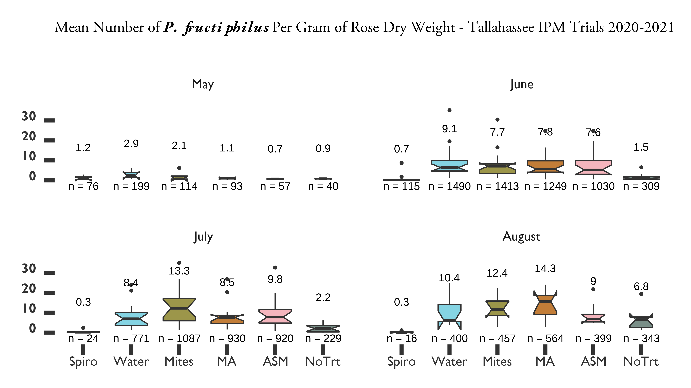

# INTEGRATED PEST MANAGEMENT OF *PHYLLOCOPTES FRUCTIPHILUS* {#intro-asm-ipm-pfruct}
## Introduction: *Phyllocoptes fructiphiulus* - an increasingly large problem {#intro-ipm-pfruct}
*Phyllocoptes fructiphilus* Keifer (Trombidiformes: Eriophyidae) is a microscopic plant-feeding arachnid known as an eriophyid mite. *P. fructiphilus* is host specific, only feeding on plants in the genus *Rosa*, and normally cause little damage by itself. Unfortunately, *P. fructiphilus* has become infamous due to Rose Rosette Virus (RRV), a pathogen which the mite transmits while feeding. RRV infection creates the following symptoms: witches' brooms/rosetting, deformed flowers, increased prickle density, elongated shoots, reddened leaves and stems, and increased die-back which ultimately kills the rose host [@Allington1968; @Tzanetakis2006; @Laney2011]. This disease is known as Rose Rosette Disease (RRD) and is widely considered the most serious disease of roses in the US. RRD and the mite have invaded the southeastern US as they followed the range expansion of the non-native *Rosa multiflora* (Thunb) towards the coast [@Amrine1996; @Amrine2002; @Otero-Colina2018]. RRD afflicts a passionate group from different sectors of the US rose industry, including homeowners, commercial landscapers, nurseries, conservationists, and rosarians, all of whom stand to lose millions of dollars and many established roses plantings in the coming years [@Babu2014; @Byrne2019, @Rwahnih2019]. Florida, as the nation's largest producer of roses, has a special interest developing methods to better control *P. fructiphilus* and RRD. There is a critical need to improve management of *P. fructiphilus* and RRD. Unfortunately, few commercially available roses have resistance to RRD [@Byrne2018; @Bello2017]. Presently, growers are recommended to manage the *P. fructiphilus* by removing plants and spraying pesticides [@UGA2018; @Olson2017; @Hong2012]. However, pesticides have come under increased public scrutiny due to concerns about health, the environment, pest resistance, and harm to pollinators [@Alavanja2004, @Fenner2013, @Croft1988, @Vanbergen2013]. Increased pesticide applications also decrease grower profits and reduce competitiveness with foreign markets. The lack of alternative or complementary management options exacerbates this issue: rose growers need more options for *P. fructiphilus* control, especially methods which can be integrated into existing management programs. In 2013, nursery workers in Quincy, Gadsden County, Florida, USA, detected unusual red growths, deformed stems and extra thorniness on 15 knockout roses which had been imported from out of state. Eight symptomatic plants were tested by our Plant Diagnostic Clinic at the University of Florida's North Florida Research and Education Center in Quincy, FL, and found to be positive for RRD, but the *P. fructiphilus* mites were not detected at that time [@Babu2014]. On February 14, 2019, populations of *P. fructiphilius* were encountered on roses in Tallahassee, Leon County, Florida [@Fife2020]. The existence of *P. fructiphilus* in northern Florida increases the the possibility of introducing RRD from areas where the disease had become established, including the neighboring states of Georgia and Alabama [@Solo2020; @Solo2018]. 

### Integrating Pest Management: What are the effects of Systemic Acquired Resistance on *Amblyseius swirskii* and *P. fructiphilus*? {#intro-asm-ipm}
Integrated Pest Management (IPM) is the combination of science-informed best practices designed to keep the cost of pest control below the value of the crop damages which would occur without intervention (i.e. economic injury level) [@USDA2018; @Flint1981; @Stern1959]. In practice, IPM is informed by an understanding of the pest's biology and the judicious use of chemical controls, natural predators (biological controls), plant breeding, plant immune systems and physical (cultural) controls as needed to control pests as efficiently as possible [@Bradley2018]. A major obstacle to controlling RRD is the small size and habits of *P. fructiphilus*. Eriophyoid mites are hard to control via conventional methods (i.e. pesticides) due to their small size and their cryptic habits: *P. fructiphilus* hide in tight spaces such as under rose sepals and petioles, and under glandular plant hairs (trichomes) [@Bauchan2019; @Otero-Colina2018; @Jesse2006]. This means that management which relies on contact with the pest is unlikely to reach these mites under normal circumstances. It is possible that predatory mites can circumvent this problem and combat *P. fructiphilus* *in situ*. Predatory mites in the family Phytoseiidae can manage a variety of agricultural pests [@Gerson2003; @Carrillo2015], and some species are small enough that they may be able to find and feed on *P. fructiphilus* in their hiding places (Carillo, personal communication). As part of the efforts to develop novel mite management methods, our lab has leveraged its experience with chemical ecology to conduct a series of preliminary two-choice maze (Y-tube olfactometer) trials with various species of commercially-available predatory mites. In these trials, mites can be exposed to chemical odorants which are correlated with the pest arthropod, such as samples droppings or sheds of the pest, a substrate which the pest has walked on, eggs of the pest, or plants which have been attacked by the pest. Attraction to these odorants is usually suggestive of predatory mite feeding preferences, and is a fast way to judge their potential for use in biological control [@Janssen1990]. While testing the compatibility of our rose system with various commercially-available predatory mites, we observed that *Amblyseius swirskii* Athias-Henriot (Mesostigmata: Phytoseiidae) mites were attracted towards roses which were infected with RRD (see *\@ref(results-olfact)`*). This was noteworthy because *A. swirskii* are generalist predators which feed on other common agricultural pests such as whiteflies [@Bolckmans2005], spider mites [@McMurtry1970], and thrips [@Wimmer2008]. *A. swirskii* can also persist on pollen [@Loughner2011; @Delisle2015] and other arthropods even when the pest of concern is absent [@Janssen2015]. This allows *A. swirskii*  to be released as a preventative measure instead of reacting to an outbreak [@Kutuk2011]. Furthermore, phytoseiid mites integrate well into pest management programs and are compatible with certain pesticides [@Trumble1993; @Nicetic2001; @Fernandez2017] and other bio-control agents [@Midthassel2016]. Although *A. swirksii* mites are likely too large to infiltrate into the tight spaces needed to feed on *P. fructiphilus*, they remain a good model organism for testing combinations of different pest management treatments. These results compelled us to further investigate the differences between the chemical odorants (headspace volatiles) released from RRV-infected and uninfected roses using coupled Gas Chromatography-Mass Spectroscopy analysis (GC-MS). The GC-MS data suggested that RRV-infected roses had low levels of an important plant hormone known as Methyl Salicylate (MeSA) (*\@ref(chemeco)*). MeSA typically increases during an immune response, such as when a plant is attacked by herbivores or pathogens [@Tieman2010; @Park2007; @Shulaev1997]. We expected high levels of MeSA in these infected roses, because they were in the middle of experiencing a pathogen attack, but contrary to this expectation, we found low levels of MeSA emitted from the RRV-infected roses. MeSA is also known to be an attractive odor to some many predatory mites, which use MeSA to locate their prey [@James2004, @Gadino2011, @Boer2004a], and are often attracted to the Volatile Organic Compounds (VOCs) released when plants are injured by pests or infected with pathogens [@Boer2004b]. Our results suggest that either *A. swirski* are attracted to very low levels of MeSA, or perhaps this attraction is caused by other plant chemical cues besides MeSA. Either way, identification of these VOCs gives us insight into how RRD influences the prey-seeking behaviors of *A. swirksii*, which has implications for how effective predatory mite biocontrol will be. The most interesting part about low levels of MeSA is the role which this phytohormone typically plays in pathogen resistance [@Kalaivani2016, @Park2007]. MeSA is derived from Salicylic Acid (SA) [@Tieman2010], a chemical involved when inducing a plant’s immune response, known as Systemic Acquired Resistance (SAR) [@Gozzo2013; @Gaffney1993]. SAR protects plants from fungi, bacteria and viral pathogens when induced and affects all tissues in the plant [@Kachroo2013, @Ryals1994]. Low levels of MeSA suggest that RRV interferes with the rose's ability to defend itself against the pathogen. A possible way to avoid this negative feedback loop is to use SA to induce SAR *before* RRV infection, a procedure which would increase the rose's resistance to pathogens before exposure [@Conrath2006; @Agut2018; @Gaffney1993, @Kalaivani2016]. In light of this knowledge, we collaborated with the University of Georgia in to test how SAR-induction might protect roses from *P. fructiphilus* and/or RRD. acibenzolar-S-methyl (ASM) is a benzothiadiazole, a SAR-inducing chemical which works like Salicylic Acid to induce plant defenses against viruses and bacteria [@Darolt2020; @Takeshita2013, @Narusaka1999; @Cole1999, @Ziadi2001; @Tripathi2010]. ASM is currently used by growers to protect plants from fungal infection [@Ziadi2001; @Tripathi2010]. ASM application also has shown chitinase activity in roses [@Suo2001]. Mites have an exoskeleton comprised of chitin [@Nuzzaci1996a], and some studies have shown that the hypersensitive response and SAR interfere with the ability of eriophyoid mites to feed or grow on induced plants [@Bronner1991a; @Westphal1991; @Westphal1992]. A remaining concern is the effect that SAR-induction may have on predatory mite releases: although predatory mites do not feed directly on plants, they may still be harmed via direct and indirect effects of SAR-induction [@Ataide2016, @Pappas2017]. We conducted a number of field studies from 2018-2021 in order to test the integration of predatory mites with SAR.


## Materials & Methods {#mm-asm-ipm}
### SAR-induction with ASM to reduce populations of *P. fructiphilus* {#ipm-actigard}
We tested the efficacy of SAR-induction against mites in field trials conducted at Griffin and Athens, GA, sites with low and high *P. fructiphilus* pest pressure, respectively. 
**Roses**
This will be a 12-week experiment conducted from August to October simultaneously in Griffin, GA and Athens, GA.
Each site will be given 48 Pink Double Knock Out® Roses (Star Roses and Plants, West Grove, PA, USA) which will be planted in 1 gallon buckets filled with potting soil and mixed with granular slow-release fertilizer. Plants will be placed on black plastic mulch and be watered weekly with overhead impact sprinklers.

**Mites**
*Phyllocoptes fructiphilus* are present in the landscape of Georgia. Tissue from RRD-infected roses will be placed onto roses during the first week and 5th week

**Spray rates**
We will be applying the Acibenzolar-S-methyl (ASM) based Actigard50WG® (Syngenta AG, Basel, Switzerland), at two different rates: 50 mg/L (Half rate) and 100 mg/L (High rate) to observe the effects of inducing Systemic Acquired Resistance (SAR) on *Phyllocoptes fructiphilus* Kiefer. We will have two field sites in Georgia with local populations of *P. fructiphilus*: Griffin GA and Athens, GA. The tests in Griffin will have two controls for chemical applications in this experiment: The first will be the miticide Kontos (Bayer CropScience LP, Cary, NC, USA), at the label rate as a positive control and the second will be water as a negative control. The tests in Athens will have a control of untreated roses as well as water as a negative control.

**Data Collection**
Rose/rosebud cuttings ~10 cm will be taken from each plant before the first treatment to determine the initial populations of *P. fructiphilus* on the roses. We will then take a subset of samples from each rose treatment weekly, rotating samples until each rose plant has been sampled three times. We will also collect samples from all roses at the end of the trial. This experiment will be repeated for two seasons. Rose samples will be placed in 50 mL centrifuge tubes and refrigerated or frozen until floral samples can be processed. Samples will be processed using the washing methods of @Monfreda2007, eriophyoid mites will be counted and identified as previously described.

**Plot Design - 2018**
```{r, cache = TRUE, cache.extra = file.mtime('figure/rrv_asm_plot_2018_griffin.png'), fig.cap= "Field design for testing the potential of Acibenzolar-S-Methyl to reduce populations of \\textit{P. fructiphilus} by inducing Systemic Acquired Resistance in Pink Double Knock Out® roses. Trials were conducted for three months from September to December 2019 in Griffin, GA. Four treatments were applied weekly fo 12 weeks: Blue = Water Red = Actigard50WG 100 \\si{\\milli\\gram}/L (High rate),  Pink = Actigard50WG \\si{\\milli\\gram}/L (Half rate) Turquoise = Kontos (Label rate). Flower cuttings were be taken weekly to record \\textit{P. fructiphilus} numbers.", out.width="80%", warning=FALSE}

```

**Plot Design - 2019**
```{r, cache.extra = file.mtime('figure/rrv_asm_plot_2019_griffin.png'), fig.cap="Field design for testing the potential of Acibenzolar-S-Methyl to reduce populations of \\textit{P. fructiphilus} by inducing Systemic Acquired Resistance in Pink Double Knock Out® roses. Trials were conducted for three months from September to December 2019 in Griffin, GA. Four treatments were applied weekly fo 12 weeks: Blue = Water Red = Actigard50WG 100 \\si{\\milli\\gram}/L (High rate),  Pink = Actigard50WG 100 \\si{\\milli\\gram}/L (Half rate) Turquoise = Kontos (Label rate). Flower cuttings were be taken weekly to record \\textit{P. fructiphilus} numbers.", out.width="80%", warning=FALSE}
knitr::include_graphics('figure/rrv_asm_plot_2019_griffin.png')
```

### Integrating Pest Management Methods to control *Phyllocoptes fructiphilus* {#ipm-trials}

<!-- slow release sachets which are sheltered and provided with felt patches and and moisture in the form of water-absorbant sodium polyacrylate gels had better release of predators [@Shimoda2018] -->

We tested ASM alongside a different a SAR-inducer (SP2700, Trade name 'Ninja', SePro) and combined one of the SAR-inducers with predatory mites to observe any synergistic effects. We used an acaricide as a negative control and water as a positive control. (see *\@ref(fig:ipm)*). 


Spray applications done weekly for 12 weeks, on the same day each week, weather permitting.
The site had divided into two blocks, with ten plots of roses in each block. Each plot was 3 \si{m}$^2$ with approximately 12 roses, the six roses at the center of the plot were treated, while the adjacent roses on either side was left as a buffer between plots to avoid treatment drift.

Five treatments were applied: tap water as a positive control, Kontos (Spirotetramat) Bayer - High rate as a negative control, Actigard 50 WG (acibenzolar-S-methyl) Syngenta - 100 \si{\milli\gram}/\si{\liter}, *Amblyseius swirskii* mini sachets with hooks (Ambly-S, Arbico Organics, Oro Valley, AZ, USA) - two sachets per rose in treated plot, and a combined treatment of Actigard - 100 \si{\milli\gram}/\si{\liter} + *A. swirskii* - two sachets per rose in treated plot.

Samples were collected and processed using the same methods as previously described in \@ref(mm-survey).

- 95\% Ethanol
- 500 mL Nalgene Bottles (labeled with date, plot # and treatment)
- Pruners/Secateurs

The two sachets of *A. swirskii* mites were applied to each of the six treated roses on the 1st, 5th and 9th week of the experiment, following the application instructions from the supplying company. These sachets contain live colonies of *A. swirskii* and a mite which they consume for food. There is a small hole at the bottom of the sachet where the mites are able to leave and climb on the roses searching for food, accordingly, the sachet was hung from rose canes in the center of each rose. The *A. swirskii* plots were also treated with water weekly in order to keep conditions similar to other treatments.

Flower cuttings were taken weekly from from each of the six roses in the center of each plot.


Three flowers (buds if no flowers present) from each of the six flagged roses, for a total of 18 flowers/buds per bottle for each plots. **Make sure to collect 18 flowers/buds from any rose in the untreated plots 11-14 for the phenology study as well.** Place the flowers/buds into the ethanol-filled bottles provided, make sure the lid is tight, then shake the bottle vigorously for a few seconds to coat the rose tissue with ethanol and help dislodge any mites. 

- Use the sieves to separate mites from the plant tissues. (see *name of protocol sheet* for more information).

- Dry plant tissues in the appropriately labeled, high-tech *paper bag* and put into the oven until dry (~48 hrs at 50 &deg;C), then weigh the rose tissue and record the dry weight (remember to tare the scale with a paper bag for slightly improved accuracy).


We propose testing two different SAR-inducers as well as predatory mites for their ability to reduce populations of *P. fructiphilus*. We also intend to combine the effects of predatory mites with a SAR-inducer to determine if these treatments are compatible. All testing will be done in areas with high pest pressure in Georgia. Our hypothesis is that there will be fewer *P. fructiphilus* on plants treated with the SAR-inducers when compared to the water treated control group, and even fewer mites found on plants treated with the combination of a SAR-inducer and predatory mites.

### 4.2.3 Materials & Methods
  Our studies are designed to investigate if predatory phytoseiid mites such as *A. swirskii* can be combined with roses’ natural systemic activated resistance (SAR) to manage populations of the plant-parasitic mite, *P. fructiphilus*, the vector of Rose Rosette Virus (RRV). Our findings will be used to develop Integrated Pest Management (IPM) programs for *P. fructiphilus* management.


**Roses**
This will be a 12-week experiment conducted from August to October simultaneously in Griffin, GA and Athens, GA.
The Athens site will be given 96 Pink Double Knock Out® Roses (Star Roses and Plants, West Grove, PA, USA), while Griffin will use 54 roses due to the smaller plot area available. Bare root roses will be planted 2 months before the trials begin to allow new flush to form. Rose planting media and environmental conditions will be the same as previously described.

**Mite Infestation**
*Phyllocoptes fructiphilus* are present in the landscape of Georgia. Rose cuttings ~10 cm will be taken from roses showing symptoms of Rose Rosette Disease in the landscape and placed in each rose pot on the 1st, 5th and 9th week of the experiment.

**Predatory mites**
  
*Amblyseius swirskii* mites will be applied on the 1st, 5th and 9th week of the experiment. These mites are deployed from polyethylene fiber sachets containing live colonies of *A. swirskii* and a mite which they consume for food. There is a small hole at the bottom of these sachets which allows the mites to be slowly released into the environment.

**Field Treatments**
  
1. Water - Control
1. Actigard - 100 mg/L
1. Ninja - label rate
1. Kontos - label rate
1. *A. swirskii* (one sachet per rose treated)
1. *A. swirskii* + Ninja (one sachet per rose treated, label rate)

**Data Collection**

Georgia collaborators will be collecting flower samples from all roses once before beginning the treatments on week 1 and once at the end of the experiment on week 12. For weeks 2 through 11, Georgia collaborators will collect flower samples starting from the top rows of each block every week, until each row has been sampled three times (see *\@ref(fig:ipm-athens)* and *\@ref(fig:ipm-griff)*). Georgia collaborators rate disease severity for each rose every week before they spray, rating roses according to the Horsfall-Barratt Scale [@Horsfall1945]. Roses displaying symptoms of RRD will have tissues sent to the Plant Disease Diagnostic Clinic at the North Florida Reasearch and Extension Center(PDC) for virus confirmation.

**Sample Processing** 

- A flower cutting of about ~12 cm will be take and placed the flower petal side down into 50 ml centrifuge tubes filled with 15 ml of 95% ethanol so the entire flower is submerged over the sepals. Once the lid is is secure, the the tube will be shaken vigorously for a few seconds to help dislodge any mites. Samples will be processed using the washing methods of @Monfreda2007, eriophyoid mites will be counted and identified as previously described.

**Plot Design - Athens**
  
The site at Athens, GA has space for five blocks: A, B, C, D and E. Each block is a 3 $\times$ 6 plot with 18 plants, with three plants in each treatment. The experiments will be run for 12 weeks. We will be sampling flower cuttings from two rows each week, starting with the top rows (1-15 and 16-30 for week one) of each block and rotating to the next row each week (31-45 and 46-60 on week 2) continuing until all rows have been sampled three times. In order to avoid confusion, each rose pot will be labeled with a stake that has the plant number and treatment abbreviation: (W, A, K, M, N, +) written on it. Applications will be done on the same day each week, weather permitting, preferably at the beginning of the week.

```{r ipm-athens, cache.extra = file.mtime('figure/rrv_ipm_plot_map_2019_athens.png'), fig.cap = "Field design for Integrated Pest Management trials on Pink Double Knock Out® roses to control \\textit{P. fructiphilus} in Athens, GA with five treatments. W = Water A = Actigard50WG, K = Kontos, M = \\textit{A. swirkii} predatory mite sachets, N = SP2700 (Trade name: Ninja, SePro), + = \\textit{A. swirskii} + Ninja combined treatments. All products were applied at their label rates for 12 weeks. Flower cuttings were taken weekly to record \\textit{P. fructiphilus} numbers.", out.width="80%", warning=FALSE}
knitr::include_graphics('figure/rrv_ipm_plot_map_2019_athens.png')
```

**Plot Design - Griffin**
  
The site at Griffin, GA has space for three blocks: X, Y, and Z. Each block is a 3 $\times$ 6 plot with 18 plants, with three plants in each treatment. This experiment was run for 12 weeks as well. We will be sampling flower cuttings from two rows each week, starting with the top rows (1-9 and 10-18 for week one) of each block and rotating to the next row each week (19-27 and 28-36 on week 2) continuing until all rows have been sampled three times. Labels and applications were conducted in the same manner as previously described.

```{r ipm-griff, cache.extra = file.mtime('figure/rrv_ipm_plot_map_2019_griffin.png'), fig.cap= "Field design for Integrated Pest Management trials on Pink Double Knock Out® roses to control \\textit{P. fructiphilus} in Griffin, GA with five treatments. W = Water A = Actigard50WG, K = Kontos, M = \\textit{A. swirkii} predatory mite sachets, N = SP2700 (Trade name: Ninja, SePro), + = \\textit{A. swirskii} + Ninja combined treatments. All products were applied at their label rates for 12 weeks. Flower cuttings were taken weekly to record \\textit{P. fructiphilus} numbers.", out.width="80%", warning=FALSE}

```

```{r, cache.extra = file.mtime('figure/rrv_ipm_plot_map_2021_talla.tif'), fig.cap = "Field design for Integrated Pest Management trials on Pink Double Knock Out® roses to control \\textit{P. fructiphilus} in Tallahassee, FL with five treatments: Water, Actigard50WG, Kontos, \\textit{Amblyseius swirkii} predatory mite sachets, and \\textit{A. swirskii} + Actigard combined treatments. All products were applied at their label rates for 12 weeks. Flower cuttings were taken weekly to record \\textit{P. fructiphilus} numbers.", out.width="80%", warning=FALSE}
grid::grid.raster(tiff::readTIFF('figure/rrv_ipm_plot_map_2021_talla.tif'))
```

## Results {#results-asm-ipm}
Combining predatory mites with a SAR-inducer was as effective as the miticide alone, and controlled herbivorous mite populations more than either SAR-induction or predatory mites alone (see *\@ref(fig:ipm)*).

```{r asm, cache = TRUE, cache.extra = file.mtime('figure/actigard_graph.png'), fig.cap="SAR-induction trials on Pink Double Knock Out® roses to control \\textit{Phyllocoptes fructiphilus} in Athens and Griffin, GA. Statistical significance was determined using Tukey contrasts for multiple Comparisons of means. Groups which share letters are not statistically different from one another. $\\alpha = 0.05$. water = Water Control, High = 100 \\si{\\milli\\gram}/\\si{\\liter} Actigard® 50WG (Syngenta, Greensboro, NC, USA) acibenzolar-S-methyl (ASM), low = 50 \\si{\\milli\\gram}/\\si{\\liter} Actigard® 50WG (Syngenta, Greensboro, NC, USA) acibenzolar-S-methyl (ASM), kontos = Kontos® Miticide Insecticide - Spirotetramat (Bayer Corporation, Whippany, New Jersey, USA), untreated = No treatment. All products were applied at their label rates for 12 weeks. Flower cuttings were taken weekly to record the numbers of herbivorous mites.", out.width="80%", warning=FALSE}
knitr::include_graphics('figure/actigard_graph.png')
```

```{r ipm, cache = TRUE, cache.extra = file.mtime('figure/ipm_graph.png'), fig.cap="Integrated Pest Management trials on Pink Double Knock Out® roses to control \\textit{Phyllocoptes fructiphilus} in Athens and Griffin, GA with five treatments. Statistical significance was determined using Tukey contrasts for multiple Comparisons of means. Groups which share letters are not statistically different from one another. $\\alpha = 0.05$. water = Water Control, actigard = Actigard® 50WG (Syngenta, Greensboro, NC, USA) acibenzolar-S-methyl (ASM), kontos = Kontos® Miticide Insecticide - Spirotetramat (Bayer Corporation, Whippany, New Jersey, USA), mites = \\textit{Amblyseius swirkii} predatory mite mini sachets on hooks (Ambly-S, Arbico Organics, Oro Valley, AZ, USA), ninja = SP2700 (Trade name: Ninja\\texttrademark, SePro, Carmel, IN, USA), mites + ninja = \\textit{A. swirskii} + Ninja combined treatments. All products were applied at their label rates for 12 weeks. Flower cuttings were taken weekly to record the numbers of herbivorous mites.", out.width="80%", warning=FALSE}
knitr::include_graphics('figure/ipm_graph.png')
```

```{r ipm-talla-erios, cache = TRUE, cache.extra = file.mtime('figure/rrv_ipm_graph_erios_talla.png'), fig.cap="Integrated Pest Management trials on Pink Double Knock Out® roses to control \\textit{Phyllocoptes fructiphilus} in Tallahassee, FL with five treatments. Statistical significance was determined using Tukey contrasts for multiple Comparisons of means. Groups which share letters are not statistically different from one another. $\\alpha = 0.05$. Water = Water Control, Actigard = Actigard® 50WG (Syngenta, Greensboro, NC, USA) acibenzolar-S-methyl (ASM), Kontos = Kontos® Miticide Insecticide - Spirotetramat (Bayer Corporation, Whippany, New Jersey, USA), Mites = \\textit{Amblyseius swirkii} predatory mite mini sachets on hooks (Ambly-S, Arbico Organics, Oro Valley, AZ, USA), Mites + Actigard = \\textit{A. swirskii} + Actigard combined treatments. Untreated = No treatment. All products were applied at their label rates for 12 weeks. Flower cuttings were taken weekly to record the numbers of \\textit{P. fructiphilus} and other herbivorous mites.", out.width="80%", warning=FALSE}
knitr::include_graphics('figure/rrv_ipm_graph_erios_talla.png')
```

```{r ipm-talla-erios-week, cache = TRUE, cache.extra = file.mtime('figure/rrv_ipm_graph_erios_talla_week.png'), fig.cap="Integrated Pest Management trials on Pink Double Knock Out® roses to control \\textit{Phyllocoptes fructiphilus} in Tallahassee, FL with five treatments. Water = Water Control, Actigard = Actigard® 50WG (Syngenta, Greensboro, NC, USA) acibenzolar-S-methyl (ASM), Kontos = Kontos® Miticide Insecticide - Spirotetramat (Bayer Corporation, Whippany, New Jersey, USA), Mites = \\textit{Amblyseius swirkii} predatory mite mini sachets on hooks (Ambly-S, Arbico Organics, Oro Valley, AZ, USA), MA = \\textit{A. swirskii} + Actigard combined treatments. Untreated = No treatment. All products were applied at their label rates for 12 weeks. Flower cuttings were taken weekly to record the numbers of \\textit{P. fructiphilus} and other herbivorous mites.", out.width="80%", warning=FALSE}

```

```{r ipm-talla-other, cache = TRUE, cache.extra = file.mtime('figure/rrv_ipm_graph_other_talla.png'), fig.cap="Integrated Pest Management trials on Pink Double Knock Out® roses to control \\textit{Phyllocoptes fructiphilus} in Tallahassee, FL with five treatments. Statistical significance was determined using Tukey contrasts for multiple Comparisons of means. Groups which share letters are not statistically different from one another. $\\alpha = 0.05$. Water = Water Control, Actigard = Actigard® 50WG (Syngenta, Greensboro, NC, USA) acibenzolar-S-methyl (ASM), Kontos = Kontos® Miticide Insecticide - Spirotetramat (Bayer Corporation, Whippany, New Jersey, USA), Mites = \\textit{Amblyseius swirkii} predatory mite mini sachets on hooks (Ambly-S, Arbico Organics, Oro Valley, AZ, USA), Mites + Actigard = \\textit{A. swirskii} + Actigard combined treatments. Untreated = No treatment. All products were applied at their label rates for 12 weeks. Flower cuttings were taken weekly to record the numbers of \\textit{P. fructiphilus} and other herbivorous mites.", out.width="80%", warning=FALSE}
knitr::include_graphics('figure/rrv_ipm_graph_other_talla.png')
```

## Discussion {#dis-asm-ipm}
Our results suggest that SAR-induced plant defenses have the potential to manage populations of *P. fructiphilus* and other herbivorous mites, especially when integrating SAR-induction with predatory mites.