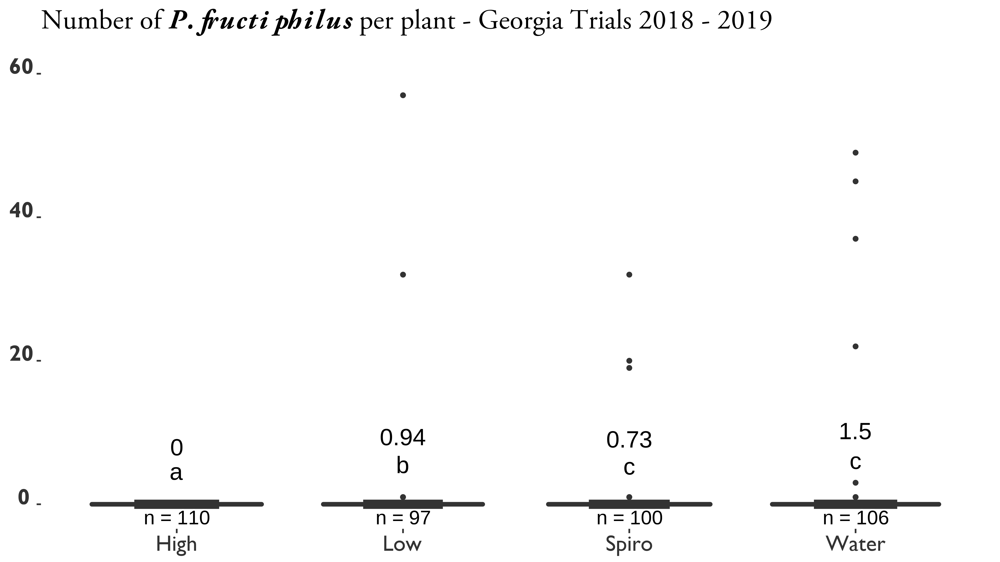
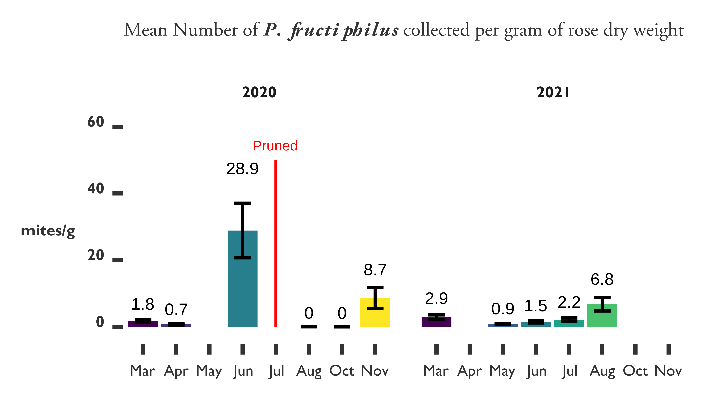
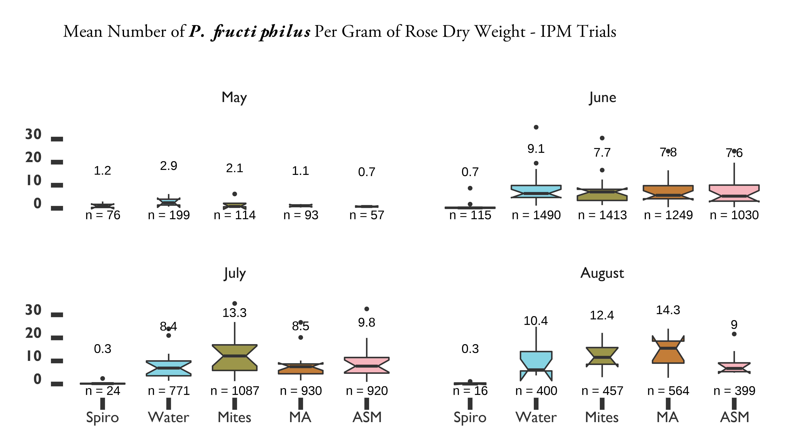
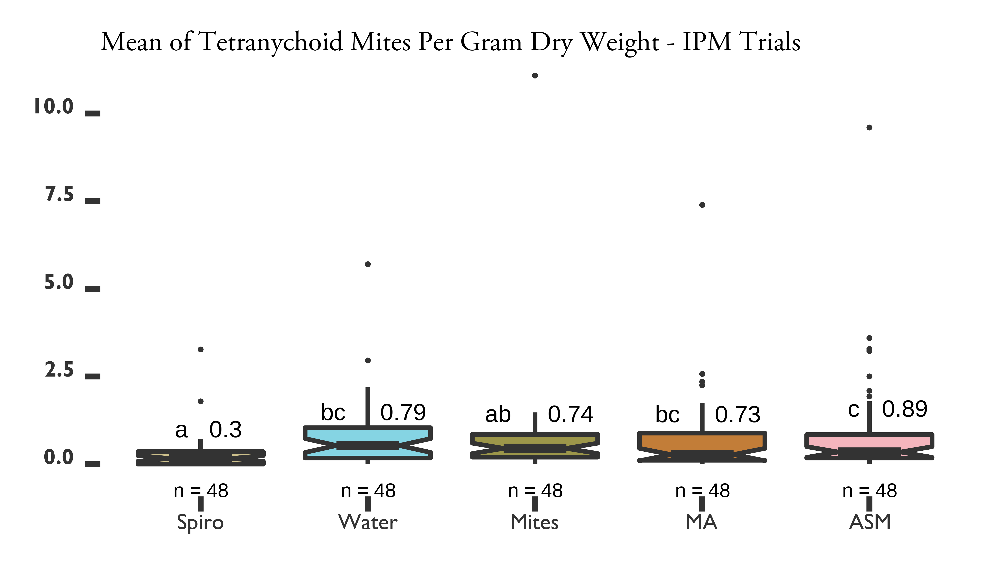
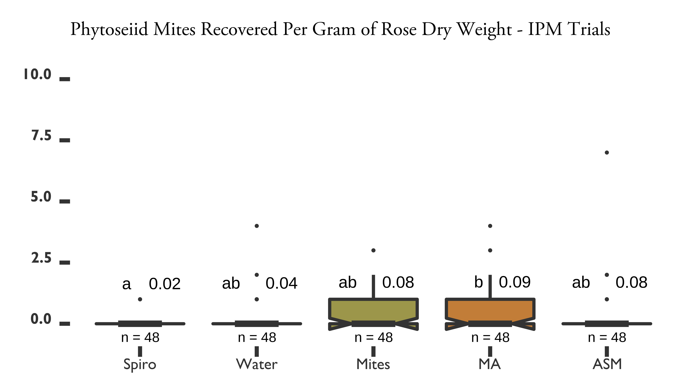
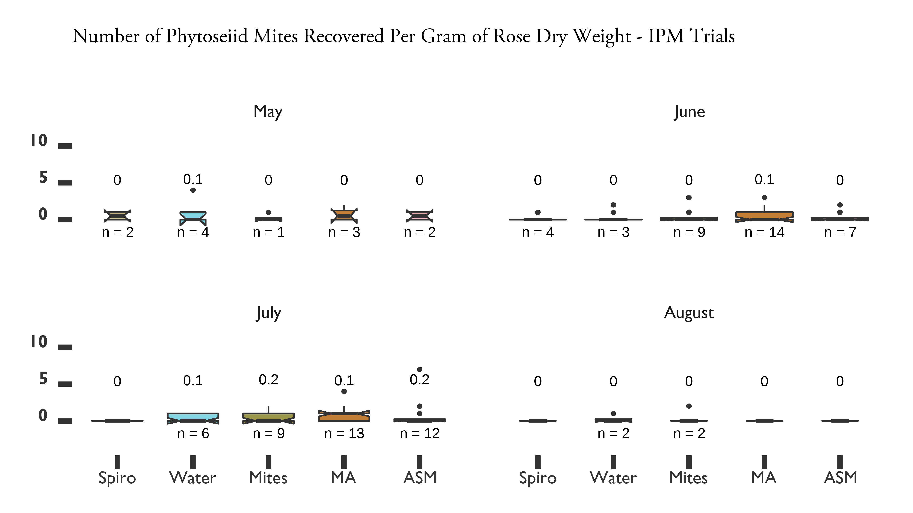

# MANAGEMENT OF *PHYLLOCOPTES FRUCTIPHILUS* WITH SYSTEMIC ACQUIRED RESISTANCE
## Introduction: *Phyllocoptes fructiphiulus* - An Increasingly Large Problem
*Phyllocoptes fructiphilus* Keifer (Trombidiformes: Eriophyidae) is a microscopic plant-feeding arachnid known as an eriophyid mite. *P. fructiphilus* is host specific, only feeding on plants in the genus *Rosa*, and normally cause little damage by itself. Unfortunately, *P. fructiphilus* has become infamous due to Rose Rosette Virus (RRV), a pathogen which the mite transmits while feeding. RRV infection creates the following symptoms: witches' brooms/rosetting, deformed flowers, increased prickle density, elongated shoots, reddened leaves and stems, and increased die-back which ultimately kills the rose host [@Allington1968; @Tzanetakis2006; @Laney2011]. This disease is known as Rose Rosette Disease (RRD) and is widely considered the most serious disease of roses in the US. RRD and the mite have invaded the southeastern US as they followed the range expansion of the non-native *Rosa multiflora* (Thunb) towards the coast [@Amrine1996; @Amrine2002; @Otero-Colina2018]. RRD afflicts a passionate group from different sectors of the US rose industry, including homeowners, commercial landscapers, nurseries, conservationists, and rosarians, all of whom stand to lose millions of dollars and many established roses plantings in the coming years [@Babu2014; @Byrne2019, @Rwahnih2019]. Florida, as the nation's largest producer of roses, has a special interest developing methods to better control *P. fructiphilus* and RRD. There is a critical need to improve management of *P. fructiphilus* and RRD. Unfortunately, few commercially available roses have resistance to RRD [@Byrne2018; @Bello2017]. Presently, growers are recommended to manage the *P. fructiphilus* by removing plants and spraying pesticides [@UGA2018; @Olson2017; @Hong2012]. However, pesticides have come under increased public scrutiny due to concerns about health, the environment, pest resistance, and harm to pollinators [@Alavanja2004, @Fenner2013, @Croft1988, @Vanbergen2013]. Increased pesticide applications also decrease grower profits and reduce competitiveness with foreign markets. The lack of alternative or complementary management options exacerbates this issue: rose growers need more options for *P. fructiphilus* control, especially methods which can be integrated into existing management programs. In 2013, nursery workers in Quincy, Gadsden County, Florida, USA, detected unusual red growths, deformed stems and extra thorniness on 15 knockout roses which had been imported from out of state. Eight symptomatic plants were tested by our Plant Diagnostic Clinic at the University of Florida's North Florida Research and Education Center in Quincy, FL, and found to be positive for RRD, but the *P. fructiphilus* mites were not detected at that time [@Babu2014]. On February 14, 2019, populations of *P. fructiphilius* were encountered on roses in Tallahassee, Leon County, Florida [@Fife2020]. The existence of *P. fructiphilus* in northern Florida increases the the possibility of introducing RRD from areas where the disease had become established, including the neighboring states of Georgia and Alabama [@Solo2020; @Solo2018]. 


### Integrating pest management: what are the effects of systemic acquired resistance on *Amblyseius swirskii* and *PPhyllocoptes fructiphilus*?
Integrated Pest Management (IPM) is the combination of science-informed best practices designed to keep the cost of pest control below the value of the crop damages which would occur without intervention (i.e. economic injury level) [@USDA2018; @Flint1981; @Stern1959]. In practice, IPM is informed by an understanding of the pest's biology and the judicious use of chemical controls, natural predators (biological controls), plant breeding, plant immune systems and physical (cultural) controls as needed to control pests as efficiently as possible [@Bradley2018].  


As part of the efforts to develop novel mite management methods, our lab has leveraged its experience with chemical ecology to conduct a series of preliminary two-choice maze (Y-tube olfactometer) trials with various species of commercially-available predatory mites. In these trials, mites can be exposed to chemical odorants which are correlated with the pest arthropod, such as samples droppings or sheds of the pest, a substrate which the pest has walked on, eggs of the pest, or plants which have been attacked by the pest. Attraction to these odorants is usually suggestive of predatory mite feeding preferences, and is a fast way to judge their potential for use in biological control [@Janssen1990]. While testing the compatibility of our rose system with various commercially-available predatory mites, we observed that *Amblyseius swirskii* Athias-Henriot (Mesostigmata: Phytoseiidae) mites were attracted towards roses which were infected with RRD (see *\@ref(results-olfact)`*). This was noteworthy because *A. swirskii* are generalist predators which feed on other common agricultural pests such as whiteflies [@Bolckmans2005], spider mites [@McMurtry1970], and thrips [@Wimmer2008]. *A. swirskii* can also persist on pollen [@Loughner2011; @Delisle2015] and other arthropods even when the pest of concern is absent [@Janssen2015]. This may allow *A. swirskii*  to be released as a preventative measure instead of reacting to an outbreak [@Kutuk2011]. Furthermore, phytoseiid mites integrate well into pest management programs and are compatible with certain pesticides [@Trumble1993; @Nicetic2001; @Fernandez2017] and other bio-control agents [@Midthassel2016]. Although *A. swirksii* mites are likely too large to infiltrate into the tight spaces needed to feed on *P. fructiphilus*, and they are not typically used to control whiteflies or thrips on roses. 

<!-- they remain a good model organism for testing combinations of different pest management treatments. -->

These results encouraged us to further investigate the differences between the chemical odorants (headspace volatiles) released from RRV-infected and uninfected roses using coupled Gas Chromatography-Mass Spectroscopy analysis (GC-MS). The GC-MS data suggested that RRV-infected roses had low levels of an important plant hormone known as Methyl Salicylate (MeSA) (*\@ref(chemeco)*). MeSA typically increases during an immune response, such as when a plant is attacked by herbivores or pathogens [@Tieman2010; @Park2007; @Shulaev1997]. We expected high levels of MeSA in these infected roses, because they were in the middle of experiencing a pathogen attack, but contrary to this expectation, we found low levels of MeSA emitted from the RRV-infected roses. MeSA is also known to be an attractive odor to some many predatory mites, which use MeSA to locate their prey [@James2004, @Gadino2011, @Boer2004a], and are often attracted to the Volatile Organic Compounds (VOCs) released when plants are injured by pests or infected with pathogens [@Boer2004b]. Our results suggest that either *A. swirski* are attracted to very low levels of MeSA, or perhaps this attraction is caused by other plant chemical cues besides MeSA. Either way, identification of these VOCs gives us insight into how RRD influences the prey-seeking behaviors of *A. swirksii*, which has implications for how effective predatory mite biocontrol might be. The most interesting part about low levels of MeSA is the role which this phytohormone typically plays in pathogen resistance [@Kalaivani2016, @Park2007]. MeSA is derived from Salicylic Acid (SA) [@Tieman2010], a chemical involved when inducing a plant’s immune response, known as Systemic Acquired Resistance (SAR) [@Gozzo2013; @Gaffney1993]. SAR protects plants from fungi, bacteria and viral pathogens when induced and affects all tissues in the plant [@Kachroo2013, @Ryals1994]. Low levels of MeSA suggest that RRV interferes with the rose's ability to defend itself against the pathogen. A possible way to avoid this negative feedback loop is to use SA to induce SAR *before* RRV infection, a procedure which would increase the rose's resistance to pathogens before exposure [@Conrath2006; @Agut2018; @Gaffney1993, @Kalaivani2016]. In light of this knowledge, we collaborated with the University of Georgia in to test how SAR-induction might protect roses from *P. fructiphilus* and/or RRD. acibenzolar-S-methyl (ASM) is a benzothiadiazole, a SAR-inducing chemical which works like Salicylic Acid to induce plant defenses against viruses and bacteria [@Darolt2020; @Jeschke2015; @Takeshita2013, @Narusaka1999; @Cole1999, @Ziadi2001; @Tripathi2010]. ASM is currently used by growers to protect plants from fungal infection [@Jeschke2015; @Ziadi2001; @Tripathi2010]. ASM application also has shown chitinase activity in roses [@Suo2001], and reduces the severity of RRD infection [@Babu2021]. It is not known if this reduction in RRD severity and incidence is related to the effects of plant physiology on the virus, or due to reduced populations of *P. fructiphilus* when ASM is applied [@Babu2021]. Mites have an exoskeleton comprised of chitin [@Nuzzaci1996a], and some studies have shown that the hypersensitive response and SAR interfere with the ability of eriophyoid mites to feed or grow on induced plants [@Bronner1991a; @Westphal1991; @Westphal1992]. A remaining concern is the effect that SAR-induction may have on predatory mite releases: although predatory mites do not feed directly on plants, they may still be harmed via direct and indirect effects of SAR-induction [@Ataide2016, @Pappas2017]. We conducted a number of field studies from 2018-2021 in order to test the integration of predatory mites with SAR.


### Phenology of populations of *Phyllocoptes fructiphilus* in northern Florida
*P.fructiphilus* were encountered on roses in Tallahassee, Leon County, Florida, on February 14, 2019 [@Fife2020]. Accordingly, the NFREC reported the find to the Florida Department of Agriculture and Consumer Services, who were able to confirm the mite species as *P. fructiphilius*. Researchers at the NFREC monitored the local populations of *P. fructiphilus* in that area from 2020-2021, before conducting the IPM field trial in Tallahassee.


## Materials & Methods
### Inducing systemic acquired resistance with acibenzolar-S-methyl to reduce populations of *Phyllocoptes fructiphilus*
We tested the efficacy of SAR-induction against mites in field trials during 12 weeks, from August to October at Griffin and Athens, GA. Griffin and Athens sites had low and high *P. fructiphilus* pest pressure, respectively.

***Phyllocoptes fructiphilus* Infestations**
Potted plants were inoculated with putatively *P.fructiphilus*-infested canes from nearby RRD-infected roses in the landscape. Rose canes from infected roses were placed onto potted roses during the first and fifth weeks of the experiment.

**Roses**
Field sites had 48 Pink Double Knock Out® Roses (Star Roses and Plants, West Grove, PA, USA) planted in 1 gallon buckets filled with potting soil and mixed with a granular slow-release fertilizer. Roses were placed on black plastic mulch with approximately 2 ft of space between pots. Plants were watered daily with overhead impact sprinklers. Plants in Griffin were placed alongside a plot of RRD-infected roses during 2018, and a second plot of RRD-infected roses was planted on the opposite side during 2019 (see *\@ref(fig:grif-asm-2018)* and *\@ref(fig:grif-asm-2019)*). Plots were designed with 12 roses total for each treatment, with 16 pots in 3 rows. 4 columns of 3 roses per block were assigned to the same treatment, and the same plants were rotated to new blocks of the same treatment during the second year (see *\@ref(fig:grif-asm-2018)* and *\@ref(fig:grif-asm-2019)*). Plants were monitored in a greenhouse to observe potential disease progress during the winter of 2018.

**Treatments**
Actigard50WG® (Syngenta, Greensboro, NC, USA), (acibenzolar-S-methyl, ASM) was applied at two different rates: 50 \si{\milli\gram}/\si{\liter} (Low rate) and 100 \si{\milli\gram}/\si{\liter} (High rate) to observe the effects of inducing Systemic Acquired Resistance (SAR) on *P. fructiphilus*. A spirotetramat based miticide was applied at the label rate (Kontos® Miticide Insecticide, Bayer Corporation, Whippany, New Jersey, USA), and tap water was used as a control. Trials in Athens had the same treatments.

**Plot Design ASM Trials, Griffin - 2018**
```{r grif-asm-2018, cache = TRUE, cache.extra = file.mtime('figure/rrv_asm_plot_2018_griffin.png'), fig.cap= "Field design for testing the potential of acibenzolar-S-methyl (ASM) to reduce populations of \\textit{P. fructiphilus} by inducing Systemic Acquired Resistance (SAR) in Pink Double Knock Out® roses. Trials were conducted for three months from September to December 2019 in Griffin, GA. Four treatments were applied weekly fo 12 weeks: Blue = Water Red = Actigard50WG® 100 \\si{\\milli\\gram}/L (High rate),  Pink = Actigard50WG® \\si{\\milli\\gram}/L (Half rate) Turquoise = Kontos® (Label rate). Flower cuttings were be taken weekly to record \\textit{P. fructiphilus} numbers.", fig.scap= "Field design for testing the potential of acibenzolar-S-methyl (ASM) to reduce populations of \\textit{P. fructiphilus}", out.width="80%", warning=FALSE}
knitr::include_graphics('figure/rrv_asm_plot_2018_griffin.png')
```

**Plot Design ASM Trials, Griffin - 2019**
```{r grif-asm-2019, cache.extra = file.mtime('figure/rrv_asm_plot_2019_griffin.png'), fig.cap="Field design for testing the potential of ASM to reduce populations of \\textit{P. fructiphilus} by inducing SAR in Pink Double Knock Out® roses. Trials were conducted for three months from September to December 2019 in Griffin, GA. Four treatments were applied weekly fo 12 weeks: Blue = Water Red = Actigard50WG® 100 \\si{\\milli\\gram}/L (High rate),  Pink = Actigard50WG® 100 \\si{\\milli\\gram}/L (Half rate) Turquoise = Kontos® (Label rate). Flower cuttings were be taken weekly to record \\textit{P. fructiphilus} numbers.", fig.scap="Field design for testing the potential of ASM to reduce populations of \\textit{P. fructiphilus}", out.width="80%", warning=FALSE}

```

**Data Collection for ASM Trials**
Rose/rosebud cuttings of about ~10 cm of cane were taken from each rose before the first treatments to determine the initial populations of *P. fructiphilus* on the roses. A stratified subset (one row across all blocks) of samples was taken from each rose treatment weekly, rotating samples until each rose plant has been sampled three times. Samples were collected from all roses at the end of the trial. The field trial was repeated for two seasons during the growing seasons of 2018 and 2019. Rose samples were placed in 50 mL centrifuge tubes and refrigerated or frozen until floral samples could be processed with 90% ethanol according to the methods of @Monfreda2007. Eriophyoid mites and other mites collected were counted. Eriophyoid mites were identified after clearing and mounting in Hoyer's iodine-modified medium as described by @Faraji2008.


### Integrating management options to control *Phyllocoptes fructiphilus*
During 2019 we conducted a second set of field trials in Griffin and Athens in addition to the ASM trials. We tested ASM alongside a different a SAR-inducer (SP2700, Trade name 'Ninja', SePro) and combined this SAR-inducer with predatory mites releases to observe any synergistic effects. We again tested a spirotetramat-based miticide and used water as a positive control (see *\@ref(fig:athens-ipm-2019)* and *\@ref(fig:griff-ipm-2019)*).

**Mite Infestation**
*P. fructiphilus* are present in the landscape of Georgia. Cuttings of ~10 cm or rose cane were taken from roses showing symptoms of RRD in the landscape and placed in each rose pot on the 1st, 5th and 9th weeks of the experiment.

**Predatory mites**
*Amblyseius swirskii* predatory mites were applied/released on the 1st, 5th and 9th week of the experiments. Mites were deployed from polyethylene fiber sachets (Ambly-S, Arbico Organics, Oro Valley, AZ, USA), containing live colonies of *A. swirskii* and a mite which they consume for food. There is a small hole at the bottom of these sachets which allowed the mites to be slowly released into the environment. The sachets were hung from rose canes in the center of each rose canopy to encourage successful mite release [@Buitenhuis2014].

**Roses**
The experiments were run for 12 weeks from August to October simultaneously in Griffin, GA and Athens, GA. Bare root roses were planted 2 months before the trials began to allow new flush to form. Rose planting media and environmental conditions were the same as previously described. The Athens site received and planted 96 Pink Double Knock Out® Roses (Star Roses and Plants, West Grove, PA, USA), while the Griffin site received 54 roses due to the smaller plot area available. The site at Athens had space for five blocks, while the site at Griffin, GA had space for three blocks. Each block was a 3 $\times$ 6 plot with 18 plants, with three roses for each treatment. Flower cuttings were sampled from two rows each week, starting with the top rows of each block and rotating to the next row each week, continuing until all rows were sampled three times. 

**Treatments**
Actigard50WG® (Syngenta, Greensboro, NC, USA), (acibenzolar-S-methyl, ASM) was applied at 100 \si{\milli\gram}/\si{\liter}, SP2700 (Trade name: Ninja\texttrademark, SePro, Carmel, IN, USA) was applied at its labeled rate, A spirotetramat based miticide was applied at the label rate (Kontos® Miticide Insecticide, Bayer Corporation, Whippany, New Jersey, USA), and tap water was used as a control. *A. swirskii* mites were deployed with one sachet per rose treated, and *A. swirskii* + Ninja treatments were applied with one sachet per rose treated, and SP2700 applied at its labelled rate. Treatments were done on the same day each week, weather permitting. Trials in Athens had the same treatments.


**Plot Design - Athens IPM 2019**
```{r athens-ipm-2019, cache.extra = file.mtime('figure/rrv_ipm_plot_map_2019_athens.png'), fig.cap = "Field design for Integrated Pest Management (IPM) trials on Pink Double Knock Out® roses to control \\textit{P. fructiphilus} in Athens, GA with five treatments. W = Water A = Actigard50WG, K = Kontos®, M = \\textit{A. swirkii} predatory mite sachets, N = SP2700 (Trade name: Ninja, SePro), + = \\textit{A. swirskii} + Ninja combined treatments. All products were applied at their label rates for 12 weeks. Flower cuttings were taken weekly to record \\textit{P. fructiphilus} numbers.", fig.scap = "Field design for Integrated Pest Management (IPM) trials on Pink Double Knock Out® roses to control \\textit{P. fructiphilus} in Athens, GA with five treatments", out.width="80%", warning=FALSE}
knitr::include_graphics('figure/rrv_ipm_plot_map_2019_athens.png')
```


**Plot Design - Griffin IPM 2019**
```{r griff-ipm-2019, cache.extra = file.mtime('figure/rrv_ipm_plot_map_2019_griffin.png'), fig.cap= "Field design for IPM trials on Pink Double Knock Out® roses to control \\textit{P. fructiphilus} in Griffin, GA with five treatments. W = Water A = Actigard50WG, K = Kontos®, M = \\textit{A. swirkii} predatory mite sachets, N = SP2700 (Trade name: Ninja, SePro), + = \\textit{A. swirskii} + Ninja combined treatments. All products were applied at their label rates for 12 weeks. Flower cuttings were taken weekly to record \\textit{P. fructiphilus} numbers.", fig.scap= "Field design for IPM trials on Pink Double Knock Out® roses to control \\textit{P. fructiphilus} in Griffin, GA with five treatments", out.width="80%", warning=FALSE}
knitr::include_graphics('figure/rrv_ipm_plot_map_2019_griffin.png')
```

**Data Collection for Georgia IPM Trials**
Flower samples were collected from all roses once before beginning the treatments on week 1 and once at the end of the experiment on week 12. For weeks 2 through 11, flower samples were collected weekly. starting from the top rows of each block, until each row was sampled three times (see *\@ref(fig:athens-ipm-2019)* and *\@ref(fig:griff-ipm-2019)*). Disease severity was recorded weekly according to the Horsfall-Barratt Scale [@Horsfall1945]. Roses displaying symptoms of RRD had tissues sent to the Plant Disease Diagnostic Clinic at the North Florida Reasearch and Extension Center(PDC) for virus confirmation. Flower cuttings of about ~12 cm were taken and placed in 50 ml centrifuge tubes. Flowers were placed flower side down and submerged with 15 ml of 95% ethanol. Once the lid was secured, the the tube was shaken vigorously for a few seconds to help dislodge any mites. Samples were processed using the washing methods of @Monfreda2007, eriophyoid mites were counted and identified as previously described.


### Phenology field study
In order to be sure that a further series of IPM trials would be successful, we monitored a population of *P. fructiphilus* in Tallahassee which had mites but no RRD. Rose cuttings were collected periodically from four plots in the landscape of a church in Leon County, FL from 2020-2021: The site had two plantings of 2-3 years old Double Pink Knockout roses, with open sun exposure, ~0.3 \si{\metre} spacing, and natural watering. Blocks were divided into 24 plots of ~3 \si{\metre}$^2$, with approximately 12 roses per plot. Samples were processed as previously described in \@ref(mm-survey). After washing, plant tissues were placed into in paper bags and put into a drying oven for ~48 hrs at 50 &deg;C, after which dry weight was recorded. Mites were counted and recorded to track changes in the mite populations. Roses were pruned once on the beginning of July 2020 by a professional landscaping crew.

### IPM field trials, Tallahassee 2021
A second trial of IPM was conducted in Tallahassee, FL. This site did not have RRD present, but had verified populations of *P. fructiphilus* present in the landscape (see APPENDIX). Spray applications were done weekly for 12 weeks from May to August 2021. Treatments were made on the same day each week, weather permitting. 

**Roses**
The site was divided into two blocks, with ten plots of roses in each block. Each plot was 3 \si{m}$^2$ with approximately 12 roses, the six roses at the center of the plot were treated, while the adjacent roses on either side was left as a buffer between plots to avoid treatment drift.

**Treatments**
Five treatments were applied: tap water as a control, Actigard50WG® (acibenzolar-S-methyl, Syngenta, Greensboro, NC, USA) - 100 \si{\milli\gram}/\si{\liter}, *Amblyseius swirskii* mini sachets with hooks (Ambly-S, Arbico Organics, Oro Valley, AZ, USA) - two sachets per rose in treated plots, and a combined treatment of Actigard50WG® - 100 \si{\milli\gram}/\si{\liter} + *A. swirskii* - two sachets per rose in treated plots, and a spirotetramat miticide (Kontos® Miticide Insecticide, Bayer Corporation, Whippany, New Jersey, USA), (see *\@(talla-ipm-2021)*).

**Mite Infestation**
*P. fructiphilus* are present in the landscape of Tallahassee. Populations were present on the roses, as verified by the phenology experiments.

**Predatory mites**
The two sachets of *A. swirskii* mites were applied to each of the six treated roses on the 1st, 5th and 9th week of the experiment, following the application instructions from the supplying company (Ambly-S, Arbico Organics, Oro Valley, AZ, USA). The sachets were hung from rose canes in the center of each rose. The *A. swirskii* plots were also treated with water weekly when the other plots were sprayed in order to keep conditions similar to other treatments.

**Data Collection for Tallahassee IPM Trials**
Samples were collected and processed using similar methods as previously described in \@ref(mm-survey): Flower cuttings were taken weekly from from each of the six roses in the center of each plot. Three flowers (or buds if no flowers were present) were taken from each of the six central roses in each plot, for a total of 18 flowers/buds per bottle for each sampling bottle.The flowers/buds were placed into the ethanol-filled bottles and shaken vigorously for a few seconds to coat the rose tissue with ethanol and help dislodge any mites. Plant samples were processed according to the methods described in @Monfreda2007. Plant tissues were retained after mites were washed off, and dried in kraft paper bags and put into the oven until dry (~48 hrs at 50 &deg;C), after which the dry weight of the rose tissues was recorded.

```{r talla-ipm-2021, cache.extra = file.mtime('figure/rrv_ipm_plot_map_2021_talla.tif'), fig.cap = "Field design for IPM trials on Pink Double Knock Out® roses to control \\textit{P. fructiphilus} in Tallahassee, FL with five treatments: Water, Actigard50WG®, Kontos®, \\textit{Amblyseius swirkii} predatory mite sachets, and \\textit{A. swirskii} + Actigard combined treatments. All products were applied at their label rates for 12 weeks. Flower cuttings were taken weekly to record \\textit{P. fructiphilus} numbers.", fig.scap = "Field design for IPM trials on Pink Double Knock Out® roses to control \\textit{P. fructiphilus} in Tallahassee, FL with five treatments", out.width="80%", warning=FALSE}
grid::grid.raster(tiff::readTIFF('figure/rrv_ipm_plot_map_2021_talla.tif'))
```

### Analysis of field trial data
All data from all trials was processed and analyzed using R version 4.1.1 [@RCT2021]. The data were all count data, so a Zero-Inflated Poisson Model [@Zeileis2008] was required for the ASM data [@Hothorn2008], while Generalized Linear Mixed Models [@Bates2015] were used for all of the IPM and phenology trials. Estimated marginal means (least squares means) [@Lenth2021] and Tukey Contrasts Multiple Comparisons of Means were used to determine significant effects. In addition, about ~5\% of early samples collected from the Tallahassee field trials were missing dry weights. Missing weight data was estimated and imputted using Multivariate Imputation by Chained Equations via the mice package [@vanBuuren2011]. 

## Results
### ASM trials
```{r asm-graph, cache = TRUE, cache.extra = file.mtime('figure/rrv_actigard_graph.png'), fig.cap="SAR-induction trials on Pink Double Knock Out® roses to control \\textit{Phyllocoptes fructiphilus} in Athens and Griffin, GA. Statistical significance was determined using Tukey contrasts for multiple Comparisons of means. Groups which share letters are not statistically different from one another. $\\alpha = 0.05$. water = Water Control, High = 100 \\si{\\milli\\gram}/\\si{\\liter} Actigard50WG® (Syngenta, Greensboro, NC, USA) acibenzolar-S-methyl (ASM), low = 50 \\si{\\milli\\gram}/\\si{\\liter} Actigard50WG® (Syngenta, Greensboro, NC, USA) acibenzolar-S-methyl (ASM), Spiro = Kontos® Miticide Insecticide - Spirotetramat (Bayer Corporation, Whippany, New Jersey, USA), All products were applied for 12 weeks. Flower cuttings were taken weekly to record the numbers of herbivorous mites.", fig.scap="SAR-induction trials on Pink Double Knock Out® roses to control \\textit{Phyllocoptes fructiphilus} in Athens and Griffin, GA", out.width="80%", warning=FALSE}

```


<!-- ```{r asm-athns-2018-graph, echo = FALSE, warning = FALSE, cache = TRUE, cache.extra = file.mtime('data/rrv_athens_disease_progress_2018.csv'), caption = "\\label{tab:asm-athns-2018-graph}", out.width="100%"} -->
<!-- #The Athens disease progress data doesn't really show anything -->
<!-- df <-read_csv('data/rrv_actigard_master_datasheet.csv') -->
<!-- df <- df %>% filter(Field == 'Athens') -->
<!-- ggplot(data = df, mapping = aes(x = Treatment, y=`H-B Score`)) + -->
<!--   geom_boxplot() + -->
<!-- ggtitle("Horsfall-Barratt Score - ASM Trials 2018 - Athens, GA") -->

<!-- ggplot(data = df, mapping = aes(x = Treatment, y = AUDPC)) + -->
<!--   geom_boxplot() + -->
<!--   ggtitle("Area Under the Disease Progress Curve - ASM Trials - Athens, GA") -->

<!-- ``` -->


```{r asm-athns-2018-table, echo = FALSE, warning = FALSE, cache = TRUE, cache.extra = file.mtime('data/rrv_athens_disease_progress_2018.csv'), caption = "\\label{tab:asm-athns-2018-table}", out.width="100%"}
read_csv('data/rrv_athens_disease_progress_2018.csv',
         show_col_types = FALSE) %>%
  knitr::kable(format = "latex",
               booktabs = TRUE,
               caption = "Progression of RRD on SAR-induced Pink Double Knock Out® roses in Athens, GA 2018.") %>%
  kable_styling(latex_options = c("striped", "scale_down", full_width = TRUE)) %>%
  landscape()

```


### Phenology
```{r pheno-graphs, cache = TRUE, cache.extra = file.mtime('figure/rrv_pheno_bargraph.png'), fig.pos = 'h', fig.cap="Phenology of \\textit{P. fructiphilus} mite populations on roses in Leon County, Florida 2020-2021. Roses were pruned back heavily on July 9, 2020.", fig.scap="Phenology of \\textit{P. fructiphilus} mite populations on roses in Leon County, Florida", out.width="100%", warning=FALSE}

```


### IPM trials
```{r ipm-talla-erios, cache = TRUE, cache.extra = file.mtime('figure/rrv_ipm_graph_erios_talla.png'), fig.cap="IPM trials on Pink Double Knock Out® roses to control \\textit{P. fructiphilus} in Tallahassee, FL with five treatments. Statistical significance was determined using Tukey contrasts for multiple Comparisons of means. Groups which share letters are not statistically different from one another. $\\alpha = 0.05$. Water = Water Control, ASM = Actigard50WG® (Syngenta, Greensboro, NC, USA) acibenzolar-S-methyl (ASM), Spiro = Kontos® Miticide Insecticide - Spirotetramat (Bayer Corporation, Whippany, New Jersey, USA), Mites = \\textit{Amblyseius swirkii} predatory mite mini sachets on hooks (Ambly-S, Arbico Organics, Oro Valley, AZ, USA), MA = \\textit{A. swirskii} + Actigard combined treatments. All products were applied at their label rates for 12 weeks. Flower cuttings were taken weekly to record the numbers of \\textit{P. fructiphilus} and other herbivorous mites.", fig.scap="IPM trials on Pink Double Knock Out® roses to control \\textit{P. fructiphilus} in Tallahassee, FL with five treatments", out.width="80%", warning=FALSE}
knitr::include_graphics('figure/rrv_ipm_graph_erios_talla.png')
```

```{r ipm-talla-erios-month, cache = TRUE, cache.extra = file.mtime('figure/rrv_ipm_graph_erios_talla_month.png'), fig.cap="IPM trials on Pink Double Knock Out® roses to control \\textit{P. fructiphilus} in Tallahassee, FL with five treatments. Water = Water Control, ASM = Actigard50WG® (Syngenta, Greensboro, NC, USA) acibenzolar-S-methyl (ASM), Spiro = Kontos® Miticide Insecticide - Spirotetramat (Bayer Corporation, Whippany, New Jersey, USA), Mites = \\textit{Amblyseius swirkii} predatory mite mini sachets on hooks (Ambly-S, Arbico Organics, Oro Valley, AZ, USA), MA = \\textit{A. swirskii} + Actigard combined treatments. All products were applied at their label rates for 12 weeks. Flower cuttings were taken weekly to record the numbers of \\textit{P. fructiphilus} and other herbivorous mites.", fig.cap="IPM trials on Pink Double Knock Out® roses to control \\textit{P. fructiphilus} in Tallahassee, FL with five treatments", out.width="80%", warning=FALSE}

```

```{r ipm-talla-tets, cache = TRUE, cache.extra = file.mtime('figure/rrv_ipm_graph_tets_talla.png'), fig.cap="IPM trials on Pink Double Knock Out® roses to control \\textit{P. fructiphilus} in Tallahassee, FL with five treatments. Statistical significance was determined using Tukey contrasts for multiple Comparisons of means. Groups which share letters are not statistically different from one another. $\\alpha = 0.05$. Water = Water Control, ASM = Actigard50WG® (Syngenta, Greensboro, NC, USA) acibenzolar-S-methyl (ASM), Spiro = Kontos® Miticide Insecticide - Spirotetramat (Bayer Corporation, Whippany, New Jersey, USA), Mites = \\textit{Amblyseius swirkii} predatory mite mini sachets on hooks (Ambly-S, Arbico Organics, Oro Valley, AZ, USA), MA = \\textit{A. swirskii} + Actigard combined treatments. All products were applied at their label rates for 12 weeks. Flower cuttings were taken weekly to record the numbers of \\textit{P. fructiphilus} and other herbivorous mites.", fig.cap="IPM trials on Pink Double Knock Out® roses to control \\textit{P. fructiphilus} in Tallahassee, FL with five treatments", out.width="80%", warning=FALSE}

```

```{r ipm-talla-tets-month, cache = TRUE, cache.extra = file.mtime('figure/rrv_ipm_graph_tets_talla_month.png'), fig.cap="IPM trials on Pink Double Knock Out® roses to control \\textit{P. fructiphilus} in Tallahassee, FL with five treatments. Statistical significance was determined using Tukey contrasts for multiple Comparisons of means. Groups which share letters are not statistically different from one another. $\\alpha = 0.05$. Water = Water Control, ASM = Actigard50WG® (Syngenta, Greensboro, NC, USA) acibenzolar-S-methyl (ASM), Spiro = Kontos® Miticide Insecticide - Spirotetramat (Bayer Corporation, Whippany, New Jersey, USA), Mites = \\textit{Amblyseius swirkii} predatory mite mini sachets on hooks (Ambly-S, Arbico Organics, Oro Valley, AZ, USA), MA = \\textit{A. swirskii} + Actigard combined treatments. All products were applied at their label rates for 12 weeks. Flower cuttings were taken weekly to record the numbers of \\textit{P. fructiphilus} and other herbivorous mites.", fig.cap="IPM trials on Pink Double Knock Out® roses to control \\textit{P. fructiphilus} in Tallahassee, FL with five treatments", out.width="80%", warning=FALSE}

```

```{r ipm-talla-preds, cache = TRUE, cache.extra = file.mtime('figure/rrv_ipm_graph_preds_talla.png'), fig.cap="IPM trials on Pink Double Knock Out® roses to control \\textit{P. fructiphilus} in Tallahassee, FL with five treatments. Statistical significance was determined using Tukey contrasts for multiple Comparisons of means. Groups which share letters are not statistically different from one another. $\\alpha = 0.05$. Water = Water Control, ASM = Actigard50WG® (Syngenta, Greensboro, NC, USA) acibenzolar-S-methyl (ASM), Spiro = Kontos® Miticide Insecticide - Spirotetramat (Bayer Corporation, Whippany, New Jersey, USA), Mites = \\textit{Amblyseius swirkii} predatory mite mini sachets on hooks (Ambly-S, Arbico Organics, Oro Valley, AZ, USA), MA = \\textit{A. swirskii} + Actigard combined treatments. All products were applied at their label rates for 12 weeks. Flower cuttings were taken weekly to record the numbers of \\textit{P. fructiphilus} and other herbivorous mites.", fig.cap="IPM trials on Pink Double Knock Out® roses to control \\textit{P. fructiphilus} in Tallahassee, FL with five treatments", out.width="80%", warning=FALSE}

```

```{r ipm-talla-preds-month, cache = TRUE, cache.extra = file.mtime('figure/rrv_ipm_graph_preds_talla_month.png'), fig.cap="IPM trials on Pink Double Knock Out® roses to control \\textit{P. fructiphilus} in Tallahassee, FL with five treatments. Statistical significance was determined using Tukey contrasts for multiple Comparisons of means. Groups which share letters are not statistically different from one another. $\\alpha = 0.05$. Water = Water Control, ASM = Actigard50WG® (Syngenta, Greensboro, NC, USA) acibenzolar-S-methyl (ASM), Spiro = Kontos® Miticide Insecticide - Spirotetramat (Bayer Corporation, Whippany, New Jersey, USA), Mites = \\textit{Amblyseius swirkii} predatory mite mini sachets on hooks (Ambly-S, Arbico Organics, Oro Valley, AZ, USA), MA = \\textit{A. swirskii} + Actigard combined treatments. All products were applied at their label rates for 12 weeks. Flower cuttings were taken weekly to record the numbers of \\textit{P. fructiphilus} and other herbivorous mites.", fig.cap="IPM trials on Pink Double Knock Out® roses to control \\textit{P. fructiphilus} in Tallahassee, FL with five treatments", out.width="80%", warning=FALSE}

```


## Discussion
We had low recovery of *P. fructiphilus* for the ASM and IPM trials in Georgia. This lead us to the phenology study, to ensure that there had been adequate establishment of *P. fructiphilus* to create measurable effects. The phenology study was successful, and helped to inform the IPM trial in Tallahassee, which produced some meaningful data. Unfortunately, our results suggest that only applications of spirotetramat were able to significantly reduce populations of *P. fructiphilus*, an effect seen in all of the field trials conducted. SAR-induced plant defenses were unable to reduce mite numbers more than the control, even when combined with predatory mite releases (see *\@ref(fig:ipm-talla-erios)*). The low recovery of *A. swirskii* makes it difficult to make claims about their efficacy as predators of *T. urticae* on roses. It is possible that *A. swirskii* simply dispersed to the point of leaving the rose plots: @Buitenhuis2013 noted the ability of *A. swirskii* to move quickly on roses due to fewer trichomes, and recommended adjusting the release rates accordingly. This also emphasizes their lack of utility for feeding on *P. fructiphilus*: aside from being too large, *A. swirskii* predation was found to be negatively correlated with trichome density [@Buitenhuis2013], suggesting that *A. swirskii* are unlikely to feed on *P. fructiphilus* hidden in the dense trichomes of rose sepals. Spirotetramat is known to be harmless to *A. swirskii* [@Fernandez2017], but no patterns emerged for either spirotetramat or ASM. Some evidence has been given that slow release mite sachets which are sheltered and provided with felt patches and/or moisture in the form of water-absorbant sodium polyacrylate gels had better releases of predators [@Shimoda2018]. In addition, other studies have struggled to recover phytoseiid mites generally, as evidenced by our mite surveys on roses. Fortunately, we did recover *A. swirskii* more often in the plots where they had been released, which is what we expected. We did not see an effect of *A. swirskii* release on the tetranychid mites which we found on the roses. Populations of *P. fructiphilius* showed seasonal fluctuations in mite numbers, with highest populations achieved during June 2020 and July 2021. Rose pruning in July 2020 reduced the numbers of *P, fructiphilus* collected for 3 months, populations began to recover that November. However, the number of *P.fructiphilus* collected was not significantly different between the years 2020 and 2021 for the phenology trials. Mite numbers remained relatively lower during 2021 compared to the previous year. None of the mite-infested roses have shown symptoms of RRD to date. Tracking populations for longer periods of time with additional climatic data could be used to determine the best times to prune and apply chemistry to reduce mite numbers. The large reductions of *P. fructiphilus* seen post pruning suggests its potential as a method of cultural mite control. The combination of pruning with acaricide treatments has been previously tested to control *P. fructiphilus*, with limited success [@Windham2014], but these studies were conducted in areas of high pest pressure, with the presence of RRD. It is unlikely that acaricides or pruning are sufficient to prevent RRD infection: pruning does not remove the virus [@Bello2017], and the inoculation access period for transmission of RRD is surprisingly short, with mites able to transmit the virus within an hour of plant feeding [@Bello2017]. Even so, the efficacy of combining pruning and acaricides has not been tested in areas with recent introductions of the mite without the virus. Combined management treatments may prove more effective in maintaining low populations of non-viruliferious *P. fruciphilus*, and should be investigated for preventing the spread of the mite, rather than preventing the disease proper.